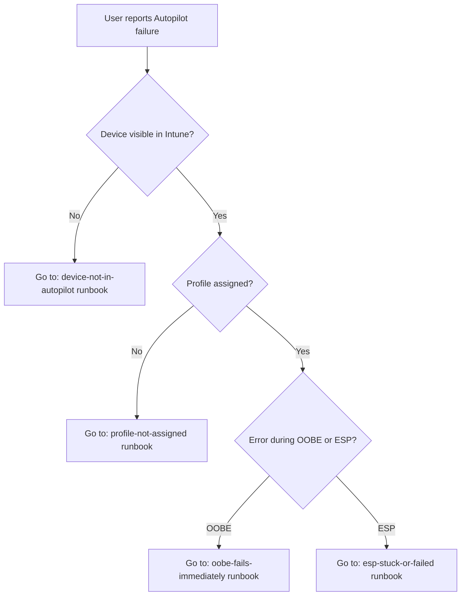

# Architecture Research

**Domain:** Documentation suite — Windows Autopilot troubleshooting and lifecycle guides
**Researched:** 2026-03-10
**Confidence:** HIGH (existing project structure is concrete, patterns are well-established for technical documentation)

## Standard Architecture

### System Overview

```
┌─────────────────────────────────────────────────────────────────────┐
│                        docs/ (Content Layer)                         │
├───────────────────┬─────────────────────┬───────────────────────────┤
│   lifecycle/      │   troubleshooting/  │   reference/              │
│  ┌─────────────┐  │  ┌───────────────┐  │  ┌─────────────────────┐  │
│  │ overview.md │  │  │ l1-runbooks/  │  │  │ error-codes.md      │  │
│  │ hardware-   │  │  │ l2-runbooks/  │  │  │ powershell-ref.md   │  │
│  │   hash.md   │  │  │ decision-     │  │  │ registry-paths.md   │  │
│  │ profile-    │  │  │   trees/      │  │  │ endpoints.md        │  │
│  │   assign.md │  │  └───────────────┘  │  │ quick-ref/          │  │
│  │ oobe.md     │  │                     │  └─────────────────────┘  │
│  │ esp.md      │  │                     │                           │
│  └─────────────┘  │                     │                           │
├───────────────────┴─────────────────────┴───────────────────────────┤
│                     Shared Foundation                                │
│  ┌──────────────────┐  ┌──────────────────┐  ┌──────────────────┐   │
│  │  _glossary.md    │  │  _templates/     │  │  _index.md       │   │
│  │  (shared terms)  │  │  (doc standards) │  │  (entry point)   │   │
│  └──────────────────┘  └──────────────────┘  └──────────────────┘   │
└─────────────────────────────────────────────────────────────────────┘
         │                       │                      │
         ▼                       ▼                      ▼
  src/powershell/         src/backend/           src/frontend/
  (linked by function      (linked by             (future: renders
   name in docs)            API endpoint)          docs inline)
```

### Component Responsibilities

| Component | Responsibility | Integration Point |
|-----------|----------------|-------------------|
| `docs/lifecycle/` | End-to-end Autopilot flow narrative — what happens, in order | Links to troubleshooting/ at each failure point |
| `docs/troubleshooting/l1-runbooks/` | Scripted steps for Service Desk — no deep technical knowledge required | Links to decision-trees/ for branching logic |
| `docs/troubleshooting/l2-runbooks/` | Deep technical investigation — registry, logs, PowerShell | Links to reference/ for function signatures |
| `docs/troubleshooting/decision-trees/` | Mermaid flowcharts — structured L1 triage | Embedded in L1 runbooks; standalone per scenario |
| `docs/reference/error-codes.md` | Searchable error → cause → fix table | Linked from every runbook that may surface the error |
| `docs/reference/powershell-ref.md` | Function signatures, parameters, examples | Linked from L2 runbooks and lifecycle docs |
| `docs/reference/quick-ref/` | One-page cheat sheets for common actions | Standalone; designed for print/pinning |
| `docs/common-issues.md` | **EXISTING** — currently ungrouped scenarios | Migrate content into the new structure; file becomes an index |
| `docs/architecture.md` | **EXISTING** — system architecture | Repurpose as L2 reference; keep file, update links |

## Recommended Project Structure

```
docs/
├── _index.md                          # Master entry point — "start here"
├── _glossary.md                       # Shared terminology (OOBE, ESP, TPM, ZTD, etc.)
│
├── lifecycle/                         # What Autopilot does, step by step
│   ├── 00-overview.md                 # Full flow diagram + narrative
│   ├── 01-hardware-hash-import.md     # Hash collection, OEM upload, CSV upload
│   ├── 02-profile-assignment.md       # Intune groups, profile sync, timing
│   ├── 03-oobe-flow.md                # User-driven vs pre-provisioning branching
│   ├── 04-esp-phases.md               # Device prep, device setup, account setup
│   └── 05-post-enrollment.md          # Rename, policy application, state verification
│
├── troubleshooting/
│   ├── l1-runbooks/                   # Service Desk — scripted, low-skill required
│   │   ├── device-not-in-autopilot.md
│   │   ├── esp-stuck-or-failed.md
│   │   ├── profile-not-assigned.md
│   │   ├── network-connectivity.md
│   │   └── oobe-fails-immediately.md
│   │
│   ├── l2-runbooks/                   # Desktop Engineering — technical, investigative
│   │   ├── tpm-attestation-failure.md
│   │   ├── hybrid-join-failure.md
│   │   ├── policy-conflict-analysis.md
│   │   ├── esp-deep-dive.md           # Log paths, event IDs, WMI queries
│   │   └── log-collection-guide.md    # Get-AutopilotLogs, MDMDiagnosticsTool
│   │
│   └── decision-trees/                # Mermaid diagrams — structured triage
│       ├── l1-initial-triage.md       # First call: is it registered? is it connectivity?
│       ├── esp-failure-tree.md        # ESP stuck → app? policy? network? timeout?
│       ├── profile-assignment-tree.md # No profile → group? sync? tenant? profile config?
│       └── tpm-attestation-tree.md    # TPM fail → BIOS? firmware? ownership? Secure Boot?
│
├── reference/
│   ├── error-codes.md                 # Master error lookup table
│   ├── powershell-ref.md              # All exported functions — AutopilotDiagnostics + Remediation
│   ├── registry-paths.md              # All documented registry paths with purpose
│   ├── endpoints.md                   # Required network endpoints + what each does
│   │
│   └── quick-ref/                     # One-page cheat sheets
│       ├── l1-quick-ref.md            # L1: top 5 checks, top 3 escalation triggers
│       ├── l2-quick-ref.md            # L2: PowerShell commands, log paths, event IDs
│       └── log-locations.md           # Where every relevant log lives
│
├── architecture.md                    # EXISTING — keep, update cross-links
└── common-issues.md                   # EXISTING — becomes navigation index, content migrates
```

### Structure Rationale

- **lifecycle/ before troubleshooting/:** Lifecycle docs provide the mental model that makes troubleshooting logical. L2 engineers need the lifecycle to understand what should happen before diagnosing why it didn't. L1 engineers can skip lifecycle and go straight to runbooks.

- **l1-runbooks/ and l2-runbooks/ are separate directories, not sections in one file:** Different audiences will bookmark different directories. L1 staff should never need to navigate through L2 content to find their guide. Separation prevents confusion and reduces cognitive overhead for both groups.

- **decision-trees/ as standalone files, not embedded only in runbooks:** Mermaid diagrams embedded in runbooks are useful for reading. Decision trees as standalone files can also be exported, printed, or displayed on a second screen during a call. Both are valid; standalone is the canonical version.

- **reference/ is lookup, not narrative:** Reference content has no linear reading order. It is optimized for Ctrl+F or browser search. Error codes especially must be in a flat table, not nested under scenarios.

- **quick-ref/ is for humans under pressure:** During a live incident, a one-page reference prevents errors. These files are deliberately short, link out rather than repeat, and use tables over prose.

- **_index.md and _glossary.md with underscore prefix:** Underscores sort first alphabetically in most file browsers and wikis. These shared files should be immediately visible and not buried.

## Architectural Patterns

### Pattern 1: Tiered Entry Points

**What:** Each audience (L1, L2) has a designated entry path that never requires navigating the other tier's content to reach what they need.

**When to use:** Always. Every L1 runbook starts from the L1 decision tree or `_index.md → troubleshooting/l1-runbooks/`. Every L2 guide starts from `_index.md → troubleshooting/l2-runbooks/` or `reference/`.

**Trade-offs:** Requires some deliberate duplication (e.g., "what is ESP" defined briefly in an L1 runbook, fully in lifecycle/). This is intentional — do not refactor it out. Cross-references to lifecycle are for readers who want depth, not for making L1 content depend on L2 content.

**Example entry point structure in `_index.md`:**
```markdown
## I am Service Desk (L1)
→ Start here: [L1 Initial Triage Decision Tree](troubleshooting/decision-trees/l1-initial-triage.md)
→ Runbooks: [L1 Runbooks Index](troubleshooting/l1-runbooks/)

## I am Desktop Engineering (L2)
→ Start here: [Autopilot Lifecycle Overview](lifecycle/00-overview.md)
→ Deep dives: [L2 Runbooks Index](troubleshooting/l2-runbooks/)
→ References: [PowerShell Reference](reference/powershell-ref.md)
```

### Pattern 2: Scenario-Anchored Cross-References

**What:** Every cross-reference is anchored to a specific scenario or action, not a general page. Use fragment links (`file.md#section`) rather than linking to a top-level file.

**When to use:** Any time a doc references another doc. Avoid "see also: common-issues.md" — instead write "see [ESP stuck: app install timeout](troubleshooting/l2-runbooks/esp-deep-dive.md#app-install-timeout)."

**Trade-offs:** More maintenance when headings change. Worth it — vague cross-references are unused cross-references.

### Pattern 3: PowerShell Function Linking Convention

**What:** Every mention of a PowerShell function in documentation links to the corresponding entry in `reference/powershell-ref.md` using a consistent anchor format: `#function-name-lowercase`.

**When to use:** All diagnostic and remediation function mentions in lifecycle docs, runbooks, and decision trees.

**Trade-offs:** None meaningful. Functions are stable exports; links will remain valid.

**Example:**
```markdown
Run [`Get-AutopilotDeviceStatus`](../reference/powershell-ref.md#get-autopilotdevicestatus)
to capture a full snapshot before attempting remediation.
```

**Functions to document in `reference/powershell-ref.md`:**

From `AutopilotDiagnostics.psm1` (7 exported functions):
- `Get-AutopilotDeviceStatus` — full device snapshot
- `Get-AutopilotHardwareHash` — hardware hash via CIM
- `Get-AutopilotRegistrationState` — registry-based registration check
- `Get-AutopilotProfileAssignment` — assigned profile details
- `Get-TPMStatus` — TPM readiness flags
- `Test-AutopilotConnectivity` — endpoint reachability tests
- `Get-AutopilotLogs` — MDM diagnostics + event log collection

From `AutopilotRemediation.psm1` (5 exported functions):
- `Reset-AutopilotRegistration` — clears local Autopilot state (ShouldProcess)
- `Reset-TPMForAutopilot` — clears TPM for re-attestation (ShouldProcess)
- `Repair-AutopilotConnectivity` — resets WinHTTP, DNS, Winsock
- `Restart-EnrollmentStatusPage` — kills ESP process, clears state (ShouldProcess)
- `Remove-AutopilotDevice` — full device removal for re-imaging (ShouldProcess)

### Pattern 4: Mermaid for Decision Trees

**What:** L1 decision trees use Mermaid flowchart syntax embedded directly in Markdown. GitHub, GitLab, Confluence, and most modern wikis render Mermaid natively.

**When to use:** Every scenario with more than two branching conditions. L2 guides can use prose with numbered steps instead — their value is depth, not speed.

**Trade-offs:** Mermaid diagrams are not universally rendered (some SharePoint configurations require plugins). Export each decision tree as a PNG as a companion artifact for environments that can't render Mermaid.

**Example structure for `troubleshooting/decision-trees/l1-initial-triage.md`:**
```markdown
## L1 Initial Triage


```

## Data Flow

### Documentation Navigation Flow

```
User arrives with a problem
    ↓
_index.md (role-based entry)
    ↓
L1 → decision-trees/ → l1-runbooks/ → reference/error-codes.md
    ↓                                         ↓
    Resolve OR escalate to L2             PowerShell command
                                          from reference/powershell-ref.md

L2 → lifecycle/ (understand expected) → l2-runbooks/ (investigate actual)
    ↓                                         ↓
    reference/registry-paths.md          reference/powershell-ref.md
    reference/endpoints.md               (remediation functions)
```

### Cross-Reference Flow

```
lifecycle/04-esp-phases.md
    → troubleshooting/l1-runbooks/esp-stuck-or-failed.md (at each failure point)
    → troubleshooting/l2-runbooks/esp-deep-dive.md (for deep analysis)
    → reference/error-codes.md#esp-errors (specific error codes)

troubleshooting/l1-runbooks/esp-stuck-or-failed.md
    → troubleshooting/decision-trees/esp-failure-tree.md (triage flowchart)
    → troubleshooting/l2-runbooks/esp-deep-dive.md (escalation path)

troubleshooting/l2-runbooks/esp-deep-dive.md
    → reference/powershell-ref.md#get-autopilotlogs (log collection)
    → reference/powershell-ref.md#restart-enrollmentstatuspage (remediation)
    → reference/registry-paths.md#enrollments (registry path for ESP state)
```

### Key Data Flows

1. **Error lookup:** User has an error code → `reference/error-codes.md` → cause column → fix column → linked runbook for steps
2. **Escalation:** L1 runbook reaches escalation trigger → links directly to corresponding L2 runbook section, not to the top of the L2 file
3. **PowerShell invocation:** L2 runbook mentions a function → links to `reference/powershell-ref.md` entry → entry includes copy-paste syntax, parameters, and expected output

## Integration Points

### Existing Files (Modify, Don't Replace)

| Existing File | Current State | Action Required |
|---------------|---------------|-----------------|
| `docs/common-issues.md` | Flat list of 7 scenarios with PowerShell snippets | Convert to navigation index. Migrate each scenario to the appropriate l1 or l2 runbook. Add links to new locations. Keep file as redirect/index. |
| `docs/architecture.md` | System architecture for the three-tier tool | Repurpose as L2 reference. Add a section linking to `reference/powershell-ref.md`. Add cross-link from `_index.md → L2 path`. No content deletion needed. |

### New Files to Create

All files under the structure defined in "Recommended Project Structure" above that do not currently exist. Priority build order (see below).

### Codebase Integration Points

| Doc Location | Links To | Notes |
|--------------|----------|-------|
| `reference/powershell-ref.md` | `src/powershell/AutopilotDiagnostics.psm1`, `src/powershell/AutopilotRemediation.psm1` | Link to specific line ranges if hosting on GitHub; use function names as anchors if not |
| `l2-runbooks/log-collection-guide.md` | `src/powershell/AutopilotDiagnostics.psm1` `Get-AutopilotLogs` | Document the OutputPath parameter and what each collected file contains |
| `reference/endpoints.md` | `src/powershell/AutopilotDiagnostics.psm1` `Test-AutopilotConnectivity` | Document which endpoints `Test-AutopilotConnectivity` checks; note the 5-second timeout |
| `reference/registry-paths.md` | `src/powershell/AutopilotDiagnostics.psm1`, `AutopilotRemediation.psm1` | All registry paths referenced in module code; `HKLM:\SOFTWARE\Microsoft\Provisioning\Diagnostics\Autopilot`, `AutopilotSettings`, `Enrollments` |
| Future: `src/frontend/` | `docs/` | Frontend may render docs inline; flat markdown with relative links is forward-compatible |

### External Services Referenced in Docs

| Service | Doc Location | Notes |
|---------|--------------|-------|
| Microsoft Intune portal | All L1 runbooks | Link to `intune.microsoft.com` for portal steps |
| Microsoft Graph API | `docs/architecture.md`, `l2-runbooks/` | L2 reference only; not L1 content |
| MDMDiagnosticsTool.exe | `reference/powershell-ref.md`, `l2-runbooks/log-collection-guide.md` | Ships with Windows; no installation required |
| Event Viewer paths | `l2-runbooks/esp-deep-dive.md`, `reference/quick-ref/log-locations.md` | Exact event log names from AutopilotDiagnostics.psm1 lines 162-166 |

## Build Order for Documentation

Build in this sequence — each phase's output is referenced by the next:

**Phase 1 — Foundation (everything depends on this):**
1. `docs/_glossary.md` — defines terms used everywhere
2. `docs/reference/registry-paths.md` — sourced from PowerShell modules directly
3. `docs/reference/endpoints.md` — sourced from `Test-AutopilotConnectivity` and CLAUDE.md
4. `docs/reference/powershell-ref.md` — all 12 exported functions

**Phase 2 — Lifecycle (L2 mental model, L1 context):**
5. `docs/lifecycle/00-overview.md` — the full Autopilot flow diagram
6. `docs/lifecycle/01-hardware-hash-import.md` through `05-post-enrollment.md`

**Phase 3 — L1 Runbooks and Decision Trees (depend on lifecycle and reference):**
7. `docs/troubleshooting/decision-trees/l1-initial-triage.md`
8. `docs/troubleshooting/l1-runbooks/` — all 5 scenarios
9. Remaining decision trees (esp-failure-tree, profile-assignment-tree, tpm-attestation-tree)

**Phase 4 — L2 Deep Dives (depend on lifecycle and reference):**
10. `docs/troubleshooting/l2-runbooks/log-collection-guide.md`
11. `docs/troubleshooting/l2-runbooks/esp-deep-dive.md`
12. `docs/troubleshooting/l2-runbooks/tpm-attestation-failure.md`
13. `docs/troubleshooting/l2-runbooks/hybrid-join-failure.md`
14. `docs/troubleshooting/l2-runbooks/policy-conflict-analysis.md`

**Phase 5 — Reference Completion and Entry Points:**
15. `docs/reference/error-codes.md`
16. `docs/reference/quick-ref/` (3 files)
17. `docs/_index.md` — written last because it links to everything
18. Update `docs/common-issues.md` to redirect/index
19. Update `docs/architecture.md` to add cross-links

## Anti-Patterns

### Anti-Pattern 1: Audience Mixing in a Single File

**What people do:** Create one giant `troubleshooting.md` with L1 and L2 content intermixed, separated by headers.

**Why it's wrong:** L1 staff have to scroll past registry paths and PowerShell scripts to find their scripted steps. L2 engineers have to read through "ask the user to restart" steps before reaching technical content. Both groups stop using the doc.

**Do this instead:** Strict directory separation by audience tier. Cross-reference between tiers at escalation boundaries only.

### Anti-Pattern 2: Orphaned Error Codes

**What people do:** Scatter error codes and messages inside individual runbooks without a central lookup table.

**Why it's wrong:** A user with an error code they don't recognize cannot find which runbook applies. The single most common first step in troubleshooting is "I have this error, what does it mean?" — this must be answerable without knowing which runbook to read.

**Do this instead:** All error codes go in `reference/error-codes.md` first, with a link to the runbook. Runbooks may also mention the error in context, but the canonical definition lives in the table.

### Anti-Pattern 3: Prose-Only Decision Logic

**What people do:** Write L1 decision logic as "If X, then Y. If not X, check Z. If Z is true and Y is false, escalate."

**Why it's wrong:** Under call pressure, L1 staff lose their place in prose logic. Decision trees (Mermaid flowcharts) are processable in one visual scan.

**Do this instead:** Mermaid flowchart for any decision with more than two branches. Prose is for background context, not branching logic.

### Anti-Pattern 4: Linking to File Tops Instead of Sections

**What people do:** `See [L2 ESP guide](troubleshooting/l2-runbooks/esp-deep-dive.md) for more detail.`

**Why it's wrong:** The L2 ESP guide may be 500 lines. "More detail" sends the reader to a wall of text with no navigation hint.

**Do this instead:** Always link to the specific section: `See [ESP: App Install Timeout](troubleshooting/l2-runbooks/esp-deep-dive.md#app-install-timeout) for log analysis steps.`

### Anti-Pattern 5: Duplicating PowerShell Function Documentation

**What people do:** Copy-paste function descriptions and parameters into each runbook where the function is mentioned.

**Why it's wrong:** When a function signature changes, every runbook with the copy needs updating. They will fall out of sync.

**Do this instead:** One canonical entry per function in `reference/powershell-ref.md`. Runbooks link to it. The only PowerShell content in a runbook is the specific invocation pattern for that scenario.

## Scaling Considerations

| Scale | Documentation Adjustments |
|-------|--------------------------|
| 1-3 engineers using docs | Current structure — markdown files in git, local rendering |
| 5-20 engineers, multi-team | Export to SharePoint/Confluence using the markdown-as-source workflow. Add a CI step to validate internal links. |
| Enterprise, multiple tenants | Add a `tenants/` directory alongside `docs/` for environment-specific overlays. Core docs remain generic per the project constraint. |

### Scaling Priorities

1. **First maintenance burden:** Internal links breaking when files are renamed. Mitigation: use a link checker in CI (e.g., `markdown-link-check`) from the start.
2. **Second maintenance burden:** Error codes table becoming stale. Mitigation: error codes table should be the first doc updated when a new scenario is documented.

## Sources

- Existing codebase: `docs/architecture.md`, `docs/common-issues.md` (direct inspection)
- Existing codebase: `src/powershell/AutopilotDiagnostics.psm1`, `src/powershell/AutopilotRemediation.psm1` (direct inspection — all exported functions catalogued)
- Project constraints: `.planning/PROJECT.md` (markdown-in-git, L1/L2 separation, generic guidance)
- Project constraints: `CLAUDE.md` (three-tier architecture, docs/ as documentation home)
- Mermaid diagram rendering: supported natively in GitHub, GitLab, Obsidian, Confluence (with plugin), and most modern wikis as of 2026

---
*Architecture research for: Windows Autopilot documentation suite — docs/ directory structure and cross-referencing*
*Researched: 2026-03-10*
