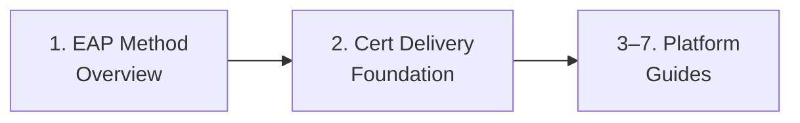

> **Guide scope:** This guide set covers 802.1X enterprise network authentication configuration for Intune-managed devices -- client-side only.
> For 802.1X protocol terminology (supplicant, authenticator, RADIUS, EAP, SCEP, PKCS, trusted root), see the [Network Authentication Glossary](../_glossary-network.md).

# 802.1X Network Authentication: Admin Setup Guides

This folder houses the shared 802.1X conceptual foundation -- EAP method overview and certificate delivery foundation -- plus per-platform admin setup guides for configuring 802.1X Wi-Fi and wired network profiles in Microsoft Intune.

## Setup Sequence

1. **[EAP Method Overview](01-eap-method-overview.md)** -- EAP-TLS, PEAP-MSCHAPv2, and EAP-TTLS presented co-equally: what authenticates, client requirements, trust requirements, and when to choose each. No method is ranked as a default.

2. **[Certificate Delivery Foundation](02-cert-delivery-foundation.md)** -- Deployment ordering rule (trusted-root profile → SCEP/PKCS client cert → 802.1X network profile), EKU requirements, RADIUS server-name validation, and the per-platform cert-delivery support matrix.

3–7. Platform guides (Phase 102–106) -- entries added as each guide is authored.

> **Wired 802.1X availability note:** Android Enterprise has no native Intune wired-network profile type -- Wi-Fi only; see the Android guide for details. Linux has no native Intune Wi-Fi or wired profile -- script-based EAP-TLS only via nmcli; see the Linux guide for details.

## Scope

Intune client-side configuration only -- RADIUS/NPS server assumed to exist. See [full scope exclusion list](02-cert-delivery-foundation.md#canonical-scope-callout).

## See Also

- [EAP Method Overview](01-eap-method-overview.md)
- [Certificate Delivery Foundation](02-cert-delivery-foundation.md)
- [Network Authentication Glossary](../_glossary-network.md)

---
*Next step: [EAP Method Overview](01-eap-method-overview.md)*

---

## Change History

| Date | Change | Author |
|------|--------|--------|
| 2026-06-29 | Initial version -- 802.1X admin-setup folder overview (two foundation guides) | -- |
