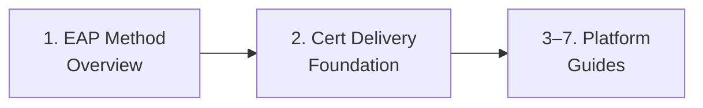

> **Guide scope:** This guide set covers 802.1X enterprise network authentication configuration for Intune-managed devices -- client-side only.
> For 802.1X protocol terminology (supplicant, authenticator, RADIUS, EAP, SCEP, PKCS, trusted root), see the [Network Authentication Glossary](../_glossary-network.md).

# 802.1X Network Authentication: Admin Setup Guides

This folder houses the shared 802.1X conceptual foundation -- EAP method overview and certificate delivery foundation -- plus per-platform admin setup guides for configuring 802.1X Wi-Fi and wired network profiles in Microsoft Intune.

## Setup Sequence

1. **[EAP Method Overview](01-eap-method-overview.md)** -- EAP-TLS, PEAP-MSCHAPv2, and EAP-TTLS presented co-equally: what authenticates, client requirements, trust requirements, and when to choose each. No method is ranked as a default.

2. **[Certificate Delivery Foundation](02-cert-delivery-foundation.md)** -- Deployment ordering rule (trusted-root profile → SCEP/PKCS client cert → 802.1X network profile), EKU requirements, RADIUS server-name validation, and the per-platform cert-delivery support matrix.

3. **[Windows 802.1X Admin Setup (Wi-Fi + Wired)](03-windows.md)** -- Wi-Fi and wired profiles for all three EAP methods; dot3svc dependency and Remediation pattern; enforcement staging; KB5014754 strong certificate mapping.

4. **[macOS 802.1X Admin Setup (Wi-Fi + Wired)](04-macos.md)** -- Wi-Fi and wired profiles for all three EAP methods; immutable deployment-channel decision (User vs Device keychain) before profile creation; wired SCEP-only constraint; server name required to suppress dynamic trust dialog.

5. **[iOS/iPadOS 802.1X Admin Setup (Wi-Fi + Wired)](05-ios.md)** -- Wi-Fi and wired profiles for all three EAP methods; MAC-address randomization disabled for NAC environments (iOS 14+); wired profile targets M-series iPads with USB Ethernet; wired SCEP-only constraint.

6. **[Android Enterprise 802.1X Admin Setup (Wi-Fi)](06-android.md)** -- Wi-Fi profiles for all three EAP methods across COBO/COPE/COSU/BYOD work profile modes; UPN-in-SAN deployment requirement for personally-owned work profile; version-gated RADIUS server-name behavior (Android 11+/14+); no native wired profile (gap documented).

7. **[Linux 802.1X Admin Setup (EAP-TLS via nmcli)](07-linux.md)** -- No native Intune Wi-Fi, wired, or cert-delivery profiles for Linux; guide documents EAP-TLS via nmcli (NetworkManager `802-1x.*`) as an OS-level workaround, with out-of-band certificate prerequisites. Ubuntu 24.04 LTS and 26.04 LTS. PEAP-MSCHAPv2 and EAP-TTLS out of scope (not in verifiable Microsoft/vendor sources for Intune-managed Linux fleets).

> **Wired 802.1X availability note:** Android Enterprise has no native Intune wired-network profile type -- Wi-Fi only; see the Android guide for details. Linux has no native Intune Wi-Fi or wired profile -- script-based EAP-TLS only via nmcli; see the Linux guide for details.

## Scope

Intune client-side configuration only -- RADIUS/NPS server assumed to exist. See [full scope exclusion list](02-cert-delivery-foundation.md#canonical-scope-callout).

## See Also

- [EAP Method Overview](01-eap-method-overview.md)
- [Certificate Delivery Foundation](02-cert-delivery-foundation.md)
- [Network Authentication Glossary](../_glossary-network.md)

---
*Next step: [EAP Method Overview](01-eap-method-overview.md)*

---

## Change History

| Date | Change | Author |
|------|--------|--------|
| 2026-06-29 | Initial version -- 802.1X admin-setup folder overview (two foundation guides) | -- |
| 2026-06-30 | Added item 3 -- Windows platform-guide entry linking 03-windows.md; narrowed placeholder range from 3--7 to 4--7 | -- |
| 2026-06-30 | Added item 4 -- macOS platform-guide entry linking 04-macos.md; narrowed placeholder range from 4--7 to 5--7 | -- |
| 2026-06-30 | Added item 5 -- iOS/iPadOS platform-guide entry linking 05-ios.md; narrowed placeholder range from 5--7 to 6--7 | -- |
| 2026-06-30 | Added item 6 -- Android Enterprise platform-guide entry linking 06-android.md; narrowed placeholder range from 6--7 to 7 | -- |
| 2026-06-30 | Added item 7 -- Linux platform-guide entry linking 07-linux.md; placeholder removed | -- |
