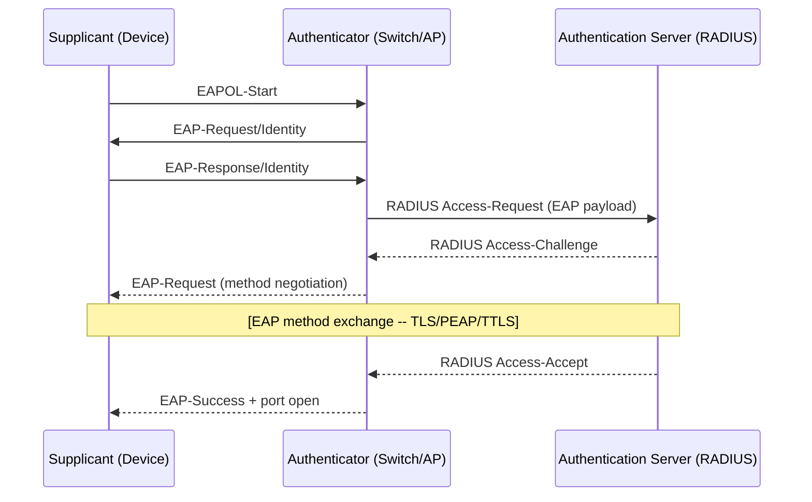

> **Prerequisites:** Read the [Network Authentication Glossary](../_glossary-network.md)
> for [802.1X](../_glossary-network.md#8021x), [EAP](../_glossary-network.md#eap),
> [RADIUS](../_glossary-network.md#radius), [supplicant](../_glossary-network.md#supplicant),
> and [authentication server](../_glossary-network.md#authentication-server) definitions
> before this guide.

# 802.1X EAP Method Overview

This guide compares the three EAP methods supported for 802.1X across Intune-managed platforms -- EAP-TLS, PEAP-MSCHAPv2, and EAP-TTLS -- as co-equal paths. No method is ranked or recommended as a default; each is appropriate for specific infrastructure and credential environments. See [02-cert-delivery-foundation.md](02-cert-delivery-foundation.md) for certificate delivery prerequisites.

## The 802.1X Three-Actor Model

802.1X authentication involves three actors. The [supplicant](../_glossary-network.md#supplicant) is the device requesting network access. The [authenticator](../_glossary-network.md#authenticator) is the network device (switch port or wireless AP) that relays the authentication exchange without inspecting EAP content. The [authentication server](../_glossary-network.md#authentication-server) is the [RADIUS](../_glossary-network.md#radius) server that evaluates the supplicant's identity and issues an Access-Accept or Access-Reject decision.

The exchange begins with [EAPOL](../_glossary-network.md#eapol) frames between supplicant and authenticator -- this happens before the device has an IP address. The authenticator proxies the [EAP](../_glossary-network.md#eap) payload to the RADIUS server over UDP/IP. The EAP method exchange (TLS handshake, PEAP tunnel, or TTLS tunnel) occurs inside this relay path.

---

## EAP-TLS

EAP-TLS is the mutual-certificate EAP method: both the supplicant and the RADIUS server present and validate X.509 certificates. No password or shared secret is exchanged between the device and the network.

### What Authenticates

Both sides authenticate by certificate. The supplicant presents a client certificate issued by a CA that the RADIUS server trusts. The RADIUS server presents its own certificate, which the supplicant validates against a trusted root. Neither side sends a replayable credential.

### What the Client Requires

- A client certificate installed on the device. In Intune, this is delivered via a [SCEP](../_glossary-network.md#scep) or [PKCS](../_glossary-network.md#pkcs) certificate profile.
- A [trusted root](../_glossary-network.md#trusted-root) certificate for the CA that issued the RADIUS server's certificate, delivered via a Trusted Certificate profile.
- An 802.1X Wi-Fi or Wired network profile configured for EAP-TLS that references the client certificate and trusted root profiles.

### Trust Requirements

The RADIUS server must trust the CA that issued the client certificate -- the NPS network policy must reference that CA. The client must trust the CA that issued the RADIUS server's certificate, which the Trusted Certificate profile satisfies.

Always populate the [server-name validation](../_glossary-network.md#server-name-validation) field in the network profile with the RADIUS server's FQDN or certificate CN. Configure the outer identity (see [inner-outer identity](../_glossary-network.md#inner-outer-identity)) to an anonymous value to prevent the certificate subject name from being visible in cleartext before the TLS tunnel is established.

### When to Choose

Choose EAP-TLS when:
- Certificate infrastructure (SCEP/PKCS profile via NDES or Cloud PKI) is deployed or planned
- Machine authentication without a password dependency is required
- Mutual authentication -- both the device and the RADIUS server verify each other's certificate -- is a security requirement
- Highest assurance posture is needed

---

## PEAP-MSCHAPv2

PEAP-MSCHAPv2 (Protected EAP -- Microsoft Challenge Handshake Authentication Protocol v2) uses a server certificate to establish an outer TLS tunnel. Inside the tunnel, the user authenticates with a domain username and password via MSCHAPv2. No client certificate is required.

### What Authenticates

The RADIUS server authenticates by presenting its certificate (outer TLS). Inside the encrypted tunnel, the user authenticates with domain credentials via MSCHAPv2. The supplicant does not present a certificate.

### What the Client Requires

- A [trusted root](../_glossary-network.md#trusted-root) certificate for the CA that issued the RADIUS server's certificate
- Domain username and password, or a device credential for machine-based authentication
- An 802.1X Wi-Fi or Wired network profile configured for PEAP with MSCHAPv2 as the inner method

No client certificate is required.

### Trust Requirements

The client must validate the RADIUS server's certificate before the MSCHAPv2 credential exchange begins inside the tunnel. Server validation must be enabled and the [server-name validation](../_glossary-network.md#server-name-validation) field must be populated with the RADIUS server's FQDN or CN.

> **Security note:** Server validation is REQUIRED for PEAP-MSCHAPv2. The default Windows EAP XML profile skeleton ships with server validation disabled -- this setting must be explicitly overridden to enable server validation and to populate the RADIUS server name field. Without server validation and a populated server name, a rogue RADIUS server can complete the outer TLS handshake before the device detects a certificate mismatch, exposing the MSCHAPv2 credential exchange. Always enable server validation and always populate the server name before deploying PEAP-MSCHAPv2 profiles.

Configure the outer identity (see [inner-outer identity](../_glossary-network.md#inner-outer-identity)) in the profile to an anonymous value so the domain username is not visible in cleartext before the TLS tunnel is established. The Intune profile field is labeled "Identity privacy" or "Outer identity" depending on platform.

### When to Choose

Choose PEAP-MSCHAPv2 when:
- No client certificate infrastructure is available or planned
- The environment uses Active Directory domain credentials for network authentication
- Faster deployment than EAP-TLS is needed (no per-device certificate enrollment required)
- RADIUS is already integrated with Windows NPS and Active Directory

---

## EAP-TTLS

EAP-TTLS (EAP -- Tunneled Transport Layer Security) uses a server certificate to establish an outer TLS tunnel. Inside the tunnel, it supports multiple inner authentication methods -- PAP, MS-CHAP, MS-CHAPv2 -- offering more inner-method flexibility than PEAP-MSCHAPv2. No client certificate is required.

### What Authenticates

The RADIUS server authenticates by presenting its certificate (outer TLS). Inside the encrypted tunnel, the supplicant authenticates using whichever inner method is configured in both the Intune network profile and the RADIUS policy. The supplicant does not present a certificate.

### What the Client Requires

- A [trusted root](../_glossary-network.md#trusted-root) certificate for the CA that issued the RADIUS server's certificate
- Credentials appropriate for the configured inner method (username and password)
- An 802.1X Wi-Fi or Wired network profile configured for EAP-TTLS with a matching inner method

No client certificate is required. The inner authentication method configured in the Intune profile must match the method expected by the RADIUS/NPS policy -- a mismatch causes authentication failure after the outer tunnel is established.

### Trust Requirements

The client must validate the RADIUS server's certificate before the inner credential exchange begins. Server validation must be enabled and the [server-name validation](../_glossary-network.md#server-name-validation) field must be populated with the RADIUS server's FQDN or CN.

Configure the outer identity (see [inner-outer identity](../_glossary-network.md#inner-outer-identity)) in the profile to an anonymous value to prevent credential-related information from being observable in cleartext before the TLS tunnel is established.

**Android Enterprise note:** EAP-TTLS on Android Enterprise supports PAP, MS-CHAP, and MS-CHAPv2 as inner methods. CHAP is NOT supported. Verify the inner method matches the RADIUS/NPS policy when configuring Android Enterprise Wi-Fi profiles.

### When to Choose

Choose EAP-TTLS when:
- No client certificate infrastructure is available
- The RADIUS environment is configured with inner authentication methods beyond MSCHAPv2 (PAP, MS-CHAP)
- Flexibility in inner credential type is a requirement that PEAP-MSCHAPv2 does not satisfy
- Non-Windows platforms that support EAP-TTLS inner method options are in scope

---

## EAP Method Comparison

| Property | EAP-TLS | PEAP-MSCHAPv2 | EAP-TTLS |
|---|---|---|---|
| Client cert required | Yes | No | No |
| Server cert required | Yes | Yes | Yes |
| Inner credential | None (cert-only) | Domain username/password (MSCHAPv2) | PAP / MS-CHAP / MS-CHAPv2 |
| Identity privacy | Outer identity config | Outer identity config | Outer identity config |
| Intune support | Win / macOS / iOS / Android / Linux* | Win / macOS / iOS / Android / Linux* | Win / macOS / iOS / Android |
| Wired support | Win / macOS / iOS | Win / macOS / iOS | Win / macOS / iOS |

\*Linux: script-based EAP-TLS only via nmcli; PEAP-MSCHAPv2 and EAP-TTLS on Linux are not documented in Microsoft Learn and are out of scope for this guide set.

## TEAP

Tunneled EAP (TEAP, RFC 7170) is visible in the Windows Intune wired-network profile UI and is unique to Windows wired 802.1X configuration. It is not a co-equal path in this guide set -- it is a Windows-wired-only awareness item. A one-paragraph awareness note for TEAP appears in the Windows 802.1X guide (Phase 102). For all platforms other than Windows wired, TEAP is out of scope for this guide set.

For certificate delivery requirements -- trusted root profiles, SCEP/PKCS client certificate profiles, the deployment ordering rule, and the per-platform cert-delivery support matrix -- see [02-cert-delivery-foundation.md](02-cert-delivery-foundation.md).

---

## Change History

| Date | Change | Author |
|------|--------|--------|
| 2026-06-29 | Initial version -- co-equal EAP method overview (EAP-TLS / PEAP-MSCHAPv2 / EAP-TTLS) | -- |
