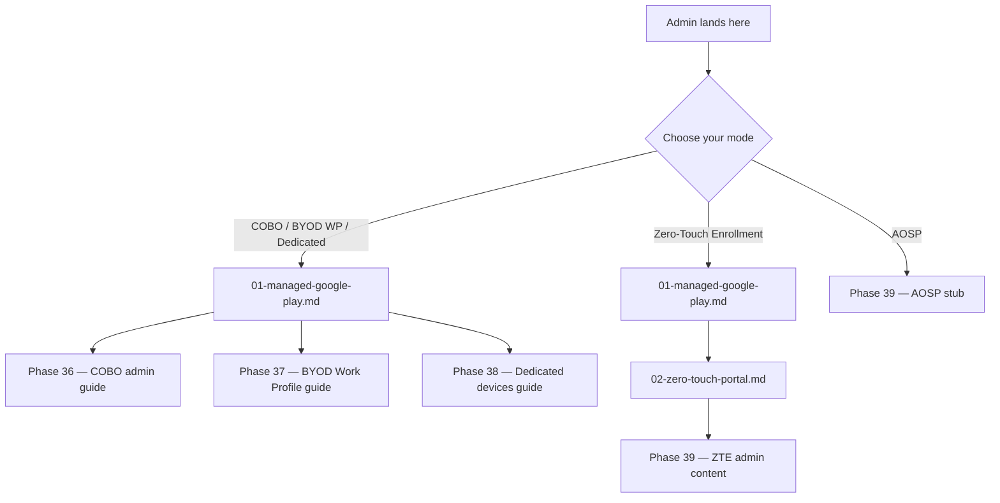

> **Platform gate:** This guide covers Android Enterprise admin setup across all enrollment modes: COBO (Fully Managed), BYOD Work Profile, Dedicated (COSU), Zero-Touch Enrollment (ZTE), and AOSP.
> For iOS/iPadOS admin setup, see [iOS Admin Setup Guides](../admin-setup-ios/00-overview.md).
> For macOS ADE setup, see [macOS Admin Setup Guides](../admin-setup-macos/00-overview.md).
> For Android terminology, see the [Android Enterprise Provisioning Glossary](../_glossary-android.md).

# Android Enterprise Admin Setup

This overview routes Intune administrators to the correct Android Enterprise admin setup path. Android Enterprise management depends on a tri-portal surface — the Intune admin center, Managed Google Play (MGP), and the Zero-Touch portal (ZT portal) — and which portals an admin must configure depends entirely on the chosen enrollment mode. Corporate-owned fully managed deployments (COBO), BYOD Work Profile, and Dedicated devices all converge through MGP binding; Zero-Touch Enrollment (ZTE) adds the ZT portal on top of MGP; AOSP uses neither portal. Choose a mode from the diagram below, then follow the guide for that mode.

For help choosing an enrollment mode, see the [Android Enterprise Enrollment Overview](../android-lifecycle/00-enrollment-overview.md) (five-mode comparison on ownership × management-scope axes) and the [Android Enterprise Prerequisites](../android-lifecycle/01-android-prerequisites.md) concept-only orientation. This page assumes the mode choice has been made.

## Setup Sequence

The diagram below shows every Android Enterprise admin setup path. Each branch from "Choose your mode" converges on the portal(s) required for that mode, then terminates at the mode-specific admin guide (authored in Phase 36–39). Read down the branch that matches your chosen mode; each leaf names the downstream admin guide that covers enrollment profile creation, app and policy assignment, and compliance for that mode.

1. **[Managed Google Play Binding](01-managed-google-play.md)** — Bind the Intune tenant to Managed Google Play using an Entra account. Required for all GMS modes (COBO, BYOD WP, Dedicated, ZTE). Complete before any GMS enrollment profile.

2. **[Zero-Touch Portal Configuration](02-zero-touch-portal.md)** — Configure the Zero-Touch portal account and DPC extras JSON, and link ZT to Intune. Required for ZTE only. Reseller relationship (Step 0) must be in place before this guide.

## Prerequisites

Each admin path has its own prerequisite set. Determine your path from the diagram above, then confirm the prerequisites for that path.

### GMS-Path Prerequisites

For COBO, BYOD Work Profile, and Dedicated enrollments:

- [ ] **Managed Google Play binding** — Complete [01-managed-google-play.md](01-managed-google-play.md) before any GMS enrollment profile.
- [ ] **Intune Administrator role** — Or custom RBAC role with enrollment management permissions.
- [ ] **Microsoft Intune Plan 1** (or higher) subscription.
- [ ] **Entra tenant active** — Required for Entra-preferred MGP binding (since August 2024).

### ZTE-Path Prerequisites

All GMS-path prerequisites PLUS:

- [ ] **Authorized Zero-Touch reseller relationship** — Devices must have been purchased from an authorized reseller. See [02-zero-touch-portal.md#step-0-reseller](02-zero-touch-portal.md#step-0-reseller).
- [ ] **Zero-Touch portal Google account** — Corporate email (NOT Gmail). Created at `accounts.google.com/signupwithoutgmail`.
- [ ] **ZT portal linked to Intune** — See [02-zero-touch-portal.md#link-zt-to-intune](02-zero-touch-portal.md#link-zt-to-intune).

### AOSP-Path Prerequisites

- [ ] **Intune Administrator role**
- [ ] **Microsoft Intune Plan 1** — Verify if Plan 2 / Intune Suite required per OEM; specialized AR/VR devices may require higher licensing. See [Phase 39 AOSP stub](06-aosp-stub.md) for OEM-specific licensing details.
- [ ] **Device is on AOSP-supported OEM list** — See [Phase 39 AOSP stub](06-aosp-stub.md) for the OEM compatibility list.

### Shared Prerequisites (All Paths)

- [ ] **Microsoft Intune Plan 1** (or higher) subscription.
- [ ] **Intune Administrator role** in Microsoft Intune admin center.
- [ ] **Active Entra tenant**.

## Portal Navigation Note

**Use `https://endpoint.microsoft.com` as the browser entry point for the Intune admin center.** The older `https://intune.microsoft.com` address remains active but may cause browser security zone mismatches during the Managed Google Play binding redirect flow (see [01-managed-google-play.md#what-breaks](01-managed-google-play.md#what-breaks) for the full what-breaks table covering this case).

Portal paths in these guides reflect the current documented experience. If menu locations differ:

- Look for equivalent options under **Devices** > **By platform** > **Android** > **Device onboarding** > **Enrollment**.
- Portal navigation may vary by Intune admin center version and tenant rollout timing.

## See Also

- [Managed Google Play Binding](01-managed-google-play.md)
- [Zero-Touch Portal Configuration](02-zero-touch-portal.md)
- [Android Enterprise Prerequisites](../android-lifecycle/01-android-prerequisites.md)
- [Android Enterprise Enrollment Overview](../android-lifecycle/00-enrollment-overview.md)
- [Android Provisioning Methods](../android-lifecycle/02-provisioning-methods.md)
- [Android Version Matrix](../android-lifecycle/03-android-version-matrix.md)
- [Android Enterprise Provisioning Glossary](../_glossary-android.md)

## Changelog

| Date | Change | Author |
|------|--------|--------|
| 2026-04-21 | Initial version — tri-portal setup sequence, 5-mode mermaid, per-path prerequisites, Portal Navigation Note | -- |
