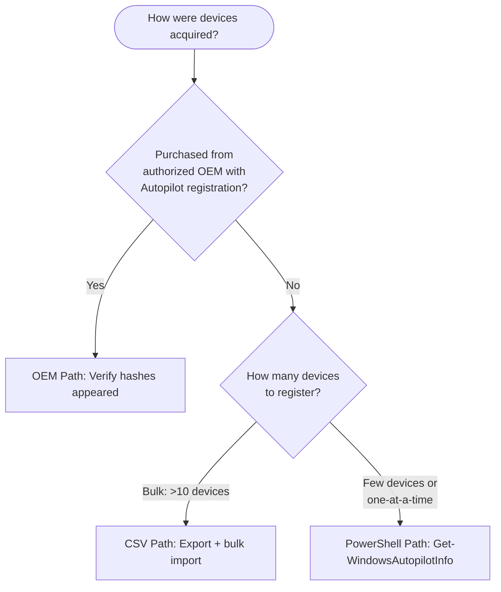

> **Version gate:** This guide covers Windows Autopilot (classic).
> For Autopilot Device Preparation (APv2), see [APv2 Admin Setup Guides](../admin-setup-apv2/00-overview.md).
> For framework selection, see [APv1 vs APv2](../apv1-vs-apv2.md).

# Hardware Hash Upload

Every Windows Autopilot (classic) deployment begins with registering devices by uploading their hardware hashes to your Intune tenant. The hash uniquely identifies each device and is required before any deployment profile can be assigned. Use the decision tree below to determine which upload path applies to your scenario.



## Prerequisites

- Intune Administrator or Autopilot Administrator role
- Devices powered on and network-connected (for PowerShell direct upload path)
- For CSV path: access to existing CSV export or physical device to generate hash

## Path 1: OEM Delivery

When devices are purchased from an authorized OEM with Autopilot registration included, the OEM uploads hardware hashes directly to your tenant. Your role is verification only.

### Steps

1. Navigate to **Intune admin center** > **Devices** > **Windows** > **Enrollment** > **Windows Autopilot** > **Devices**.
2. Search by serial number to locate the device.
3. Confirm the device appears with a populated **ZTDID** column.
4. Confirm **Profile Status** shows the expected state (Unassigned or the assigned profile name).
5. If the device is missing, contact your procurement team to confirm Autopilot registration was included in the purchase order.

> **What breaks if misconfigured:** Admin sees device not in the Autopilot device list. End user sees standard Windows OOBE instead of the Autopilot experience. See: [Device Not Registered](../l1-runbooks/01-device-not-registered.md)

## Path 2: CSV Bulk Import

Use CSV import when registering multiple devices at once. The CSV file must follow strict formatting requirements -- encoding errors are the #1 cause of import failures.

### Prerequisites

- CSV file must be in **ANSI encoding** (NOT UTF-8, NOT Unicode). This is the most common import failure cause.
- Do **NOT** open the CSV in Excel. Excel reformats columns and breaks the file silently.

### CSV Format

Required columns (case-sensitive): `Device Serial Number,Windows Product ID,Hardware Hash`

Optional columns: `Group Tag,Assigned User`

Rules:
- No extra columns beyond the five above
- No quotation marks around values
- Maximum 500 devices per CSV file
- One header row followed by one row per device

### Steps

1. Navigate to **Intune admin center** > **Devices** > **Windows** > **Enrollment** > **Windows Autopilot** > **Devices** > **Import**.
2. Select the CSV file.
3. Wait for import completion (up to 15 minutes for large batches).
4. Verify devices appear in the device list with populated ZTDIDs.

### Import Error Reference

| Error | Meaning | Resolution |
|-------|---------|------------|
| ZtdDeviceAssignedToAnotherTenant | Hash already registered in a different tenant | Remove from the original tenant first, then re-import |
| ZtdDeviceAlreadyAssigned | Device already registered in this tenant | No action needed -- device is already registered |
| ZtdDeviceDuplicated | Duplicate rows in the CSV file | Remove duplicate entries and re-import |
| InvalidZtdHardwareHash | Missing manufacturer or serial number in hash | Re-capture hash from the device |
| Incorrect header / silent failure | CSV is not ANSI-encoded | Re-save as ANSI encoding in Notepad (Save As > Encoding: ANSI) |

> **What breaks if misconfigured:** Admin sees import errors or devices not appearing after import. End user sees standard Windows OOBE instead of Autopilot. See: [Device Not Registered](../l1-runbooks/01-device-not-registered.md)

> **What breaks if misconfigured:** CSV opened in Excel before import -- column formatting is silently corrupted. Admin sees "incorrect header" or partial import. See: [Device Not Registered](../l1-runbooks/01-device-not-registered.md)

## Path 3: PowerShell Script (Get-WindowsAutopilotInfo)

Use the PowerShell script for individual device registration or when physical access to the device is available. This is the most hands-on path and the most error-prone -- follow the TLS and execution policy steps exactly.

### Prerequisites

- Physical access to the device (or remote PowerShell session)
- PowerShell 5.1 or later
- Internet connectivity
- Intune Administrator credentials (for the `-Online` direct upload option)

### Option A: Save Hash Locally as CSV

Run these commands on the target device in an elevated PowerShell prompt:

```powershell
[Net.ServicePointManager]::SecurityProtocol = [Net.SecurityProtocolType]::Tls12
New-Item -Type Directory -Path "C:\HWID"
Set-Location -Path "C:\HWID"
$env:Path += ";C:\Program Files\WindowsPowerShell\Scripts"
Set-ExecutionPolicy -Scope Process -ExecutionPolicy RemoteSigned
Install-Script -Name Get-WindowsAutopilotInfo
Get-WindowsAutopilotInfo -OutputFile AutopilotHWID.csv
```

Output: `C:\HWID\AutopilotHWID.csv` -- upload this file using the CSV Import path above.

### Option B: Direct Upload to Intune

Run these commands on the target device in an elevated PowerShell prompt:

```powershell
[Net.ServicePointManager]::SecurityProtocol = [Net.SecurityProtocolType]::Tls12
Set-ExecutionPolicy -Scope Process -ExecutionPolicy RemoteSigned
Install-Script -Name Get-WindowsAutopilotInfo -Force
Get-WindowsAutopilotInfo -Online
```

When prompted, sign in with an Intune Administrator account. Agree to the NuGet and PSGallery installation prompts when they appear.

### Common Errors

> **What breaks if misconfigured:** Execution policy blocks script. Admin sees red error text: "running scripts is disabled on this system." Fix: the `Set-ExecutionPolicy -Scope Process` command above is process-scoped only (no machine-wide impact). Run it before `Install-Script`. See: [Device Not Registered](../l1-runbooks/01-device-not-registered.md)

> **What breaks if misconfigured:** NuGet provider "no match found" error. `Install-Script` fails because TLS 1.2 is not set. Fix: the `[Net.ServicePointManager]::SecurityProtocol` line **must** be the first command in the session. See: [Device Not Registered](../l1-runbooks/01-device-not-registered.md)

> **What breaks if misconfigured:** Graph authentication errors. The `-Online` flag uses Microsoft Graph PowerShell modules (updated July 2023, not the deprecated AzureAD module). May require approving enterprise app permissions on first run. Admin sees authentication popup that errors. See: [Device Not Registered](../l1-runbooks/01-device-not-registered.md)

> **What breaks if misconfigured:** Stale hash from reimaged device. Hash must be captured from the final hardware state -- hardware changes, BIOS updates, or driver updates after capture invalidate the hash. Admin sees device registered but end user sees standard OOBE instead of Autopilot. See: [Device Not Registered](../l1-runbooks/01-device-not-registered.md)

## Verification

After uploading via any path, confirm registration:

- [ ] Device appears in **Intune admin center** > **Devices** > **Windows** > **Enrollment** > **Windows Autopilot** > **Devices**
- [ ] ZTDID column is populated
- [ ] Profile Status shows expected state (Unassigned if no profile yet, or the profile name if assigned)

## Configuration-Caused Failures

| Misconfiguration | Symptom | Runbook |
|------------------|---------|---------|
| CSV not ANSI-encoded (UTF-8 or Unicode used) | Import fails silently or "incorrect header" error | [Device Not Registered](../l1-runbooks/01-device-not-registered.md) |
| CSV edited in Excel before import | Column format corrupted; import fails or partial import | [Device Not Registered](../l1-runbooks/01-device-not-registered.md) |
| Hash captured before hardware/BIOS change | Stale hash; device not recognized at OOBE | [Device Not Registered](../l1-runbooks/01-device-not-registered.md) |
| Device hash registered in another tenant | ZtdDeviceAssignedToAnotherTenant error | [Device Not Registered](../l1-runbooks/01-device-not-registered.md) |
| TLS 1.2 not set before Install-Script | NuGet provider "no match found" error | [Device Not Registered](../l1-runbooks/01-device-not-registered.md) |
| Missing OEM registration in purchase order | Device not in Autopilot list; standard OOBE runs | [Device Not Registered](../l1-runbooks/01-device-not-registered.md) |

## See Also

- [Hardware Hash Lifecycle Stage](../lifecycle/01-hardware-hash.md)
- [APv1 vs APv2 Comparison](../apv1-vs-apv2.md)

---
*Next step: [Deployment Profile](02-deployment-profile.md)*
