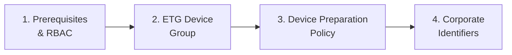

> **Version gate:** This guide covers Autopilot Device Preparation (APv2).
> For Windows Autopilot (classic), see [APv1 Admin Setup Guides](../admin-setup-apv1/00-overview.md).
> For framework selection, see [APv1 vs APv2](../apv1-vs-apv2.md).

# APv2 Admin Setup: Complete Configuration Guide

This guide walks Intune administrators through configuring a complete APv2 (Device Preparation) deployment from scratch. The setup must be completed in order -- each step depends on the previous one being complete and correct. Before starting, review the [APv2 Overview](../lifecycle-apv2/00-overview.md) to understand the Enrollment Time Grouping model that drives APv2 enrollment.

## Before You Begin

- **Device-level prerequisites** (OS version, licensing, networking, hardware): See [APv2 Prerequisites Checklist](../lifecycle-apv2/01-prerequisites.md). This guide covers admin configuration prerequisites only -- device readiness is covered separately.
- **APv1 deregistration:** If any target devices are currently registered with Windows Autopilot (APv1 classic), they must be deregistered before configuring APv2. APv1 silently takes precedence when both registrations exist -- the device enters the APv1 ESP flow instead of the APv2 Device Preparation experience with no error shown.

## Setup Sequence

Complete these steps in order. Each guide includes a verification checklist and a "What breaks if misconfigured" callout for every configurable setting.

1. **[Prerequisites and RBAC Role](01-prerequisites-rbac.md)** -- Verify admin-level prerequisites (APv1 deregistration, licensing, auto-enrollment, Entra join permissions) and create a custom RBAC role with all five required permission categories. This must be complete before any other configuration step.

2. **[Enrollment Time Grouping Device Group](02-etg-device-group.md)** -- Create the ETG security group, add the Intune Provisioning Client (AppID: `f1346770-5b25-470b-88bd-d5744ab7952c`) as the group owner, and assign apps and scripts to the group. The ETG group is the core object that all subsequent setup depends on.

3. **[Device Preparation Policy](03-device-preparation-policy.md)** -- Create and configure the Device Preparation policy: select the ETG device group, assign the user group, configure deployment settings, select apps and scripts for installation during OOBE, and set timeout and error behavior.

4. **[Corporate Identifiers](04-corporate-identifiers.md)** -- Configure corporate device identifiers and understand the enrollment restriction interaction. This step is conditional -- required only if enrollment restrictions block personal device enrollment in your organization.

## See Also

- [APv2 Overview](../lifecycle-apv2/00-overview.md)
- [APv2 Deployment Flow](../lifecycle-apv2/02-deployment-flow.md)
- [APv1 vs APv2 Comparison](../apv1-vs-apv2.md)
- [APv2 Failure Catalog](../error-codes/06-apv2-device-preparation.md)

---
*Next step: [Prerequisites and RBAC Role](01-prerequisites-rbac.md)*
