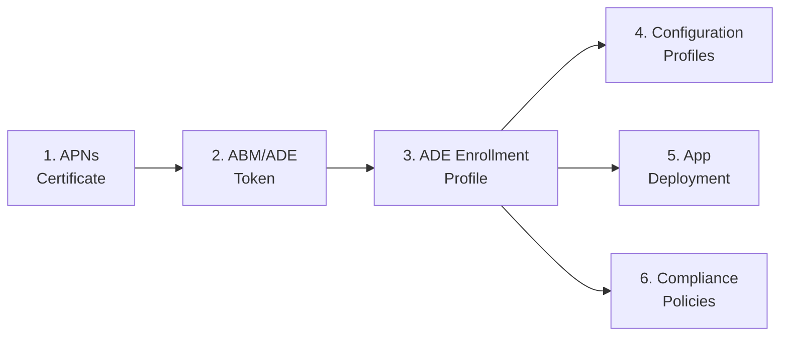

> **Platform gate:** This guide covers iOS/iPadOS ADE configuration via Apple Business Manager and Intune.
> For macOS ADE setup, see [macOS Admin Setup Guides](../admin-setup-macos/00-overview.md).
> For iOS/iPadOS enrollment terminology, see the [Apple Provisioning Glossary](../_glossary-macos.md).

# iOS/iPadOS Admin Setup: Corporate ADE Configuration and Device Management

This guide walks Intune administrators through iOS/iPadOS Automated Device Enrollment prerequisites plus the core post-enrollment admin tasks: configuration profiles, app deployment, and compliance policies. Complete the guides in order -- each is a prerequisite for the next.

## Setup Sequence

1. **[APNs Certificate](01-apns-certificate.md)** -- Create and maintain the Apple Push Notification certificate that enables all Apple MDM communication. This certificate is shared infrastructure -- one expired certificate breaks iOS, iPadOS, AND macOS management simultaneously.

2. **[ABM/ADE Token](02-abm-token.md)** -- Configure the enrollment program token linking Apple Business Manager to Intune for iOS/iPadOS device syncing. Shared portal steps cross-reference the macOS ABM guide; only iOS-specific differences are documented inline.

3. **[ADE Enrollment Profile](03-ade-enrollment-profile.md)** -- Create the enrollment profile that configures supervised mode, authentication method, Setup Assistant customization, and locked enrollment for corporate iOS/iPadOS devices.

4. **[Configuration Profiles](04-configuration-profiles.md)** — Deploy Wi-Fi, VPN, Email, Certificates, Device Restrictions (with supervised-only callouts per category), and Home Screen Layout. Configuration profiles enforce settings; compliance policies detect non-compliance.

5. **[App Deployment](05-app-deployment.md)** — Deploy iOS/iPadOS apps via VPP (device-licensed or user-licensed), LOB (.ipa), or Store apps without VPP. Silent install requires supervised mode AND device licensing.

6. **[Compliance Policies](06-compliance-policy.md)** — Configure OS version gates, jailbreak detection, passcode requirements, and Actions for Noncompliance. Includes dedicated Conditional Access timing section covering the enrollment-to-first-evaluation window.

## Prerequisites

Before starting the iOS/iPadOS ADE configuration guides:

- [ ] **Apple Push Notification certificate Apple ID** -- A company email address Apple ID (NOT a personal Apple ID). As a best practice, use a distribution list monitored by more than one person.
- [ ] **Apple Business Manager account** -- A Managed Apple ID with Device Manager or Administrator role in ABM.
- [ ] **Intune Administrator role** -- Or a custom RBAC role with enrollment management permissions.
- [ ] **Microsoft Intune Plan 1** (or higher) subscription.
- [ ] **iOS/iPadOS enrollment path selected** -- Confirm ADE is the appropriate path for your deployment. See [Enrollment Path Overview](../ios-lifecycle/00-enrollment-overview.md).

## Portal Navigation Note

The Intune admin center is actively rolling out updated navigation for enrollment configuration. Portal paths referenced in these guides reflect the current documented experience. If menu locations differ from what is described:

- Look for equivalent options under **Devices** > **Device onboarding** > **Enrollment** > **Apple** tab.
- The settings and their effects remain the same regardless of navigation path.
- Portal navigation may vary by Intune admin center version and tenant rollout timing.

## Cross-Platform References

- [macOS Admin Setup Guides](../admin-setup-macos/00-overview.md) -- macOS ADE configuration (shared ABM portal steps)
- [iOS/iPadOS Enrollment Path Overview](../ios-lifecycle/00-enrollment-overview.md) -- Enrollment type comparison and supervision concept
- [iOS/iPadOS ADE Lifecycle](../ios-lifecycle/01-ade-lifecycle.md) -- End-to-end ADE enrollment pipeline

## See Also

- [iOS/iPadOS ADE Lifecycle](../ios-lifecycle/01-ade-lifecycle.md)
- [Apple Provisioning Glossary](../_glossary-macos.md)
- [Windows APv1 Admin Setup](../admin-setup-apv1/00-overview.md)
- [macOS Admin Setup](../admin-setup-macos/00-overview.md)

---
*Next step: [APNs Certificate](01-apns-certificate.md)*

---

| Date | Change | Author |
|------|--------|--------|
| 2026-04-16 | Extended overview to include Phase 28 guides 04/05/06 and updated Mermaid diagram to 6-node graph | -- |
| 2026-04-16 | Initial version -- iOS admin setup overview with Mermaid diagram and 3-guide setup sequence | -- |
