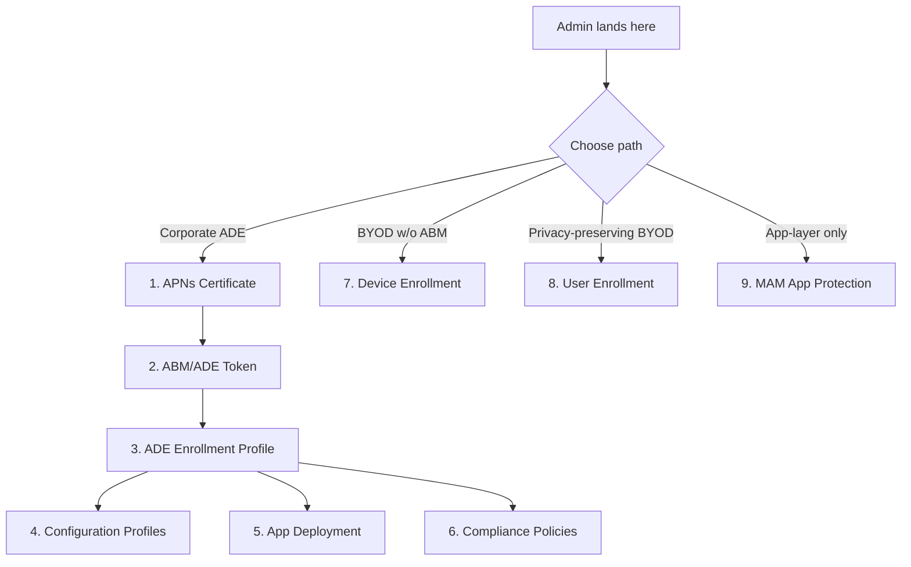

> **Platform gate:** This guide covers iOS/iPadOS admin setup across all enrollment paths: corporate ADE, Device Enrollment, account-driven User Enrollment, and MAM-WE.
> For macOS ADE setup, see [macOS Admin Setup Guides](../admin-setup-macos/00-overview.md).
> For iOS/iPadOS enrollment terminology, see the [Apple Provisioning Glossary](../_glossary-macos.md).

# iOS/iPadOS Admin Setup

This overview routes Intune administrators to the correct iOS/iPadOS admin setup path. Corporate devices purchased through Apple Business Manager follow the Automated Device Enrollment (ADE) chain (guides 01-06). Personal-device and non-ABM paths — Device Enrollment (diagram: "BYOD w/o ABM"), account-driven User Enrollment (diagram: "Privacy-preserving BYOD"), and app-layer MAM-WE (diagram: "App-layer only") — are parallel alternatives, each with its own prerequisites and trade-offs. Choose a path from the diagram below, then follow the guide for that path.

## Setup Sequence

1. **[APNs Certificate](01-apns-certificate.md)** -- Create and maintain the Apple Push Notification certificate that enables all Apple MDM communication. This certificate is shared infrastructure -- one expired certificate breaks iOS, iPadOS, AND macOS management simultaneously.

2. **[ABM/ADE Token](02-abm-token.md)** -- Configure the enrollment program token linking Apple Business Manager to Intune for iOS/iPadOS device syncing. Shared portal steps cross-reference the macOS ABM guide; only iOS-specific differences are documented inline.

3. **[ADE Enrollment Profile](03-ade-enrollment-profile.md)** -- Create the enrollment profile that configures supervised mode, authentication method, Setup Assistant customization, and locked enrollment for corporate iOS/iPadOS devices.

4. **[Configuration Profiles](04-configuration-profiles.md)** — Deploy Wi-Fi, VPN, Email, Certificates, Device Restrictions (with supervised-only callouts per category), and Home Screen Layout. Configuration profiles enforce settings; compliance policies detect non-compliance.

5. **[App Deployment](05-app-deployment.md)** — Deploy iOS/iPadOS apps via VPP (device-licensed or user-licensed), LOB (.ipa), or Store apps without VPP. Silent install requires supervised mode AND device licensing.

6. **[Compliance Policies](06-compliance-policy.md)** — Configure OS version gates, jailbreak detection, passcode requirements, and Actions for Noncompliance. Includes dedicated Conditional Access timing section covering the enrollment-to-first-evaluation window.

7. **[Device Enrollment](07-device-enrollment.md)** — Company Portal and web-based enrollment flows for personal and corporate iOS/iPadOS devices without ABM. Covers capabilities available without supervision and personal-vs-corporate ownership-flag behavior. No ABM token required.

8. **[User Enrollment](08-user-enrollment.md)** — Account-driven User Enrollment for privacy-preserving BYOD. IT manages only work apps and data within a managed APFS volume; personal apps, data, and device-level attributes remain outside Intune's management scope. Profile-based User Enrollment is deprecated and not available for new enrollments.

9. **[MAM App Protection](09-mam-app-protection.md)** — Microsoft Intune app protection policies (MAM-WE) protect work data inside SDK-integrated apps without enrolling the device. Covers the three-level data protection framework, dual-targeting for enrolled and unenrolled devices, iOS-specific behaviors, and selective wipe. Standalone — does not require reading any MDM enrollment guide.

## Prerequisites

Each enrollment path has its own prerequisite set. Determine your path from the diagram above, then confirm the prerequisites for that path.

### ADE-Path Prerequisites

For corporate ADE deployments (guides 01-06):

- [ ] **Apple Push Notification certificate Apple ID** — A company email address Apple ID (NOT a personal Apple ID). As a best practice, use a distribution list monitored by more than one person.
- [ ] **Apple Business Manager account** — A Managed Apple ID with Device Manager or Administrator role in ABM.
- [ ] **Intune Administrator role** — Or a custom RBAC role with enrollment management permissions.
- [ ] **Microsoft Intune Plan 1** (or higher) subscription.
- [ ] **iOS/iPadOS enrollment path = ADE confirmed** — See [Enrollment Path Overview](../ios-lifecycle/00-enrollment-overview.md).

### BYOD-Path Prerequisites

For non-ABM enrollment and MAM-WE deployments (guides 07, 08, 09):

- [ ] **APNs certificate active** — Required for Device Enrollment ([07-device-enrollment.md](07-device-enrollment.md)) and account-driven User Enrollment ([08-user-enrollment.md](08-user-enrollment.md)). Not required for MAM-WE ([09-mam-app-protection.md](09-mam-app-protection.md)).
- [ ] **Managed Apple ID considerations reviewed** — Required for account-driven User Enrollment. See [User Enrollment guide](08-user-enrollment.md) for the distinction between Managed Apple ID and personal Apple ID.
- [ ] **Microsoft 365 licensing baseline** — Required for MAM-WE app protection policies (Intune Plan 1 or higher).
- [ ] **Intune Administrator role** — Or a custom RBAC role with enrollment management permissions.

## Portal Navigation Note

The Intune admin center is actively rolling out updated navigation for enrollment configuration. Portal paths referenced in these guides reflect the current documented experience. If menu locations differ from what is described:

- Look for equivalent options under **Devices** > **Device onboarding** > **Enrollment** > **Apple** tab.
- The settings and their effects remain the same regardless of navigation path.
- Portal navigation may vary by Intune admin center version and tenant rollout timing.

## Intune Enrollment Restrictions

Intune enrollment restrictions apply tenant-wide to iOS/iPadOS enrollment and are shared across all non-ADE paths (Device Enrollment and User Enrollment). Corporate ADE enrollment is subject to the same tenant-level settings in addition to its own ADE-profile-specific controls. Configure restrictions before end users begin enrolling.

### Platform Filtering

Intune can allow or block iOS/iPadOS enrollment at the tenant level and per-user-group. Settings live at **Devices** > **Enrollment** > **Enrollment device platform restrictions** > **iOS/iPadOS restrictions**. A platform-blocked tenant cannot enroll new iOS/iPadOS devices via any path (Device Enrollment, User Enrollment, or ADE). Policy changes apply at next device check-in; in-progress enrollments complete.

### Personal vs Corporate Ownership Flag

Every enrolled iOS/iPadOS device carries an Intune ownership designation of **Personal** or **Corporate** that affects wipe and retire behavior, compliance-evaluation scope, and default personal-data-protection posture. The designation is set automatically by the enrollment path (ADE → Corporate; Device Enrollment → administrator-configurable; User Enrollment → Personal by default). Device Enrollment administrators can mark devices as Corporate via the device-identifier-upload feature (IMEI, serial number, or Apple ID). See [Device Enrollment guide § Ownership Flag](07-device-enrollment.md) for implementation mechanics.

### Per-User Device Limits

Intune enforces a per-user device limit (default 5; configurable 1-15) across all enrollment paths. When a user exceeds their limit, additional enrollments fail with a user-visible "device cap reached" error. Settings live at **Devices** > **Enrollment** > **Device limit restrictions**.

### Enrollment-Type Blocking

Tenant administrators can block specific enrollment types at the policy layer: block personal-owned devices (Device Enrollment), block account-driven User Enrollment, or block the legacy profile-based User Enrollment flow. Settings live at **Devices** > **Enrollment** > **Enrollment device platform restrictions** > **iOS/iPadOS restrictions** > **Personally owned**. Blocking Device Enrollment does not affect ADE or MAM-WE.

## Cross-Platform References

- [macOS Admin Setup Guides](../admin-setup-macos/00-overview.md) -- macOS ADE configuration (shared ABM portal steps)
- [iOS/iPadOS Enrollment Path Overview](../ios-lifecycle/00-enrollment-overview.md) -- Enrollment type comparison and supervision concept
- [iOS/iPadOS ADE Lifecycle](../ios-lifecycle/01-ade-lifecycle.md) -- End-to-end ADE enrollment pipeline

## See Also

- [iOS/iPadOS Enrollment Path Overview](../ios-lifecycle/00-enrollment-overview.md) — Conceptual path overview and supervision boundary
- [iOS/iPadOS ADE Lifecycle](../ios-lifecycle/01-ade-lifecycle.md) — End-to-end ADE enrollment pipeline
- [Device Enrollment](07-device-enrollment.md) — BYOD/non-ABM enrollment
- [User Enrollment](08-user-enrollment.md) — Privacy-preserving account-driven enrollment
- [MAM App Protection](09-mam-app-protection.md) — App-layer protection without device enrollment
- [Apple Provisioning Glossary](../_glossary-macos.md)
- [Windows APv1 Admin Setup](../admin-setup-apv1/00-overview.md)
- [macOS Admin Setup](../admin-setup-macos/00-overview.md)

---
*Next step: Choose your path — [APNs Certificate](01-apns-certificate.md) for corporate ADE, [Device Enrollment](07-device-enrollment.md) for BYOD without ABM, [User Enrollment](08-user-enrollment.md) for privacy-preserving BYOD, or [MAM App Protection](09-mam-app-protection.md) for app-layer only.*

---

| Date | Change | Author |
|------|--------|--------|
| 2026-04-17 | Restructured to cover all iOS admin paths (ADE + Device Enrollment + User Enrollment + MAM-WE) — added BYOD-path prerequisites, Intune Enrollment Restrictions shared section, branching Mermaid path-selector diagram; `applies_to` widened from ADE to all | -- |
| 2026-04-16 | Extended overview to include Phase 28 guides 04/05/06 and updated Mermaid diagram to 6-node graph | -- |
| 2026-04-16 | Initial version -- iOS admin setup overview with Mermaid diagram and 3-guide setup sequence | -- |
