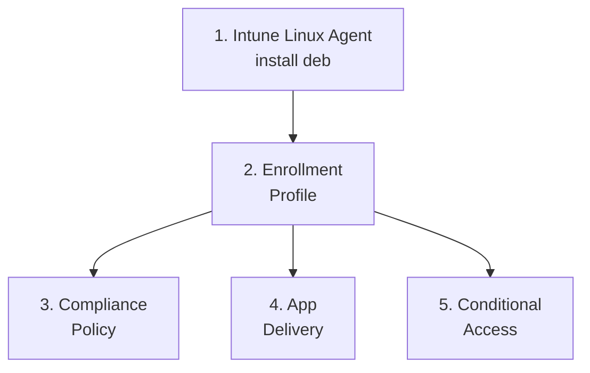

> **Platform gate:** This guide covers Linux device management in Microsoft Intune for Ubuntu 22.04 LTS and 24.04 LTS.
> For macOS ADE setup, see [macOS Admin Setup](../admin-setup-macos/00-overview.md).
> For Android Enterprise setup, see [Android Admin Setup](../admin-setup-android/00-overview.md).
> For Linux provisioning terminology, see the [Linux Provisioning Glossary](../_glossary-linux.md).
> For the locked Linux management surface (whitelist) + out-of-scope callouts, see [Linux Enrollment Overview](../linux-lifecycle/00-enrollment-overview.md#supported-management-surface).

# Linux Admin Setup Overview

This guide walks Intune administrators through configuring Linux device management in Microsoft Intune. Complete the guides in order — agent install and enrollment profile are prerequisites for all subsequent configuration.

> **For admins familiar with Windows, macOS, or Android:** see the cross-platform bridge subsection in [Linux Enrollment Overview](../linux-lifecycle/00-enrollment-overview.md#for-admins-familiar-with-windows--macos--android). That subsection covers what carries over and what does not from your existing Intune mental model.

## Setup Sequence

1. **[Intune Linux Agent](01-intune-linux-agent.md)** — Install the `intune-portal` deb package from `packages.microsoft.com` and configure the Microsoft Identity Broker.

2. **[Enrollment Profile](02-enrollment-profile.md)** — Verify Intune + Entra P1 licensing and configure user-initiated Linux enrollment.

3. **[Compliance Policy](03-compliance-policy.md)** — Configure 4 settings-catalog categories (Allowed Distributions, Custom Compliance, Device Encryption, Password Policy).

4. **[App Delivery](04-app-delivery.md)** — Script-based-only app delivery (no Win32/MSIX/.pkg analog).

5. **[Conditional Access](05-conditional-access.md)** — Web-app CA via Microsoft Edge for Linux 102.x+ (no device-level CA).

## Cross-Platform References

- [Linux Capability Matrix](../reference/linux-capability-matrix.md) — Win|Linux bilateral comparison; explicit "Not supported" cells; Cross-Platform Equivalences with 3 attributed pairs.
- [Linux Enrollment Overview — Cross-Platform Bridge](../linux-lifecycle/00-enrollment-overview.md#for-admins-familiar-with-windows--macos--android) — What carries over and what does not from your existing Windows / macOS / Android Intune mental model. Full path: `docs/linux-lifecycle/00-enrollment-overview.md#for-admins-familiar-with-windows--macos--android`
- [Linux Enrollment Overview](../linux-lifecycle/00-enrollment-overview.md) — Phase 49 management-surface whitelist + Out of Scope callout.
- [Linux Prerequisites](../linux-lifecycle/01-linux-prerequisites.md) — Ubuntu 22.04/24.04 LTS supported; Ubuntu 20.04 dropped from Intune 2508.

## See Also

- [Linux Provisioning Glossary](../_glossary-linux.md)
- [Linux Capability Matrix](../reference/linux-capability-matrix.md)
- [Linux Intune Portal Enrollment (end-user guide)](../end-user-guides/linux-intune-portal-enrollment.md)

---

| Date | Change | Author |
|------|--------|--------|
| 2026-04-27 | Initial version — Linux admin setup overview (Phase 50) | -- |
