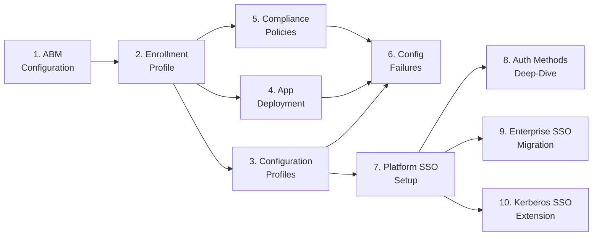

> **Platform gate:** This guide covers macOS ADE configuration via Apple Business Manager and Intune.
> For Windows Autopilot setup, see [Windows Admin Setup Guides](../admin-setup-apv1/00-overview.md).
> For macOS provisioning terminology, see the [macOS Glossary](../_glossary-macos.md).

# macOS Admin Setup: Complete Configuration Guide

This guide walks Intune administrators through configuring a complete macOS Automated Device Enrollment deployment from scratch. Complete the guides in order -- ABM configuration and enrollment profile are prerequisites for all subsequent configuration.

## Setup Sequence

1. **[ABM Configuration](01-abm-configuration.md)** -- Create ADE token in Apple Business Manager and Intune, assign devices to MDM server, configure token renewal. This must be complete before any enrollment profile can be created.

2. **[Enrollment Profile](02-enrollment-profile.md)** -- Configure enrollment profile with user affinity, authentication method, Await Configuration, locked enrollment, and Setup Assistant screen customization.

3. **[Configuration Profiles](03-configuration-profiles.md)** -- Deploy Wi-Fi, VPN, email, restrictions, FileVault, and firewall profiles via Settings Catalog. Configuration profiles enforce settings; compliance policies detect non-compliance.

4. **[App Deployment](04-app-deployment.md)** -- Deploy macOS apps via DMG, PKG (managed and unmanaged), and VPP/Apps and Books with size limits, detection rules, and uninstall capabilities documented per type.

5. **[Compliance Policies](05-compliance-policy.md)** -- Configure compliance policies for SIP, FileVault, firewall, Gatekeeper, and password. Important: no Intune security baselines exist for macOS.

6. **[Configuration-Caused Failures Reference](06-config-failures.md)** -- Consolidated reverse-lookup table of all macOS admin setup misconfigurations with links to guide files and troubleshooting runbooks.

7. **[Platform SSO Setup](07-platform-sso-setup.md)** -- Configure macOS Platform SSO via the Settings Catalog `com.apple.extensiblesso` payload. Covers Entra prerequisites, the three silent bootstrapping blockers, dual-field mixed-fleet configuration, user-group assignment, and `app-sso platform -s` verification.

8. **[Auth Methods Deep-Dive](08-auth-methods-deep-dive.md)** -- Selection guide and deep-dive reference for all three Platform SSO authentication methods (Secure Enclave key [recommended], Password sync, Smart card) with FileVault interaction, dangerous misconceptions, Touch ID biometric policy, and Passkey/FIDO2 from the Platform Credential.

9. **[Enterprise SSO Plug-in & Migration Guide](09-enterprise-sso-plugin-migration.md)** -- Decision-first reference for mixed-fleet admins: product-name disambiguation (Microsoft Enterprise SSO plug-in vs Platform SSO vs legacy SSO app extension vs Kerberos SSO extension), migrate/keep/coexist decision matrix, staged migration sequence that avoids Error 10002, what breaks during migration, and the mandatory destructive rollback procedure.

10. **[Kerberos SSO Extension](10-kerberos-sso-extension.md)** -- Configure the Apple Kerberos SSO extension (`com.apple.AppSSOKerberos.KerberosExtension`, Type: Credential) via Intune Custom Template (.mobileconfig) for PSSO-integrated on-premises AD Kerberos authentication. Covers realm and Hosts payload, PSSO TGT sharing (`usePlatformSSOTGT`), and `app-sso platform -s` / `klist` diagnostics.

## Cross-Platform References

- [Capability Matrix](../reference/macos-capability-matrix.md) -- Intune feature parity gaps between macOS and Windows
- [Windows vs macOS Concept Comparison](../windows-vs-macos.md) -- Platform terminology mapping

## See Also

- [macOS ADE Lifecycle Overview](../macos-lifecycle/00-ade-lifecycle.md)
- [Windows APv1 Admin Setup](../admin-setup-apv1/00-overview.md)
- [Windows APv2 Admin Setup](../admin-setup-apv2/00-overview.md)

---
*Next step: [ABM Configuration](01-abm-configuration.md)*

---

| Date | Change | Author |
|------|--------|--------|
| 2026-06-20 | Phase 76: added guides 07/08/09 to Mermaid diagram and numbered list | -- |
| 2026-04-14 | Initial version -- macOS admin setup overview with Mermaid diagram and 6-guide setup sequence | -- |
| 2026-06-21 | Phase 77: converted `08-auth-methods-deep-dive.md` code-span to live link with description | -- |
| 2026-06-21 | Phase 78: converted guide-09 code-span to live link with description | -- |
| 2026-06-22 | Phase 83 (KRB-04): added guide 10 node to Mermaid diagram and item 10 to numbered list | -- |
