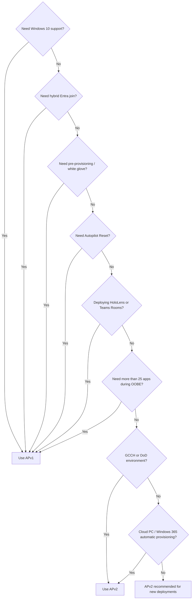

> **Version gate:** This guide compares both Autopilot frameworks.
> For APv2 (Device Preparation), see [APv2 Lifecycle Overview](lifecycle-apv2/00-overview.md).
> For APv1 (classic), see [APv1 Lifecycle Overview](lifecycle/00-overview.md).

# APv1 vs APv2: Which Autopilot Are You Troubleshooting?

Microsoft now maintains two distinct Autopilot frameworks: Windows Autopilot (APv1, the original classic framework) and Windows Autopilot Device Preparation (APv2, introduced for Windows 11). This page helps you determine which framework applies to your deployment so you follow the correct troubleshooting documentation. When in doubt, check whether hardware hash pre-staging was required to set up the device — that alone identifies APv1.

## Feature Comparison

| Feature | APv1 (Windows Autopilot) | APv2 (Device Preparation) |
|---------|--------------------------|--------------------------|
| Hardware hash registration required | Yes | No |
| Enrollment Status Page (ESP) | Yes (configured separately) | No (integrated into policy) |
| Pre-provisioning (white glove) | Yes | No |
| Self-deploying mode | Yes | No |
| Hybrid Entra join | Yes | No |
| Windows 10 support | Yes | No (Windows 11 only, 22H2+) |
| User-driven mode | Yes | Yes |
| Automatic deployment | No | Yes |
| Microsoft Entra join | Yes | Yes |
| GCCH / DoD environments | No | Yes |
| Win32 + LOB apps in same deployment | No | Yes |
| Near real-time monitoring | No | Yes |
| Max apps during OOBE | 100 | 25 |
| Device naming template | Yes | Yes (as of 2025) |
| Autopilot Reset support | Yes | No |
| HoloLens support | Yes | No |
| Teams Meeting Room support | Yes | No |
| Simpler admin configuration | No | Yes |
| Extensive OOBE customization | Yes | No |
| Blocks desktop until user config applied | Yes | No |

## Which Guide Do I Use?

**Use APv1 (Windows Autopilot) docs if:**
- You require pre-provisioning (white glove) before device delivery
- You need hybrid Entra join (simultaneous on-premises AD + Azure AD join)
- You need self-deploying mode for kiosks or shared/userless devices
- You are deploying to Windows 10 devices
- You require Autopilot Reset to re-provision already-deployed devices
- You are provisioning HoloLens or Teams Meeting Room devices

**Use APv2 (Device Preparation) docs if:**
- You want no hardware hash pre-staging (enroll devices without prior registration)
- You require GCCH or DoD cloud environment support
- You need Win32 apps and LOB apps to install in the same deployment
- You want near real-time deployment monitoring
- Your environment is Windows 11 22H2 or later (cloud-native, no on-premises AD)

**Note:** Both frameworks cannot run on the same device simultaneously. If both an APv1 profile and an APv2 policy exist in the tenant, the APv1 profile takes precedence.

## Important Notes

- "Extensive OOBE customization" (custom branding, skip screens, custom error messages) is APv1-only; APv2 offers limited OOBE customization.
- APv1 blocks the Windows desktop until device-targeted configuration is fully applied; APv2 does not block desktop access in the same way.
- This documentation suite primarily covers APv1 (classic). APv2-specific content is noted where applicable and will be expanded in a future documentation phase.

## Decision Flowchart

Use this flowchart to determine which Autopilot framework fits your deployment scenario.

If none of the APv1-only requirements apply, APv2 is recommended for new deployments due to simpler administration and no hardware hash pre-staging requirement.

## Migration Guidance (APv1 to APv2)

The following are high-level considerations for migrating devices from APv1 to APv2. This section orients administrators on what is involved — for step-by-step configuration, see the APv2 Admin Setup Guide (planned for Phase 15).

1. **No in-place migration exists.** A device currently deployed via APv1 cannot be switched to APv2 without re-enrollment. The device must go through OOBE again to pick up the APv2 Device Preparation policy.

2. **Deregister from Autopilot first.** The device must be removed from the Autopilot devices list (Intune admin center > Devices > Windows > Windows enrollment > Devices > select device > Delete). If the device is not deregistered, the APv1 profile silently takes precedence over the APv2 policy — no error is shown.

3. **APv1 and APv2 can coexist in a tenant.** Different devices can use different frameworks simultaneously. A gradual migration is possible: new devices use APv2 while existing devices remain on APv1 until they are refreshed or replaced.

4. **Plan the Enrollment Time Grouping (ETG) device group** before migrating any devices. The ETG security group must be pre-configured with the Intune Provisioning Client (AppID `f1346770-5b25-470b-88bd-d5744ab7952c`) as owner. Without this, devices will not be added to the group at enrollment time.

5. **Re-enroll devices through OOBE** after deregistration. The device will pick up the APv2 Device Preparation policy at next enrollment. Apps and scripts assigned to the ETG device group deploy during the OOBE experience.

For step-by-step APv2 configuration, see the APv2 Admin Setup Guide (planned for Phase 15). For APv2 prerequisites, see [APv2 Prerequisites](lifecycle-apv2/01-prerequisites.md).

---

*Feature comparison sourced from [Microsoft Learn](https://learn.microsoft.com/en-us/autopilot/device-preparation/compare), verified April 2026. Decision flowchart derived from official comparison criteria.*
