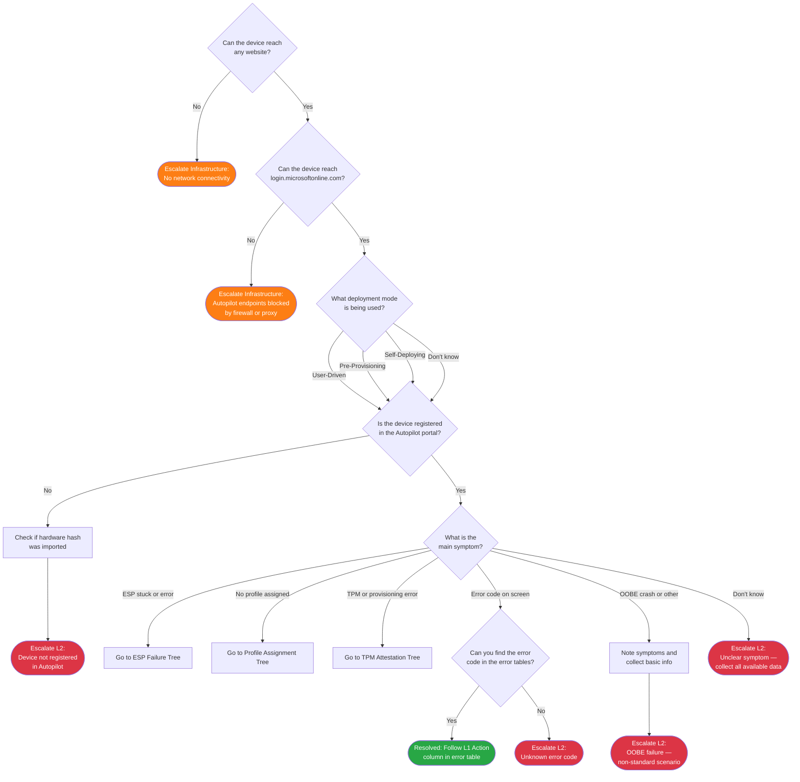

> **Version gate:** This guide covers Windows Autopilot (classic). For Device Preparation (APv2), see [APv1 vs APv2 disambiguation](../apv1-vs-apv2.md).
> **macOS:** For macOS ADE troubleshooting, see [macOS ADE Triage](06-macos-triage.md).
> **iOS/iPadOS:** For iOS/iPadOS troubleshooting, see [iOS Triage](07-ios-triage.md).

# Initial Triage Decision Tree

## How to Use These Trees

Start here when a user reports an [Autopilot](../_glossary.md#autopilot) deployment issue. Follow each decision point, answering the question shown using only what you can observe on the device screen or look up in the Intune admin center. The tree will route you to a specific scenario tree or to an escalation point with data collection instructions.

> **Note:** These decision trees cover Autopilot (classic / APv1). For Device Preparation (APv2) issues, see the [APv2 Device Preparation Triage Tree](04-apv2-triage.md).

## Legend

| Symbol | Meaning |
|--------|---------|
| Diamond `{...}` | Decision — answer the question shown |
| Rectangle `[...]` | Action — perform this step before continuing |
| Green rounded `([...])` | Resolved — issue is fixed or within expected parameters |
| Red rounded `([...])` | Escalate to L2 — collect data listed in Escalation Data table and hand off |
| Orange rounded `([...])` | Escalate to Infrastructure/Network — collect data listed in Escalation Data table and hand off |

## Scenario Trees

Use these links after this triage tree routes you to a specific scenario:

- [ESP Failure Tree](01-esp-failure.md) — [ESP](../_glossary.md#esp) (Enrollment Status Page) stuck or showing errors
- [Profile Assignment Tree](02-profile-assignment.md) — No profile assigned or wrong profile applied to device
- [TPM Attestation Tree](03-tpm-attestation.md) — [TPM](../_glossary.md#tpm) errors during pre-provisioning or self-deploying mode
- [APv2 Device Preparation Triage](04-apv2-triage.md) — APv2 (Device Preparation) deployment failure routing
- [iOS Triage](07-ios-triage.md) — iOS/iPadOS failure routing

## Decision Tree

## How to Check

| Node | Check | Where to Look |
|------|-------|---------------|
| TRD1 | Can the device reach any website? | Open a browser on the device and navigate to any public website (for example, google.com or microsoft.com). If the page loads, answer Yes. If the browser shows a connection error or times out, answer No. |
| TRD2 | Can the device reach login.microsoftonline.com? | In the same browser, navigate to `https://login.microsoftonline.com`. The page should load the Microsoft sign-in page without errors. If the page does not load or shows a certificate error, answer No — this indicates Autopilot endpoints may be blocked. |
| TRD3 | What deployment mode is being used? | Ask the user or check the deployment documentation for this device. User-driven mode requires the user to sign in at [OOBE](../_glossary.md#oobe). Pre-provisioning (white glove) is technician-initiated — the technician presses the Windows key five times at the OOBE language screen. Self-deploying starts automatically with no user interaction. If the mode is not known, answer Don't know and proceed — note it for escalation data. |
| TRD4 | Is the device registered in the Autopilot portal? | Open Intune admin center > Devices > Windows > Enrollment > Windows Autopilot devices. Search by device serial number. If the device appears with any status, answer Yes. If not found, answer No. |
| TRD5 | What is the main symptom? | Observe the device screen and ask the user what they see. Match to the closest category: ESP stuck or showing an error code (ESP tree); no Autopilot profile assigned in the portal (Profile tree); a TPM or attestation error during [pre-provisioning](../_glossary.md#pre-provisioning) or self-deploying (TPM tree); a hex error code visible on screen (error code branch); the device crashed, froze, or behaved in a way not covered above (OOBE crash / other); you cannot identify the symptom (Don't know). |
| TRD6 | Can you find the error code in the error tables? | Check [Master Error Code Index](../error-codes/00-index.md) — use Ctrl+F to search for the hex code shown on screen. If the code appears in the Quick Lookup table, answer Yes and follow the L1 Action column in the linked category file. If not found, answer No. |

## Escalation Data

| ID | Scenario | Collect | See Also |
|----|----------|---------|----------|
| TRE1 | No network connectivity | Device IP address and subnet, whether Wi-Fi or ethernet is in use, proxy configured (yes/no), browser error message shown, physical location of device | Network team / infrastructure support |
| TRE2 | Autopilot endpoints blocked by firewall or proxy | Device IP address and subnet, proxy configured (yes/no), which endpoint failed (login.microsoftonline.com), browser error message, Wi-Fi or ethernet, physical location | Network team / infrastructure support — firewall rule review needed |
| TRE3 | Device not registered in Autopilot | Device serial number, device make and model, deployment mode, whether hardware hash was previously imported (yes/no/unknown), timestamp, screenshot of Autopilot devices search showing no results | [L2 Runbooks](../l2-runbooks/00-index.md) |
| TRE4 | Unknown error code | Device serial number, full error code (0x...), deployment mode, timestamp, screenshot of error screen | [Master Error Code Index](../error-codes/00-index.md); [L2 Runbooks](../l2-runbooks/00-index.md) |
| TRE5 | OOBE crash or non-standard failure | Device serial number, deployment mode, timestamp, detailed description of what appeared on screen, sequence of events leading to the failure, screenshot if available | [L2 Runbooks](../l2-runbooks/00-index.md) |
| TRE6 | Unclear symptom | Device serial number, deployment mode, timestamp, all available screenshots, description of everything observed on the device screen | [L2 Runbooks](../l2-runbooks/00-index.md) |

## Resolution & Next Steps

| ID | Resolution | Next Steps |
|----|-----------|------------|
| TRR1 | Error code found in error table — follow the L1 Action column for that code | See [Master Error Code Index](../error-codes/00-index.md) and navigate to the category file linked for your error code. See [L1 Runbooks](../l1-runbooks/00-index.md) for step-by-step procedures. |

---

## See Also

- [APv2 Device Preparation Triage](04-apv2-triage.md) -- For APv2 (Device Preparation) deployment failures
- [iOS Triage](07-ios-triage.md) -- iOS/iPadOS (Intune-managed) triage
- [macOS ADE Triage](06-macos-triage.md) -- macOS ADE (Intune-managed) deployment failures

---

**Scenario Trees:**
- [ESP Failure Tree](01-esp-failure.md)
- [Profile Assignment Tree](02-profile-assignment.md)
- [TPM Attestation Tree](03-tpm-attestation.md)
- [APv2 Device Preparation Triage](04-apv2-triage.md)
- [iOS Triage](07-ios-triage.md)

## Version History

| Date | Change | Author |
|------|--------|--------|
| 2026-04-17 | Added iOS/iPadOS triage cross-reference banner | -- |
| 2026-04-14 | Added macOS ADE triage cross-reference banner | -- |
| 2026-04-13 | Added APv2 triage tree cross-reference (restored after accidental revert) | -- |
| 2026-03-20 | Initial version | — |
