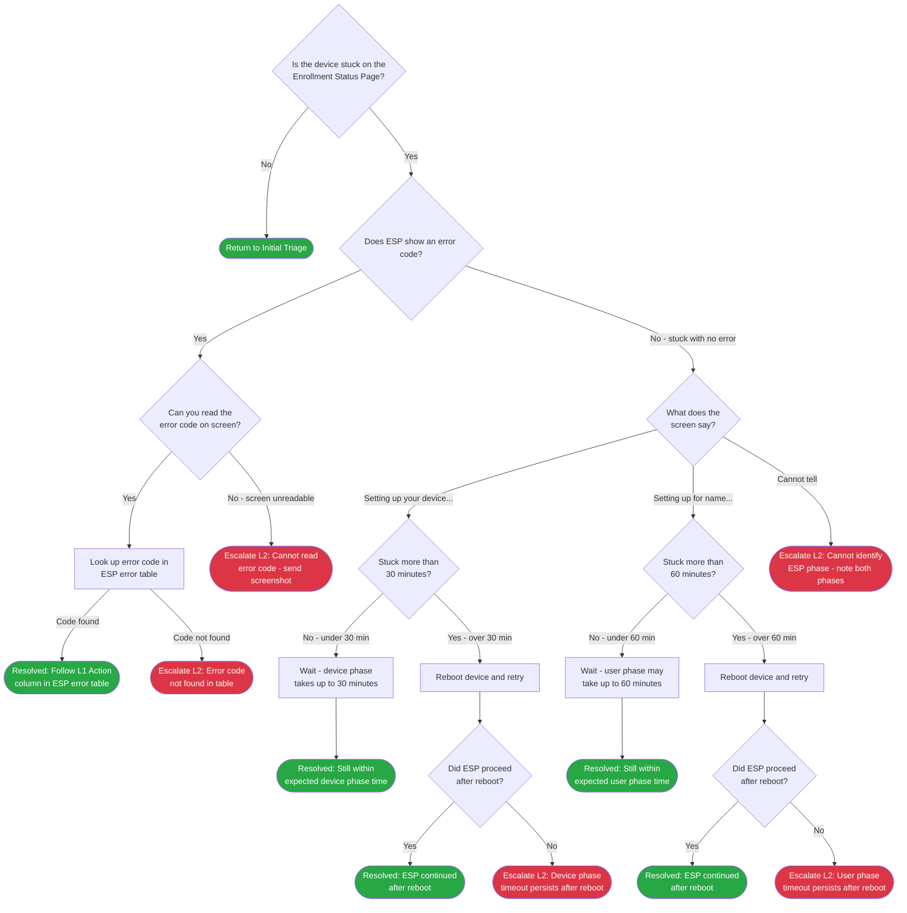

> **Version gate:** This guide covers Windows Autopilot (classic). For Device Preparation (APv2), see [APv1 vs APv2 disambiguation](../apv1-vs-apv2.md).

# ESP Failure Decision Tree

Use this tree to triage failures that occur on the [ESP](../_glossary.md#esp) (Enrollment Status Page) during Windows Autopilot provisioning. It routes you through two primary scenarios: a visible error code you can look up, or a device stuck with no error — where the correct path depends on which phase of [OOBE](../_glossary.md#oobe) is shown on screen. Every branch ends at a Resolved outcome or an escalation point with data to collect before handing off.

## Decision Tree

## How to Check

| Node | Check | Where to Look |
|------|-------|---------------|
| ESD1 | Is the device stuck on the Enrollment Status Page? | The ESP shows a loading bar with percentage and a list of items (apps, policies, certificates). If the screen shows any of these with a spinning indicator or has not changed in several minutes, answer Yes. |
| ESD2 | Does ESP show an error code? | Look at the bottom of the ESP screen or any overlay message. An error code appears as a hex string starting with 0x (for example, 0x81036502). If the only message is "Something went wrong" with no hex code, answer No. |
| ESD3 | Can you read the error code? | The code may appear small at the bottom of the screen. Note the full hex value before proceeding. If the screen is too dark or the text is cut off, answer No. |
| ESD4 | What does the screen say? | Look at the heading text on the ESP screen. "Setting up your device..." indicates device phase (runs before user signs in). "Setting up for [username]..." indicates user phase (runs after the user signs in). If neither phrase is visible or the screen is blank, answer "Cannot tell." |
| ESD5 | Stuck more than 30 minutes? | Check the time the device entered ESP. Device phase covers app installation and policy application for the device account. Industry guideline: 30 minutes is the threshold for concern, though the exact limit depends on the ESP timeout configured in the Autopilot profile. |
| ESD7 | Stuck more than 60 minutes? | User phase covers apps and policies assigned to the user. It typically runs longer than device phase, especially when many user-targeted apps are required. Industry guideline: 60 minutes is the threshold for concern. The configured ESP timeout value in the Autopilot profile is the authoritative limit. |

## Escalation Data

| ID | Scenario | Collect | See Also |
|----|----------|---------|----------|
| ESE1 | Error code not found in ESP table | Device serial number, full error code (0x...), deployment mode (user-driven / pre-provisioning / self-deploying), timestamp, screenshot of ESP screen | [L2 ESP Deep-Dive](../l2-runbooks/) (available after Phase 6) |
| ESE2 | Error code visible but unreadable | Device serial number, deployment mode, timestamp, screenshot of ESP screen (capture even if text is small) | [L2 ESP Deep-Dive](../l2-runbooks/) (available after Phase 6) |
| ESE3 | Cannot identify ESP phase | Device serial number, deployment mode, timestamp, screenshot of ESP screen showing current message | [L2 ESP Deep-Dive](../l2-runbooks/) (available after Phase 6) |
| ESE4 | Device phase timeout after reboot | Device serial number, deployment mode, timestamp, ESP phase (device), time spent on ESP before and after reboot | [L2 ESP Deep-Dive](../l2-runbooks/) (available after Phase 6) |
| ESE5 | User phase timeout after reboot | Device serial number, deployment mode, timestamp, ESP phase (user), time spent on ESP before and after reboot, username used during enrollment | [L2 ESP Deep-Dive](../l2-runbooks/) (available after Phase 6) |

## Resolution & Next Steps

| ID | Resolution | Next Steps |
|----|-----------|------------|
| ESR1 | Error code found in ESP error table — follow the L1 Action for that code | See [ESP error table](../error-codes/03-esp-enrollment.md) for the specific action. See [L1 ESP Runbook](../l1-runbooks/02-esp-stuck-or-failed.md#error-code-steps) for step-by-step procedure. |
| ESR2 | ESP proceeded after reboot during device phase | Monitor device until provisioning completes. If it sticks again, collect data and escalate. See [L1 ESP Runbook](../l1-runbooks/02-esp-stuck-or-failed.md#device-phase-steps). |
| ESR3 | ESP proceeded after reboot during user phase | Monitor device until provisioning completes and user reaches desktop. If it sticks again, collect data and escalate. See [L1 ESP Runbook](../l1-runbooks/02-esp-stuck-or-failed.md#user-phase-steps). |
| ESR4 | Still within expected user phase window | Check back in 15-minute intervals. User phase duration depends on the number of required apps assigned. If still not complete after configured timeout, escalate. See [L1 ESP Runbook](../l1-runbooks/02-esp-stuck-or-failed.md#user-phase-steps). |
| ESR5 | Still within expected device phase window | Check back in 10-minute intervals. If still not complete after 30 minutes, return to ESD5 and follow the reboot path. See [L1 ESP Runbook](../l1-runbooks/02-esp-stuck-or-failed.md#device-phase-steps). |

---

[Back to Initial Triage](00-initial-triage.md)

## Version History

| Date | Change | Author |
|------|--------|--------|
| 2026-03-20 | Initial version | — |
