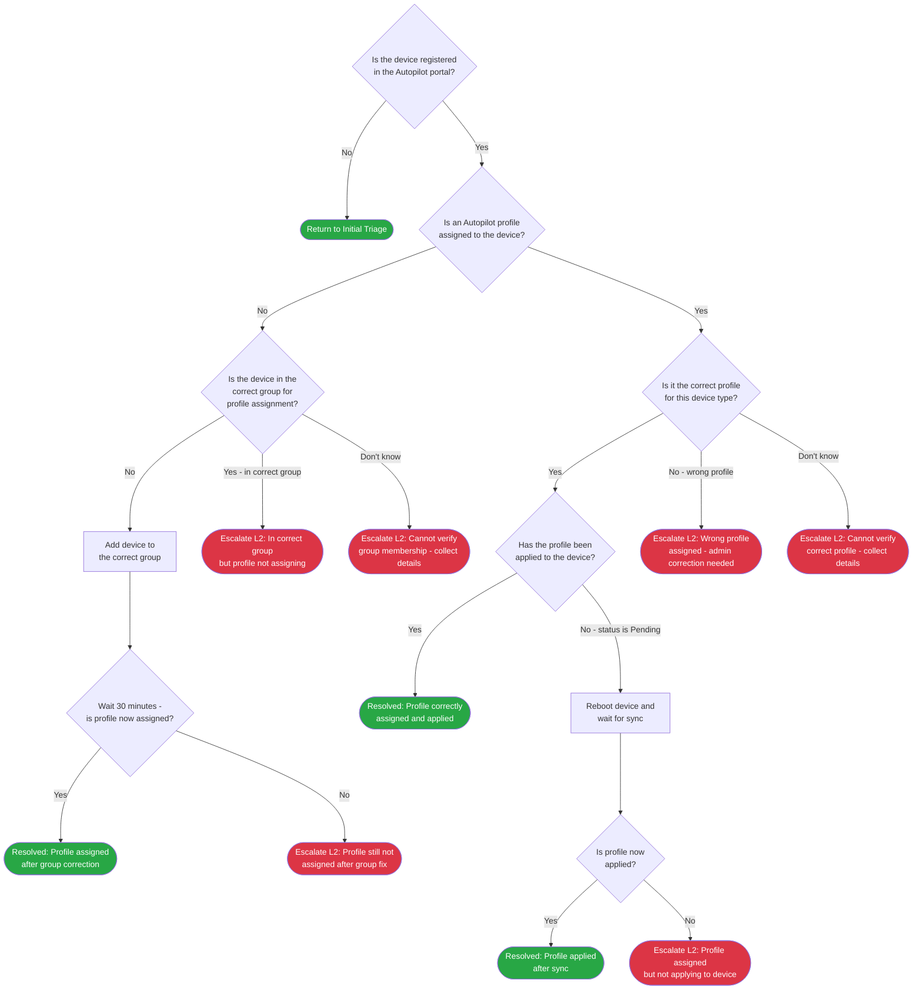

> **Version gate:** This guide covers Windows Autopilot (classic). For Device Preparation (APv2), see [APv1 vs APv2 disambiguation](../apv1-vs-apv2.md).

# Profile Assignment Failure Decision Tree

Use this tree to triage cases where an [Autopilot](../_glossary.md#autopilot) profile is not assigned or the wrong profile is applied to a device. It assumes the device is already registered in the Autopilot portal — if the device does not appear in the portal at all, return to initial triage. Every branch ends at a Resolved outcome or an escalation point with data to collect before handing off.

## Decision Tree

## How to Check

| Node | Check | Where to Look |
|------|-------|---------------|
| PRD1 | Is the device registered in the Autopilot portal? | Intune admin center > Devices > Windows > Enrollment > Windows Autopilot devices > search by serial number. If the device appears with a status, answer Yes. If not found, answer No and return to initial triage. |
| PRD2 | Is an Autopilot profile assigned to the device? | In the device's Autopilot record: check the Profile column or open the device detail. If a profile name is shown, answer Yes. If the field is blank or shows "Not assigned," answer No. |
| PRD3 | Is the device in the correct group for profile assignment? | Intune admin center > Groups > search for the Autopilot deployment group. Open the group and check Members. If the device's serial or Entra ID object is listed, answer Yes. If not listed, answer No. If you are unsure which group the profile targets, answer Don't know. |
| PRD5 | Is it the correct profile for this device type? | Compare the profile name shown on the device Autopilot record to the expected profile for this device type (for example, "Autopilot-LaptopStandard" vs "Autopilot-Kiosk"). If the names match what IT configured for this device, answer Yes. If the names do not match or you are unsure what the correct profile should be, answer Don't know. |
| PRD6 | Has the profile been applied to the device? | On the device Autopilot record or in the Intune device overview, check the profile deployment status. "Applied" means the profile has been pushed to the device. "Pending" or no status means the profile has not yet synced. |

## Escalation Data

| ID | Scenario | Collect | See Also |
|----|----------|---------|----------|
| PRE1 | Profile still not assigned after adding to correct group | Device serial number, group name the device was added to, timestamp of group change, deployment mode, current profile status in portal | [MDM Enrollment Errors](../error-codes/01-mdm-enrollment.md) (see 0x80180005 — DeviceNotSupported); [L2 Profile Investigation](../l2-runbooks/) (available after Phase 6) |
| PRE2 | Device in correct group but profile not assigning | Device serial number, group name, profile name expected, timestamp, deployment mode | [MDM Enrollment Errors](../error-codes/01-mdm-enrollment.md); [L2 Profile Investigation](../l2-runbooks/) (available after Phase 6) |
| PRE3 | Cannot verify group membership | Device serial number, profile name shown (if any), deployment mode, timestamp | [L2 Profile Investigation](../l2-runbooks/) (available after Phase 6) |
| PRE4 | Wrong profile assigned to device | Device serial number, profile name currently assigned, expected profile name, deployment mode, timestamp | [L2 Profile Investigation](../l2-runbooks/) (available after Phase 6) |
| PRE5 | Profile assigned but not applying to device | Device serial number, profile name assigned, current profile status (Pending/Failed), deployment mode, timestamp | [MDM Enrollment Errors](../error-codes/01-mdm-enrollment.md); [L2 Profile Investigation](../l2-runbooks/) (available after Phase 6) |
| PRE6 | Cannot verify correct profile | Device serial number, profile name currently assigned, deployment mode, device type or role (laptop/kiosk/shared), timestamp | [L2 Profile Investigation](../l2-runbooks/) (available after Phase 6) |

## Resolution & Next Steps

| ID | Resolution | Next Steps |
|----|-----------|------------|
| PRR1 | Profile assigned after adding device to correct group | Proceed with OOBE or retry enrollment. Monitor in Intune portal to confirm profile applies during provisioning. See [L1 Profile Runbook](../l1-runbooks/) (available after Phase 5). |
| PRR2 | Profile applied after device sync | Proceed with OOBE or retry enrollment. Confirm the correct profile name is shown as Applied before proceeding. See [L1 Profile Runbook](../l1-runbooks/) (available after Phase 5). |
| PRR3 | Profile correctly assigned and applied | No further action required for profile. If device still fails provisioning, return to initial triage to identify the new failure mode. See [L1 Profile Runbook](../l1-runbooks/) (available after Phase 5). |

---

[Back to Initial Triage](00-initial-triage.md)

## Version History

| Date | Change | Author |
|------|--------|--------|
| 2026-03-20 | Initial version | — |
