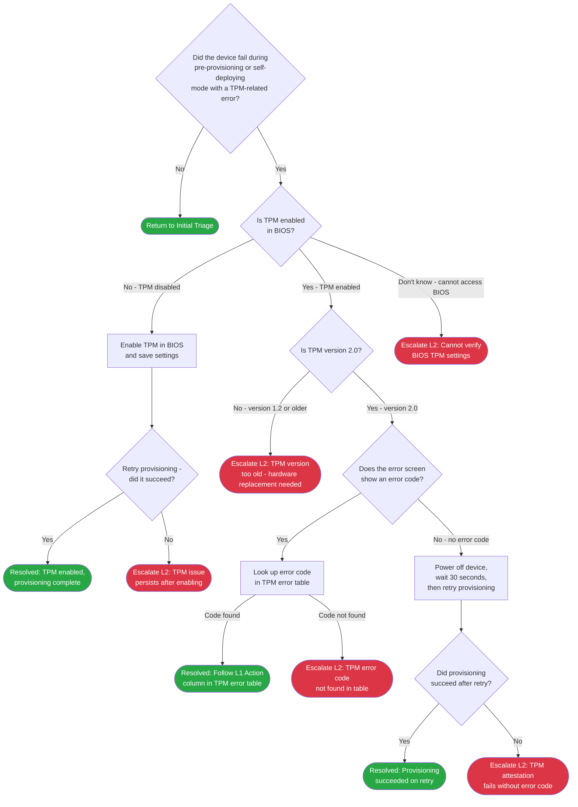

> **Version gate:** This guide covers Windows Autopilot (classic). For Device Preparation (APv2), see [APv1 vs APv2 disambiguation](../apv1-vs-apv2.md).

# TPM Attestation Failure Decision Tree

Use this tree to triage [TPM](../_glossary.md#tpm) (Trusted Platform Module) failures that occur during [pre-provisioning](../_glossary.md#pre-provisioning) or self-deploying mode provisioning. Both modes require TPM 2.0 attestation before the device can complete enrollment. This tree covers the checks an L1 agent can perform — BIOS settings verification and error code lookup — before escalating. Every branch ends at a Resolved outcome or an escalation point with data to collect before handing off.

## Decision Tree

## How to Check

| Node | Check | Where to Look |
|------|-------|---------------|
| TPD1 | Did the device fail with a TPM-related error? | Look at the error message on the device screen. TPM failures typically show keywords such as: "TPM," "attestation," "provisioning failed," or hex codes in the 0x800705xx, 0x80190xxx, or 0x8103xxxx range. If the failure occurred during pre-provisioning (technician phase) or self-deploying mode, answer Yes. |
| TPD2 | Is TPM enabled in BIOS? | Restart the device and enter BIOS/UEFI setup (the key varies by manufacturer — commonly F2, F10, Del, or Esc at the manufacturer splash screen). Navigate to Security or Advanced settings and look for a TPM, PTT (Platform Trust Technology), or Security Device setting. If it shows Enabled, answer Yes. If Disabled, answer No. If you cannot access BIOS (for example, BitLocker PIN required or no keyboard access), answer Don't know. |
| TPD4 | Is TPM version 2.0? | In the same BIOS TPM settings screen, look for a version number. The setting may be labeled TPM Version, TPM Spec, or similar. The value must show 2.0. If it shows 1.2 or any version below 2.0, answer No. Version 1.2 is not supported for pre-provisioning or self-deploying mode by design. |
| TPD5 | Does the error screen show an error code? | Look at the failure screen on the device. A hex code starts with 0x and is 8-10 characters long (for example, 0x800705b4). Note the full code before proceeding. If there is no hex code — only a generic message such as "Something went wrong" or the screen just stops — answer No. |

## Escalation Data

| ID | Scenario | Collect | See Also |
|----|----------|---------|----------|
| TPE1 | TPM issue persists after enabling in BIOS | Device serial number, device make and model, BIOS version, TPM manufacturer (shown in BIOS), deployment mode (pre-provisioning or self-deploying), timestamp, screenshot of error screen | [L2 TPM Investigation](../l2-runbooks/) (available after Phase 6) |
| TPE2 | TPM version too old (1.2 or below) | Device serial number, device make and model, BIOS version, TPM version confirmed in BIOS, deployment mode, timestamp | [L2 TPM Investigation](../l2-runbooks/) (available after Phase 6) |
| TPE3 | TPM error code not found in table | Device serial number, full error code (0x...), device make and model, BIOS version, TPM manufacturer, deployment mode, timestamp, screenshot of error screen | [L2 TPM Investigation](../l2-runbooks/) (available after Phase 6) |
| TPE4 | TPM attestation fails without error code | Device serial number, device make and model, BIOS version, TPM manufacturer, deployment mode, timestamp, description of what appears on screen when provisioning fails | [L2 TPM Investigation](../l2-runbooks/) (available after Phase 6) |
| TPE5 | Cannot verify BIOS TPM settings | Device serial number, device make and model, reason BIOS could not be accessed, deployment mode, timestamp | [L2 TPM Investigation](../l2-runbooks/) (available after Phase 6) |

## Resolution & Next Steps

| ID | Resolution | Next Steps |
|----|-----------|------------|
| TPR1 | TPM was disabled in BIOS — enabled and provisioning completed | Confirm the device has finished provisioning and is enrolled in Intune. Document the BIOS change in the ticket for asset records. See [L1 TPM Runbook](../l1-runbooks/) (available after Phase 5). |
| TPR2 | Error code found in TPM error table — follow the L1 Action for that code | See [TPM error table](../error-codes/02-tpm-attestation.md) for the specific action. Some codes may require a retry after a firmware update; follow the table instructions. See [L1 TPM Runbook](../l1-runbooks/) (available after Phase 5). |
| TPR3 | Provisioning succeeded after power-off and retry | Confirm the device has fully completed provisioning. Intermittent TPM attestation failures can occur on first attempt; a clean retry commonly resolves them. See [L1 TPM Runbook](../l1-runbooks/) (available after Phase 5). |

---

[Back to Initial Triage](00-initial-triage.md)

## Version History

| Date | Change | Author |
|------|--------|--------|
| 2026-03-20 | Initial version | — |
