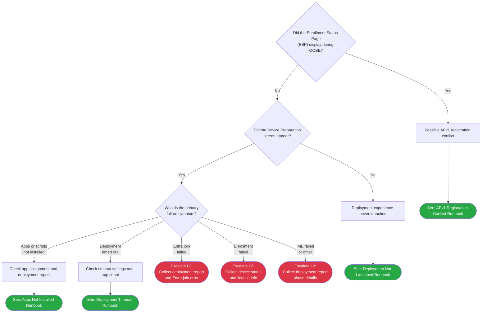

> **Version gate:** This guide covers Windows Autopilot Device Preparation (APv2). For Windows Autopilot (classic), see [Initial Triage Decision Tree](00-initial-triage.md).

# APv2 Device Preparation Triage

## How to Use This Tree

Start here when a user reports an issue with a device that was expected to go through [APv2 Device Preparation](../_glossary.md#apv2). This tree begins after the user has authenticated during OOBE -- it covers portal-observable symptoms for APv2 Device Preparation deployments. No network reachability gate is included because successful OOBE authentication already verifies network connectivity. If the user cannot reach any website or sign in at all, use the [APv1 initial triage tree](00-initial-triage.md) network gates instead (those network checks apply regardless of deployment framework).

Follow each decision point, answering the question shown using only what you can observe on the device screen or look up in the Intune admin center. The tree will route you to a specific L1 runbook or to an L2 escalation point with data collection instructions.

## Legend

| Symbol | Meaning |
|--------|---------|
| Diamond `{...}` | Decision -- answer the question shown |
| Rectangle `[...]` | Action -- perform this step before continuing |
| Green rounded `([...])` | Resolved -- issue is fixed or within expected parameters |
| Red rounded `([...])` | Escalate to L2 -- collect data listed in Escalation Data table and hand off |
| Orange rounded `([...])` | Escalate to Infrastructure/Network -- collect data listed in Escalation Data table and hand off |

## Decision Tree

## How to Check

| Node | Check | Where to Look |
|------|-------|---------------|
| APD1 | Check the screen appearance | APv1 ESP shows "Setting up your device..." or "Setting up for [username]..."; APv2 Device Preparation shows "Getting everything ready..." or a Device Preparation progress screen. If the user saw the ESP interface, answer Yes. If the user saw the Device Preparation interface or no managed deployment screen at all, answer No. |
| APD2 | Check if any deployment progress screen appeared | If no managed deployment screen appeared after user sign-in during OOBE, the deployment experience was never triggered. Answer No. If the Device Preparation progress screen appeared (even if it later failed), answer Yes. |
| APD3 | Review the Intune deployment report | Intune admin center > Devices > Monitor > Windows Autopilot device preparation deployments. Select the deployment record for this device and review the Phase column, error details, and the Apps and Scripts tabs to identify the primary failure symptom. |

## Escalation Data

| ID | Scenario | Collect Before Escalating | See Also |
|----|----------|---------------------------|----------|
| APE1 | Entra join failed | Deployment report (screenshot or export), Entra join error details from deployment record Phase column, device serial number, signing-in user UPN, Entra device settings screenshot | L2 runbooks (Phase 14) |
| APE2 | Enrollment failed | Intune device enrollment status, signing-in user UPN and license assignment screenshot, MDM scope configuration screenshot, device serial number | L2 runbooks (Phase 14) |
| APE3 | IME or infrastructure failure | Full deployment report with phase breakdown (screenshot or export), device serial number, network information (Wi-Fi/ethernet, proxy), timestamp of failure | L2 runbooks (Phase 14) |

## See Also

- [Initial Triage Decision Tree](00-initial-triage.md) -- APv1 (classic Autopilot) triage and network connectivity gates
- [APv2 Deployment Flow (10-Step Process)](../lifecycle-apv2/02-deployment-flow.md) -- Full APv2 deployment sequence
- [APv1 vs APv2](../apv1-vs-apv2.md) -- Framework comparison and selection guidance
- [L1 Runbooks](../l1-runbooks/00-index.md) -- Full index of L1 runbooks for both APv1 and APv2

## Version History

| Date | Change | Author |
|------|--------|--------|
| 2026-04-12 | Initial version | -- |
