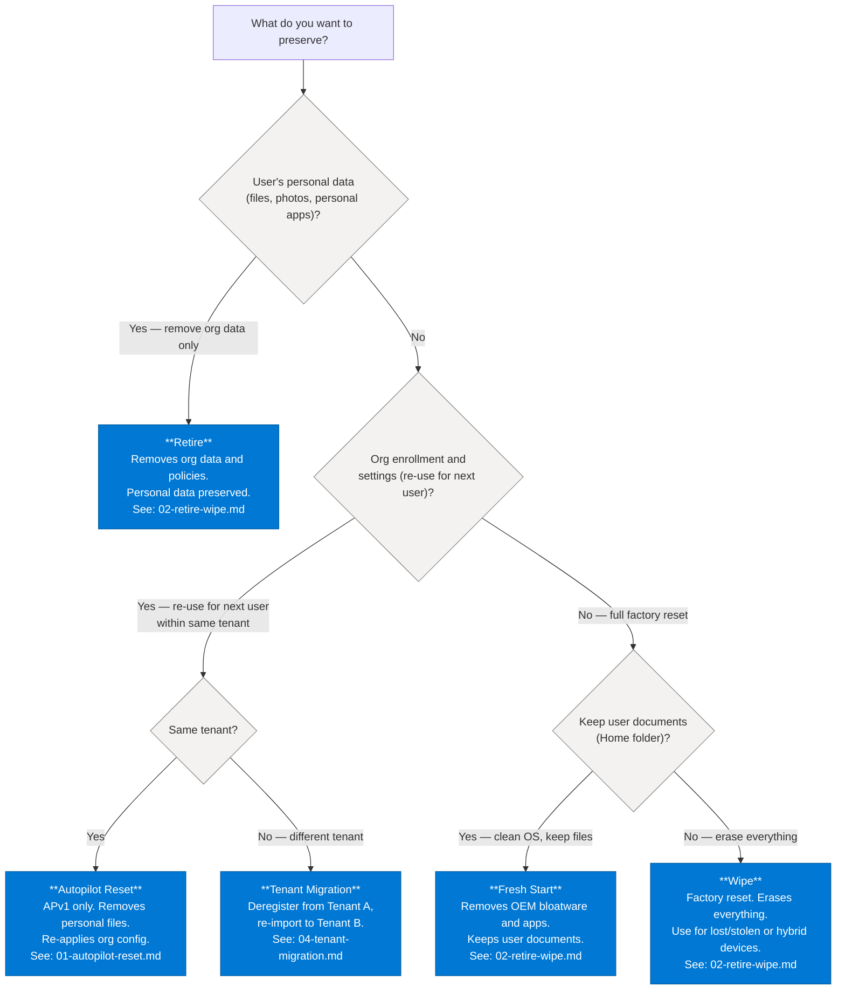

> **Version gate:** This decision tree applies to both Windows Autopilot (APv1) and Windows Autopilot Device Preparation (APv2). Actions marked "APv1 only" are not available for APv2 devices. For framework identification, see [APv1 vs APv2](../apv1-vs-apv2.md).

# Device Lifecycle Action Decision Tree

## How to Use This Tree

Start here when you need to perform a device management action post-enrollment. Answer the entry point question based on what you want to preserve, and the tree routes you to the correct action within three steps.

## Decision Tree

## Action Quick Reference

| Action | Preserves | Framework | Guide |
|--------|-----------|-----------|-------|
| Autopilot Reset | Wi-Fi, SCEP certs, MDM enrollment | APv1 only | [01-autopilot-reset.md](../device-operations/01-autopilot-reset.md) |
| Retire | Personal files, user documents | Both | [02-retire-wipe.md](../device-operations/02-retire-wipe.md) |
| Wipe | Nothing (optionally Wi-Fi state) | Both | [02-retire-wipe.md](../device-operations/02-retire-wipe.md) |
| Fresh Start | User documents (Home folder) | Both | [02-retire-wipe.md](../device-operations/02-retire-wipe.md) |
| Delete (Deregister) | Physical device unchanged | Both | [02-retire-wipe.md](../device-operations/02-retire-wipe.md) |
| Tenant Migration | N/A — cross-tenant re-registration | Both | [04-tenant-migration.md](../device-operations/04-tenant-migration.md) |

## Already Wiped or Decommissioned?

If the device has already been wiped or decommissioned and you just need to clean up the Intune record, use **Delete** (Deregister). Delete removes the Intune device record and Autopilot registration without affecting the physical device state.

See [Retire and Wipe](../device-operations/02-retire-wipe.md) — Step-by-Step: Delete (Deregister).

## Hybrid Entra Joined Devices

> **Note:** Autopilot Reset is **not supported** for hybrid Entra joined devices. If the device is hybrid joined and you need a clean slate, use **Wipe**. After wipe, the device re-enrolls as hybrid joined if the Group Policy hybrid join configuration is still in place.

---

## See Also

- [Device Operations Overview](../device-operations/00-overview.md) — All post-enrollment device management guides
- [Initial Triage Decision Tree](00-initial-triage.md) — Troubleshooting enrollment failures (not lifecycle actions)

---

## Version History

| Date | Change |
|------|--------|
| 2026-04-13 | Initial version |
