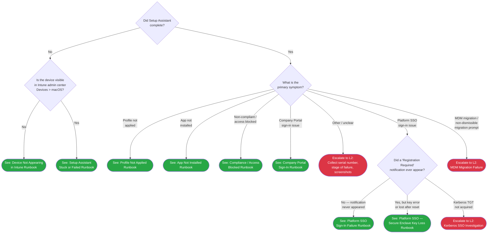

> **Platform gate:** This guide covers macOS ADE troubleshooting via Intune. For Windows Autopilot, see [Initial Triage Decision Tree](00-initial-triage.md).

# macOS ADE Triage

## How to Use This Tree

Start here when a user reports an issue with a Mac enrolled (or expected to enroll) via [ADE](../_glossary-macos.md#ade). Follow each decision point using observations from the device screen and Intune admin center. The tree routes to an L1 runbook or L2 escalation within 3 decision steps from the root.

No network reachability gate is included at the root because Setup Assistant completion already confirms basic network and Apple connectivity. If the device cannot reach any network at all and Setup Assistant never appeared, use the [Device Not Appearing in Intune runbook](../l1-runbooks/10-macos-device-not-appearing.md) directly.

## Legend

| Symbol | Meaning |
|--------|---------|
| Diamond `{...}` | Decision -- answer the question |
| Green rounded `([...])` | Resolved -- follow the linked L1 runbook |
| Red rounded `([...])` | Escalate to L2 -- collect data listed in Escalation Data table and hand off |

## Decision Tree

## Routing Verification

All terminal nodes are within 3 edges of the root node (MAC1):

| Path | Step 1 | Step 2 | Destination |
|------|--------|--------|-------------|
| Device not appearing | Setup Assistant? No | Visible in Intune? No | Runbook 10 |
| Setup Assistant stuck | Setup Assistant? No | Visible in Intune? Yes | Runbook 11 |
| Profile not applied | Setup Assistant? Yes | Symptom: profile | Runbook 12 |
| App not installed | Setup Assistant? Yes | Symptom: app | Runbook 13 |
| Compliance / access blocked | Setup Assistant? Yes | Symptom: non-compliant | Runbook 14 |
| Company Portal sign-in | Setup Assistant? Yes | Symptom: CP sign-in | Runbook 15 |
| Other / unclear | Setup Assistant? Yes | Symptom: other | L2 escalation |
| Platform SSO — registration not appearing | Setup Assistant? Yes | Symptom: Platform SSO | Runbook 35 |
| Platform SSO — Secure Enclave key error | Setup Assistant? Yes | Symptom: Platform SSO → key error | Runbook 36 |
| Kerberos SSO — TGT not acquired | Setup Assistant? Yes | Symptom: Platform SSO → Kerberos TGT | L2 escalation (#28) |
| MDM migration — deadline prompt | Setup Assistant? Yes | Symptom: MDM migration / non-dismissible migration prompt | L2 escalation (#30) |

## How to Check

| Question | How to Check |
|----------|-------------|
| Did Setup Assistant complete? | Ask the user: "Are you at the macOS desktop with a Finder menu bar?" If yes, Setup Assistant completed. If the device shows the Apple logo, a spinning globe, the Remote Management screen ("Your Mac is being configured"), or any Setup Assistant welcome/sign-in screen, it did not complete. **Exception:** A device showing a full-screen Kandji/Iru → Intune MDM migration deadline prompt is NOT in OOBE — it is in migration deadline enforcement and routes as MAC1 = Yes → MDM migration leaf (MACE3). |
| Is the device visible in Intune? | Open Intune admin center > **Devices** > **macOS**. Search by serial number. Find the serial number on the device via **Apple menu** > **About This Mac** > **System Report**, or read it from the device label. |
| What is the primary symptom? | Ask the user: "What specifically is not working?" Match their description to one of the four symptom categories. If uncertain, map to "Other / unclear" and escalate. |

## Escalation Data

| When You Escalate | Collect This |
|-------------------|-------------|
| "Other / unclear" route | Device serial number (Apple menu > About This Mac > System Report), macOS version (Apple menu > About This Mac), screenshot of current device screen, description of expected vs. actual behavior, approximate time when the issue first appeared, any steps already attempted |

## Related Resources

- [macOS L1 Runbooks Index](../l1-runbooks/00-index.md) -- All 6 macOS L1 runbooks
- [macOS L2 Runbooks Index](../l2-runbooks/00-index.md) -- L2 diagnostic guides
- [macOS ADE Lifecycle](../macos-lifecycle/00-ade-lifecycle.md) -- 7-stage enrollment lifecycle
- [Initial Triage Decision Tree](00-initial-triage.md) -- Windows Autopilot (classic) triage
- [macOS Glossary](../_glossary-macos.md) -- macOS-specific terminology

## Version History

| Date | Change | Author |
|------|--------|--------|
| 2026-06-25 | Phase 92 (NAV-01): added MDM migration leaf (MACE3 → L2 #30) off MAC3; MAC1 "How to Check" disambiguation note for deadline-lockout routing; 1 Routing Verification row | -- |
| 2026-06-24 | Phase 87 (REF-03): added Kerberos SSO third arm under MACSSO (MACE2 → L2 #28) + 1 Routing Verification row | -- |
| 2026-04-14 | Initial version | -- |
| 2026-06-22 | Phase 81 (SSOREF-04): added Platform SSO sub-decision leaf (MACSSO -> #35/#36) + 2 Routing Verification rows | -- |
