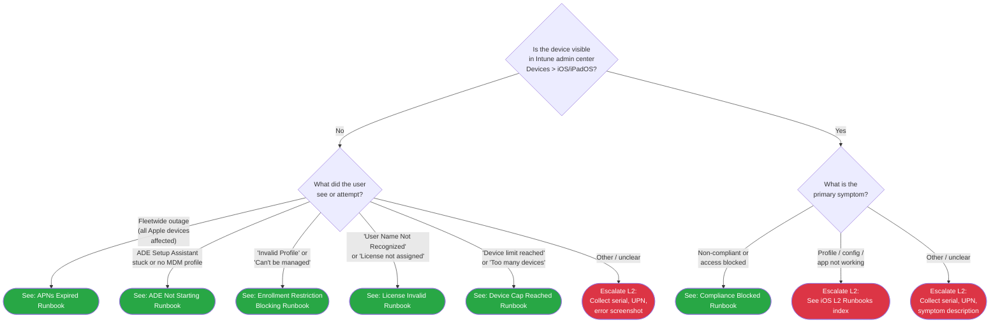

> **Platform gate:** This guide covers iOS/iPadOS troubleshooting via Intune. For Windows Autopilot, see [Initial Triage Decision Tree](00-initial-triage.md). For macOS ADE, see [macOS ADE Triage](06-macos-triage.md).

# iOS/iPadOS Triage

## How to Use This Tree

Start here when a user reports an issue with an iOS or iPadOS device enrolled (or expected to enroll) in Intune. Follow each decision point using observations from the device screen and Intune admin center. The tree routes to an L1 runbook or L2 escalation within 2 decision steps from the root (well under the SC #1 5-node budget).

No network reachability gate is included at the root because Setup Assistant completion implies basic Apple connectivity for ADE, and Company Portal launching implies network for BYOD/User Enrollment paths. If the device cannot reach any network at all, use the [APNs Expired runbook](../l1-runbooks/16-ios-apns-expired.md) or escalate to Infrastructure directly.

## Legend

| Symbol | Meaning |
|--------|---------|
| Diamond `{...}` | Decision -- answer the question |
| Green rounded `([...])` | Resolved -- follow the linked L1 runbook |
| Red rounded `([...])` | Escalate to L2 -- collect data listed in Escalation Data table and hand off |

## Decision Tree

## Routing Verification

All terminal nodes are within 2 decision steps of the root node (IOS1), well under the SC #1 5-node budget:

| Path | Step 1 | Step 2 | Destination |
|------|--------|--------|-------------|
| APNs expired | Visible? No | What attempted? Fleetwide outage | Runbook 16 |
| ADE not starting | Visible? No | What attempted? ADE Setup Assistant stuck | Runbook 17 |
| Enrollment restriction blocking | Visible? No | What attempted? Invalid Profile/Can't be managed | Runbook 18 |
| License invalid | Visible? No | What attempted? User Name Not Recognized | Runbook 19 |
| Device cap reached | Visible? No | What attempted? Device limit reached | Runbook 20 |
| Compliance blocked | Visible? Yes | Symptom: non-compliant/access blocked | Runbook 21 |
| Profile/config/app not working | Visible? Yes | Symptom: profile/app/config | L2 escalation -- primary [15-ios-ade-token-profile.md](../l2-runbooks/15-ios-ade-token-profile.md) + see-also [16-ios-app-install.md](../l2-runbooks/16-ios-app-install.md) |
| Other / unclear (not visible) | Visible? No | What attempted? Other/unclear | L2 escalation |
| Other / unclear (visible) | Visible? Yes | Symptom: other/unclear | L2 escalation |

## How to Check

| Question | How to Check |
|----------|-------------|
| Is the device visible in Intune? | Open Intune admin center > **Devices > All devices** and filter platform = iOS/iPadOS, OR **Devices > iOS/iPadOS**. Search by serial number or user UPN. Serial is visible on device via Settings > General > About > Serial Number. |
| What did the user see or attempt? | Ask the user: "What exact error did you see? Was it `"User Name Not Recognized"`? `"Device limit reached"` / `"Too many devices"`? `"Invalid Profile"` / `"The configuration for your iPhone/iPad couldn't be downloaded"`? `"Company Portal Temporarily Unavailable"`?" Match literal error text to the branches. If the error is `"Company Portal Temporarily Unavailable"` — route to runbook 20 first (device cap) per Microsoft Learn documented dual-meaning. If the user cannot recall the error and has no screenshot: route to "Other / unclear" for L2 escalation. |
| What is the primary symptom? | Ask the user: "What specifically isn't working?" Non-compliant / access blocked → runbook 21. Configuration profile missing, app not appearing, or config not applied → L2 escalation via [15-ios-ade-token-profile.md](../l2-runbooks/15-ios-ade-token-profile.md) (profile/config) or [16-ios-app-install.md](../l2-runbooks/16-ios-app-install.md) (app). Anything else → L2 escalation. |

## Escalation Data

| When You Escalate | Collect This |
|-------------------|-------------|
| Other / unclear route (IOSE1 / IOSE3) | Device serial number (Settings > General > About), iOS version, User UPN, screenshot of current device screen, description of expected vs actual behavior, approximate time when issue first appeared, any steps already attempted |
| Profile/config/app route (IOSE2 -- see [15-ios-ade-token-profile.md](../l2-runbooks/15-ios-ade-token-profile.md) or [16-ios-app-install.md](../l2-runbooks/16-ios-app-install.md)) | All of above + the specific profile/app name expected, Intune device-status screenshot showing profile/app delivery state, last check-in time |

## Related Resources

- [iOS L1 Runbooks Index](../l1-runbooks/00-index.md) -- All 6 iOS L1 runbooks (16-21)
- [iOS L2 Runbooks](../l2-runbooks/00-index.md#ios-l2-runbooks) -- L2 investigation (log collection + 3 investigation runbooks)
- [iOS/iPadOS Admin Setup Overview](../admin-setup-ios/00-overview.md) -- Admin config reference
- [iOS/iPadOS Enrollment Overview](../ios-lifecycle/00-enrollment-overview.md) -- Enrollment path concepts
- [Initial Triage Decision Tree](00-initial-triage.md) -- Windows Autopilot (classic) triage
- [macOS ADE Triage](06-macos-triage.md) -- Sibling Apple platform triage
- [Apple Provisioning Glossary](../_glossary-macos.md) -- Shared Apple terminology (iOS glossary additions in Phase 32 NAV-01)

## Version History

| Date | Change | Author |
|------|--------|--------|
| 2026-04-17 | Resolved Phase 31 L2 cross-references | -- |
| 2026-04-17 | Initial version | -- |
