> **Platform gate:** This guide covers Android Enterprise troubleshooting via Intune. For Windows Autopilot, see [Initial Triage Decision Tree](00-initial-triage.md). For macOS ADE, see [macOS ADE Triage](06-macos-triage.md). For iOS/iPadOS, see [iOS Triage](07-ios-triage.md).

# Android Triage Decision Tree

## How to Use This Tree

Start here when a user reports an issue with an Android device enrolled (or expected to enroll) in Intune. Identify the enrollment mode first, then follow the symptom branch to an L1 runbook or L2 escalation. All terminal nodes are within 2 decision steps of the root (well under the SC #1 5-node budget). Android failure root causes differ fundamentally by mode — asking mode before symptom eliminates false-negative triage (Phase 40 D-01).

No network reachability gate is included at the root (Phase 30 D-03): mode-specific runbooks handle connectivity prerequisites within their own L1 Triage Steps.

## Legend

| Symbol | Meaning |
|--------|---------|
| Diamond `{...}` | Decision -- answer the question |
| Green rounded `([...])` | Resolved -- follow the linked L1 runbook |
| Red rounded `([...])` | Escalate to L2 -- collect data listed in Escalation Data table and hand off |

## Decision Tree

```mermaid
graph TD
    AND1{"What type of Android enrollment<br/>does this device use?"}

    AND1 -->|"Personal phone,<br/>work profile (BYOD)"| AND2{"What is the primary symptom?"}
    AND1 -->|"Corporate phone,<br/>fully managed (COBO)"| AND3{"What is the primary symptom?"}
    AND1 -->|"Kiosk or single-purpose<br/>device (Dedicated / COSU)"| AND4{"What is the primary symptom?"}
    AND1 -->|"Corporate Zero-Touch<br/>enrolled (ZTE)"| AND5{"What is the primary symptom?"}
    AND1 -->|"Specialty hardware<br/>(AOSP)"| ANDE1(["Escalate L2 —<br/>AOSP L1 troubleshooting<br/>out of scope in v1.4"])
    AND1 -->|"Don't know /<br/>Can't tell"| ANDE2(["Escalate L2 —<br/>Collect serial, UPN,<br/>screenshots for<br/>mode identification"])

    AND2 -->|"Enrollment-restriction error<br/>('blocked' / 'can't enroll')"| ANDR22(["See: Enrollment Blocked<br/>(Runbook 22)"])
    AND2 -->|"Device enrolled but<br/>work profile missing"| ANDR23(["See: Work Profile Not Created<br/>(Runbook 23)"])
    AND2 -->|"Device never appeared<br/>in Intune (no error)"| ANDR24(["See: Device Not Enrolled<br/>(Runbook 24)"])
    AND2 -->|"Non-compliant /<br/>access blocked"| ANDR25(["See: Compliance Blocked<br/>(Runbook 25)"])
    AND2 -->|"Expected work app<br/>not installed"| ANDR26(["See: MGP App Not Installed<br/>(Runbook 26)"])
    AND2 -->|"Other / unclear"| ANDE3(["Escalate L2:<br/>Collect serial, UPN,<br/>symptom description"])

    AND3 -->|"Enrollment-restriction error<br/>('blocked' / 'can't enroll')"| ANDR22
    AND3 -->|"Device never appeared<br/>in Intune (no error)"| ANDR24
    AND3 -->|"Non-compliant /<br/>access blocked"| ANDR25
    AND3 -->|"Expected work app<br/>not installed"| ANDR26
    AND3 -->|"Other / unclear"| ANDE3

    AND4 -->|"Enrollment-restriction error<br/>('blocked' / 'can't enroll')"| ANDR22
    AND4 -->|"Device never appeared<br/>in Intune (no error)"| ANDR24
    AND4 -->|"Non-compliant /<br/>access blocked"| ANDR25
    AND4 -->|"Expected work app<br/>not installed"| ANDR26
    AND4 -->|"Other / unclear"| ANDE3

    AND5 -->|"Enrollment never started<br/>or stalled (ZTE-specific)"| ANDR27(["See: ZTE Enrollment Failed<br/>(Runbook 27)"])
    AND5 -->|"Post-enrollment<br/>non-compliant / access blocked"| ANDR25
    AND5 -->|"Other / unclear"| ANDE3

    click ANDR22 "../l1-runbooks/22-android-enrollment-blocked.md"
    click ANDR23 "../l1-runbooks/23-android-work-profile-not-created.md"
    click ANDR24 "../l1-runbooks/24-android-device-not-enrolled.md"
    click ANDR25 "../l1-runbooks/25-android-compliance-blocked.md"
    click ANDR26 "../l1-runbooks/26-android-mgp-app-not-installed.md"
    click ANDR27 "../l1-runbooks/27-android-zte-enrollment-failed.md"

    classDef resolved fill:#28a745,color:#fff
    classDef escalateL2 fill:#dc3545,color:#fff
    class ANDR22,ANDR23,ANDR24,ANDR25,ANDR26,ANDR27 resolved
    class ANDE1,ANDE2,ANDE3 escalateL2
```

> For AOSP tickets (ANDE1): collect device OEM / model, serial number, ticket context. See [AOSP stub](../admin-setup-android/06-aosp-stub.md) for scope context. AOSP L1 troubleshooting is out of scope in v1.4; AOSP L1 content is planned for v1.4.1.

## Routing Verification

All terminal nodes are within 2 decision steps of the root node (AND1), well under the SC #1 5-node budget (Phase 40 D-05).

| Path | Step 1 (mode) | Step 2 (symptom) | Destination |
|------|---------------|------------------|-------------|
| BYOD enrollment blocked | Personal phone, work profile (BYOD) | Enrollment-restriction error visible | Runbook 22 |
| BYOD work profile failed | Personal phone, work profile (BYOD) | Device enrolled but work profile missing | Runbook 23 |
| BYOD device not enrolled | Personal phone, work profile (BYOD) | Device never appeared in Intune | Runbook 24 |
| BYOD compliance blocked | Personal phone, work profile (BYOD) | Non-compliant / access-blocked | Runbook 25 |
| BYOD MGP app missing | Personal phone, work profile (BYOD) | Expected work app not installed | Runbook 26 |
| BYOD other / unclear | Personal phone, work profile (BYOD) | Symptom doesn't match a runbook | Escalate ANDE3 (unclear symptom) |
| COBO enrollment blocked | Corporate phone, fully managed (COBO) | Enrollment-restriction error visible | Runbook 22 |
| COBO device not enrolled | Corporate phone, fully managed (COBO) | Device never appeared in Intune | Runbook 24 |
| COBO compliance blocked | Corporate phone, fully managed (COBO) | Non-compliant / access-blocked | Runbook 25 |
| COBO MGP app missing | Corporate phone, fully managed (COBO) | Expected app not installed | Runbook 26 |
| Dedicated enrollment blocked | Kiosk or single-purpose (Dedicated/COSU) | Enrollment-restriction error visible | Runbook 22 |
| Dedicated device not enrolled | Kiosk or single-purpose (Dedicated/COSU) | Device never appeared in Intune | Runbook 24 |
| Dedicated compliance blocked | Kiosk or single-purpose (Dedicated/COSU) | Non-compliant / access-blocked | Runbook 25 |
| Dedicated MGP app missing | Kiosk or single-purpose (Dedicated/COSU) | Expected app not installed | Runbook 26 |
| ZTE enrollment failed | Corporate Zero-Touch enrolled (ZTE) | Enrollment never started or stalled | Runbook 27 |
| ZTE post-enrollment compliance | Corporate Zero-Touch enrolled (ZTE) | Non-compliant / access-blocked post-ZTE | Runbook 25 |
| AOSP all paths | Specialty hardware (AOSP) | (any) | Escalate ANDE1 (L2 out-of-scope v1.4) |
| Unknown mode | Don't know / Can't tell | (any) | Escalate ANDE2 (mode identification) |
| Other / unclear within GMS mode | Any GMS mode (BYOD/COBO/Dedicated/ZTE) | Symptom doesn't match a runbook | Escalate ANDE3 |

## How to Check

Use these questions to identify the device's enrollment mode before routing.

| Question | How to Check |
|----------|-------------|
| How does the device appear in the Intune admin center? | Open Intune admin center > **Devices > All devices** and filter by platform = Android. If device appears under "Corporate" ownership, likely COBO / Dedicated / ZTE; if "Personal," likely BYOD. |
| Is there a briefcase badge on work apps? | Ask the user: BYOD Work Profile devices show a briefcase badge on work apps (Outlook, Teams, etc.). If present, BYOD; if absent on a corporate device, COBO or Dedicated. |
| Was this device enrolled via a corporate IT process or did the user set it up themselves? | Corporate IT / reseller-provided, COBO / Dedicated / ZTE. User self-enrolled via Company Portal on a personal phone, BYOD. Specialty hardware (RealWear, Zebra, Pico, HTC VIVE Focus, Meta Quest), AOSP. |
| Which management app is installed? | Post-April 2025 AMAPI: Microsoft Intune app is primary for BYOD Work Profile; Company Portal still present. COBO / Dedicated use the Android Device Policy Controller (AFW). ZTE pushes the Android Device Policy Controller automatically at first boot. |

## Escalation Data

Collect this information before routing to L2.

| When You Escalate | Collect This |
|-------------------|-------------|
| AOSP — out of scope v1.4 (ANDE1) | Device OEM / model, serial number, User UPN, ticket context, AOSP enrollment method attempted. Route to L2. |
| Unknown mode (ANDE2) | Device serial, User UPN, lock-screen or Settings screenshot, last-known management app name (Company Portal vs Microsoft Intune app), ticket description. Route to L2 for mode identification. |
| Unclear symptom within a GMS mode (ANDE3) | Device serial, User UPN, Android version, enrollment mode (if known), symptom description, screenshot of current Intune device status pane. Route to L2. |

## Related Resources

- [Android L1 Runbooks Index](../l1-runbooks/00-index.md#android-l1-runbooks) — All 6 Android L1 runbooks (22-27)
- [Android Glossary](../_glossary-android.md) — Canonical Android Enterprise terminology
- [Android Enrollment Overview](../android-lifecycle/00-enrollment-overview.md) — Mode-ownership axes explained
- [Android Admin Setup Overview](../admin-setup-android/00-overview.md) — Tri-portal admin surface
- [AOSP Stub](../admin-setup-android/06-aosp-stub.md) — AOSP scope context (ANDE1 escalations)
- [Initial Triage Decision Tree](00-initial-triage.md) — Windows Autopilot entry point
- [macOS ADE Triage](06-macos-triage.md) — macOS ADE failure routing
- [iOS Triage](07-ios-triage.md) — iOS/iPadOS failure routing

## Version History

| Date | Change | Author |
|------|--------|--------|
| 2026-04-23 | Initial version (Phase 40 — Android L1 triage tree) | -- |
