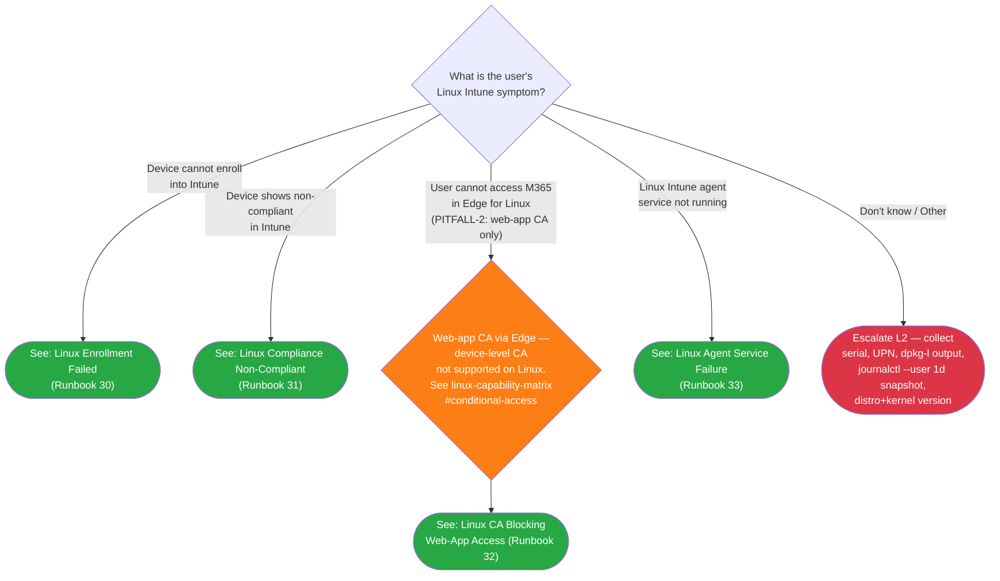

> **Platform gate:** This guide covers Linux Intune client troubleshooting (Ubuntu 22.04/24.04 LTS). For Windows Autopilot, see [Initial Triage Decision Tree](00-initial-triage.md). For macOS ADE, see [macOS ADE Triage](06-macos-triage.md). For iOS/iPadOS, see [iOS Triage](07-ios-triage.md). For Android, see [Android Triage](08-android-triage.md).

# Linux Triage Decision Tree

## How to Use This Tree

Start here when a user reports an issue with a Linux device enrolled (or expected to enroll) in Intune. Identify the failure symptom, then follow the matching branch to an L1 runbook or L2 escalation. All terminal nodes are within 2 decision steps of the root (well under the SC #1 5-node budget). Per Phase 51 D-01 + PITFALL-1 mitigation, this tree uses a flat-symptom shape (no enrollment-mode pre-gate) — Linux Intune supports a single management mode (Ubuntu 22.04/24.04 LTS via packages.microsoft.com), so the mode-axis question that gates Android does not apply.

## Legend

| Symbol | Meaning |
|--------|---------|
| Diamond `{...}` | Decision -- answer the question |
| Green rounded `([...])` | Resolved -- follow the linked L1 runbook |
| Red rounded `([...])` | Escalate to L2 -- collect data listed in Escalation Data table and hand off |
| Orange rounded `([...])` | Architectural callout -- web-app CA only on Linux (PITFALL-2) |

## Decision Tree

## Routing Verification

All terminal nodes are within 2 decision steps of the root node (LIN1), well under the SC #1 5-node budget.

| Path | Step 1 (root) | Step 2 (CA disambiguation, where applicable) | Destination |
|------|---------------|----------------------------------------------|-------------|
| Enrollment failed | Device cannot enroll into Intune | (terminal) | Runbook 30 |
| Compliance non-compliant | Device shows non-compliant in Intune | (terminal) | Runbook 31 |
| CA blocking web-app access | User cannot access M365 in Edge for Linux | LINCA → web-app CA only | Runbook 32 |
| Agent service failure | Linux Intune agent service not running | (terminal) | Runbook 33 |
| Unknown / Other | Don't know / Other | (terminal) | Escalate LINE1 |

## How to Check

Use these questions to identify which symptom branch applies before routing.

| Question | How to Check |
|----------|-------------|
| Did the device successfully enroll into Intune? | Open Intune admin center > **Devices > All devices** and filter by platform = Linux. If the device serial does not appear at all, the symptom is "Device cannot enroll" → Runbook 30. |
| Does the device appear in Intune as Non-compliant? | In **Devices > All devices > [device] > Device compliance**, the compliance state shows "Not compliant" → Runbook 31. |
| Is the user blocked accessing M365 specifically through Edge? | If the user reports "I can't sign in to Outlook on the web" or "Edge says my device isn't allowed," route via the LINCA disambiguation node → Runbook 32. Note that Linux supports web-app CA only (PITFALL-2). |
| Is the Intune agent service running on the device? | Ask the user to run `systemctl --user status intune-agent.timer` in a terminal. If output shows `inactive`, `failed`, or "Unit not found" → Runbook 33. |

## Escalation Data

Collect this information before routing to L2.

| When You Escalate | Collect This |
|-------------------|-------------|
| Unknown / Other (LINE1) | Device serial number, User UPN, distro + version (`lsb_release -a`), kernel + GA-vs-HWE (`uname -r`), `dpkg -l intune-portal` output, `journalctl --user --since "1 day ago"` snapshot, ticket description. Route to L2 for symptom identification. |

## Related Resources

- [Linux L1 Runbooks Index](../l1-runbooks/00-index.md#linux-l1-runbooks) — All 4 Linux L1 runbooks (30-33)
- [Linux Provisioning Glossary](../_glossary-linux.md) — Canonical Linux Intune terminology
- [Linux Enrollment Overview](../linux-lifecycle/00-enrollment-overview.md) — Supported management surface
- [Linux Admin Setup Overview](../admin-setup-linux/00-overview.md) — Admin configuration entry point
- [Linux Capability Matrix — Conditional Access](../reference/linux-capability-matrix.md#conditional-access) — Architectural detail for PITFALL-2
- [Initial Triage Decision Tree](00-initial-triage.md) — Windows Autopilot entry point
- [macOS ADE Triage](06-macos-triage.md) — macOS ADE failure routing
- [iOS Triage](07-ios-triage.md) — iOS/iPadOS failure routing
- [Android Triage](08-android-triage.md) — Android enrollment/compliance failure routing

## Version History

| Date | Change | Author |
|------|--------|--------|
| 2026-04-27 | Initial version (Phase 51 — Linux L1 triage tree, flat-symptom shape per D-01 / PITFALL-1) | -- |
