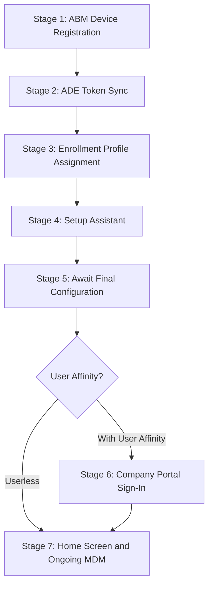

> **Version gate:** This guide covers iOS/iPadOS Automated Device Enrollment (ADE) via Apple Business Manager and Microsoft Intune. For the enrollment path overview, see [iOS/iPadOS Enrollment Path Overview](00-enrollment-overview.md). For macOS ADE, see [macOS ADE Lifecycle](../macos-lifecycle/00-ade-lifecycle.md). For terminology, see the [Apple Provisioning Glossary](../_glossary-macos.md).

# iOS/iPadOS ADE Lifecycle: Automated Device Enrollment End-to-End

## How to Use This Guide

This is a single-file narrative covering the complete iOS/iPadOS Automated Device Enrollment pipeline from Apple Business Manager registration through home screen delivery and ongoing MDM management. Like the macOS ADE lifecycle, iOS/iPadOS ADE follows a single linear pipeline with one conditional branch at Stage 6 (user affinity).

**Audience:** This guide serves all three roles:

- **L1 Service Desk:** Use the "What the Admin Sees" and "Watch Out For" sections for quick orientation and common failure identification.
- **L2 Desktop Engineering:** Use the "Behind the Scenes" sections for endpoint details, MDM protocol behavior, and log collection references.
- **Intune Admins:** Use "What Happens" sections for the complete configuration workflow and "Watch Out For" sections for misconfiguration prevention.

Each of the seven stages below contains four subsections:

- **What the Admin Sees** -- Portal views and device-side screens the admin or user encounters at this stage.
- **What Happens** -- The technical sequence of events, including numbered steps and configuration details.
- **Behind the Scenes** -- Deeper technical detail for L2 troubleshooters: endpoints, protocols, MDM behavior, and log collection references.
- **Watch Out For** -- Common pitfalls, misconfigurations, and failure modes specific to this stage, with remediation guidance.

**Navigation:**

- Start at **Stage 1** if you are setting up ADE for the first time.
- Jump to a **specific stage** if you are troubleshooting a failure at a known point in the enrollment pipeline.
- Use the **Stage Summary Table** below the pipeline diagram for a quick overview of all stages.
- See the **See Also** section at the bottom for cross-references to related guides and the enrollment overview.

### Prerequisites

All prerequisites must be met before Stage 1. Missing any prerequisite causes failures that surface at Stages 2-4.

- [ ] Apple Business Manager account configured and verified
- [ ] At least one MDM server configured in ABM and linked to Microsoft Intune
- [ ] ADE token (.p7m) downloaded from ABM and uploaded to Intune
- [ ] Apple Push Notification certificate configured in Intune (Tenant administration > Connectors and tokens)
- [ ] Appropriate Intune licenses assigned to target users
- [ ] Network connectivity to required Apple ADE endpoints and Microsoft Intune endpoints
- [ ] Enrollment profile created and assigned in Intune (Stage 3)
- [ ] Company Portal app licensed via VPP/Apps and Books in ABM (for user affinity enrollments)

---

## Supervision

Understanding supervision is essential before reading the enrollment stages. Supervision is the conceptual keystone of iOS/iPadOS ADE and anchors all downstream admin setup content for v1.3.

### What Supervision Is

Supervision is a management state set at enrollment time through ADE. When a device is supervised, the MDM server has expanded control including capabilities not available on unsupervised devices — such as enforced content restrictions, silent app installation, activation lock bypass, lost mode, and advanced security policy enforcement. Unsupervised devices receive standard MDM management only, without access to these extended capabilities.

For iOS/iPadOS 13.0 and later, devices enrolled via ADE are automatically placed in supervised mode. This is not optional and does not require admin configuration — supervision is a built-in outcome of ADE enrollment for iOS 13+.

### When Supervision Is Set

Supervision is set exclusively at enrollment time, through ADE. The enrollment profile includes a supervised mode setting. Once the device completes ADE enrollment, the supervision state is locked to the device. Supervision cannot be added to a device that was enrolled without it — for example, a device enrolled via Device Enrollment or User Enrollment cannot be promoted to supervised status without a full device erase and re-enrollment via ADE.

### Changing Supervision Requires a Full Device Erase

Changing a device from unsupervised to supervised requires a full device erase and re-enrollment via ADE. A full device erase removes all data on the device, including personal data. This is not a selective wipe, which removes only managed data while preserving personal content.

**Verification:** On a supervised device, **Settings > General > About** displays: "This iPhone is supervised and managed by [organization name]." (On iPad: "This iPad is supervised and managed by [organization name].")

Subsequent admin setup guides mark supervised-only settings with the supervised-only callout pattern.

---

## The ADE Pipeline

> Stage 6 only applies when the enrollment profile is configured for "Enroll with User Affinity" and modern authentication. Userless enrollments skip directly to Stage 7.

---

## Stage Summary Table

| Stage | Actor | Location | What Happens | Key Pitfall |
|-------|-------|----------|--------------|-------------|
| 1: ABM Device Registration | Admin | ABM Portal | Device serial numbers assigned to MDM server in Apple Business Manager | Device not assigned to correct MDM server; non-ABM-linked reseller |
| 2: ADE Token Sync | System/Intune | Intune admin center | Intune syncs device list from ABM via .p7m token (auto every 12h) | Token expired; Apple ID inaccessible; ABM T&C changed |
| 3: Enrollment Profile Assignment | Admin | Intune admin center | Enrollment profile assigned to devices (defines supervised mode, auth method, Setup Assistant screens) | No profile assigned before device powers on |
| 4: Setup Assistant | Device/User | On-device | Device contacts Apple ADE endpoints, enrolls in MDM, runs iOS-specific Setup Assistant screens | Firewall blocks ADE endpoints; APNs certificate expired |
| 5: Await Final Configuration | System/Intune | On-device | Device pauses at "Awaiting final configuration" while Intune pushes configuration policies | Misconfigured profile blocks release; APNs connectivity issues |
| 6: Company Portal Sign-In | Device/User | On-device | User signs into Company Portal for Entra ID registration and Conditional Access | Company Portal not deployed via VPP; user skips sign-in |
| 7: Home Screen and Ongoing MDM | System/Intune | On-device | Home screen delivered; single MDM channel via APNs manages device | APNs certificate renewal missed; no IME fallback on iOS |

---

## Stage 1: ABM Device Registration

### What the Admin Sees

In [Apple Business Manager](https://business.apple.com) (ABM), navigate to **Devices** and use the **Assign to MDM Server** action to associate device serial numbers with your Intune MDM server. Devices can be viewed by serial number, and bulk assignment is available for large batches of iPhones and iPads. Devices assigned by Apple resellers at purchase appear automatically in your ABM account without manual action.

### What Happens

1. **Device identity established.** The admin or OEM assigns one or more device serial numbers to the MDM server configured in ABM. The serial number is the device identity for iOS/iPadOS ADE — unlike Windows Autopilot, which uses a 4KB hardware hash.

2. **MDM server association.** The assignment links the physical device (by serial number) to the Intune MDM server that was configured during ABM setup. This is a one-to-one relationship: each device is assigned to exactly one MDM server.

3. **OEM pre-assignment.** Devices can be pre-assigned by Apple resellers at the time of purchase. When the reseller is linked to your ABM account, purchased iPhones and iPads appear in your device list automatically.

4. **Bulk operations.** ABM supports filters and bulk assignment for large batches of devices, enabling fleet-scale onboarding.

### Behind the Scenes

- The serial number is the sole identity mechanism for iOS/iPadOS ADE enrollment. There is no equivalent to the Windows hardware hash — the serial number printed on the device chassis is the same value ABM uses to identify it.
- MDM server assignment in ABM creates a server-side record that Apple's ADE service checks when the device contacts `deviceenrollment.apple.com` during Setup Assistant (Stage 4). If the device is not assigned to any MDM server, the ADE discovery check returns no enrollment profile and the device proceeds through standard (non-managed) Setup Assistant.
- ABM supports multiple MDM servers within a single organization. Devices can be reassigned between servers, but the reassignment only takes effect before the device enrolls.
- Devices added to ABM via Apple Configurator (e.g., devices not purchased through ABM-linked channels) follow the same assignment workflow but require a physical USB connection to a Mac running Apple Configurator for initial ABM enrollment.

### Watch Out For

- **Device not assigned to the correct MDM server.** If your organization has multiple MDM servers in ABM (e.g., test and production), verify the device is assigned to the intended server before shipping. You can check and change the assignment in ABM under **Devices > [serial number] > Edit MDM Server**.
- **Non-ABM-linked reseller.** Devices purchased from a reseller that is not linked to your ABM account will not appear in ABM. Contact the reseller to establish the ABM relationship, or use Apple Configurator to manually add devices to ABM (requires physical access and a Mac).
- **Reseller forgot device transfer.** The reseller purchased the device through their own ABM account but did not transfer it to your organization's ABM. The device will not appear in your device list until the transfer is completed by the reseller. Follow up with the reseller and provide your ABM organization ID.
- **Device already enrolled in another MDM.** If the device was previously enrolled in a different MDM solution and not properly removed, it may still be assigned to the previous MDM server in ABM. The previous organization must release the device before it can be reassigned.

---

## Stage 2: ADE Token Sync

### What the Admin Sees

In the **Intune admin center**, navigate to **Devices > Enrollment > Apple tab > Enrollment program tokens**. This blade shows your ADE tokens with their status, expiration dates, and the number of synced devices. You can trigger a manual sync from this view or check the last sync timestamp.

### What Happens

1. **Token establishes the connection.** The ADE token (enrollment program token, a .p7m file) connects Intune to ABM. The token is downloaded from ABM and uploaded to Intune to authorize the sync relationship.

2. **Automatic delta sync every 12 hours.** Intune syncs device information from ABM automatically once every 12 hours. Newly assigned devices in ABM appear in Intune after the next sync cycle.

3. **Full sync available once per 7 days.** A full sync (re-syncing all devices, not just changes) can only be triggered once per 7 days.

4. **Manual sync rate-limited.** Admins can trigger a manual sync from the Intune admin center. Manual sync is rate-limited to once per 15 minutes. New devices appear after the next sync cycle.

### Behind the Scenes

- The .p7m token file is cryptographically signed by Apple. It contains the authorization for Intune to query ABM's device list for the specified MDM server.
- The token is tied to a specific Apple ID. If a personal Apple ID was used to create the token and that person leaves the organization, the token cannot be renewed. Always use a Managed Apple ID for token creation.
- Token renewal is annual. A lapsed token silently stops new device syncing — existing enrolled devices continue to function, but new devices assigned in ABM will not appear in Intune until the token is renewed.
- Each ADE token in Intune corresponds to exactly one MDM server in ABM. Organizations with multiple ABM MDM servers (e.g., production vs. test) will have multiple tokens in Intune.
- The sync operation is incremental by default — only changes (new assignments, removals) since the last sync are pulled. A full sync re-fetches the entire device list and is subject to the 7-day cooldown.

> **Operational note:** Set a recurring calendar reminder 30 days before token expiration. The Intune admin center shows the expiration date on the Enrollment program tokens blade.

### Watch Out For

- **Token expired.** The ADE token must be renewed annually. Expiration is silent — no alerts are generated by default. Set a calendar reminder 30 days before expiration. Check the token status regularly in the Intune admin center.
- **Apple ID inaccessible.** The Apple ID used to create the token is no longer accessible (employee left, password lost). The token cannot be renewed without the original Apple ID. Use a Managed Apple ID tied to a shared organizational role.
- **ABM terms and conditions changed.** Apple occasionally updates ABM terms. If the new terms are not accepted in ABM, Apple suspends syncing until they are acknowledged.
- **Sync shows 0 devices.** Usually means the token is assigned to the wrong ABM MDM server, or newly purchased devices have not yet been transferred from the reseller's ABM account to your organization's ABM.

---

## Stage 3: Enrollment Profile Assignment

### What the Admin Sees

In the **Intune admin center**, navigate to the enrollment program tokens blade and select your token to view and create iOS/iPadOS enrollment profiles. Here you create profiles that define supervised mode, user affinity, authentication method, and which Setup Assistant screens to show or hide. A default profile can be set for the token so all synced devices receive it automatically.

> **Note:** Portal navigation for iOS/iPadOS enrollment profiles may vary by Intune admin center version. A new "Enrollment policies" experience was in preview as of early 2026. Phase 27 admin setup guides verify current portal navigation before documenting click-paths.

### What Happens

1. **Profile creation.** The admin creates an iOS/iPadOS enrollment profile specifying supervised mode (set to Yes for corporate ADE deployments), user affinity preference (Enroll with User Affinity for user-assigned devices, or without for shared/kiosk devices), and authentication method.

2. **Profile assigned to devices.** The profile is assigned to devices synced from ABM (by serial number) or set as the default for the token. Assignment is over-the-air — the device does not need to be present or powered on.

3. **Locked enrollment prevents profile removal.** When the "Locked enrollment" option is enabled in the profile, the management profile cannot be removed by the user from Settings. This is the recommended setting for corporate-owned supervised devices.

4. **Setup Assistant screen customization.** The enrollment profile determines which Setup Assistant screens users see during initial setup. Required screens (Language, Region, Wi-Fi) cannot be hidden.

### Behind the Scenes

- The enrollment profile is a server-side configuration stored in Intune. It is not pushed to the device during this stage. When the device contacts `iprofiles.apple.com` during Setup Assistant (Stage 4), Apple's service returns the MDM enrollment payload that includes these profile settings.
- For iOS/iPadOS 13.0 and later, devices enrolled via ADE are automatically supervised. Intune's supervised mode setting in the enrollment profile is still required to be set to Yes for corporate enrollments — this ensures the profile explicitly declares supervised intent, even though iOS 13+ ADE devices are automatically supervised.
- The authentication method choices are: Setup Assistant with modern authentication (recommended), Setup Assistant (legacy), and no authentication (for userless deployments).
- Profile assignment must occur before the device is powered on for the first time (or after a wipe). If the device reaches Setup Assistant before a profile is assigned, it will proceed through standard (non-managed) Setup Assistant without MDM enrollment.

### Watch Out For

- **No profile assigned before device powers on.** If the device starts Setup Assistant before a profile is assigned in Intune, the device will not enroll in MDM. The fix is to perform a factory reset (Settings > General > Transfer or Reset iPhone > Erase All Content and Settings), assign the profile, and then let the device re-enroll.
- **Supervised mode not enabled.** Supervision cannot be changed after enrollment without a full device erase. Verify the enrollment profile has supervised mode set to Yes before any devices enroll.
- **Locked enrollment not enabled.** Without locked enrollment, users can navigate to Settings > General > VPN & Device Management and remove the management profile, effectively unenrolling the device. Enable locked enrollment for all corporate-owned deployments.
- **Wrong authentication method.** Setup Assistant (legacy) does not support modern authentication MFA. Use "Setup Assistant with modern authentication" for all new deployments.

---

## Stage 4: Setup Assistant

### What the Admin Sees

On the physical device, iOS/iPadOS Setup Assistant presents the first-run experience. The screens shown depend on the enrollment profile configuration (Stage 3). The device progresses through language, region, Wi-Fi, and iOS-specific screens. If modern authentication is configured, an Entra credential prompt appears within Setup Assistant.

### What Happens

1. **ADE discovery.** On first power-on (or after factory reset), the device contacts Apple's ADE endpoints to check whether it is ABM-managed. The device sends its serial number and receives a redirect to the assigned MDM server.

2. **MDM enrollment profile installs.** The device downloads and installs the MDM enrollment profile. This establishes the management relationship between the device and Intune and sets the supervision state.

3. **APNs channel established.** The device installs the MDM management profile and establishes the APNs (Apple Push Notification service) channel — the sole ongoing MDM communication channel for iOS.

4. **Setup Assistant screens presented.** The device presents the configured subset of iOS/iPadOS Setup Assistant screens. The screens shown or hidden are determined by the enrollment profile configuration in Stage 3.

5. **ACME certificate issuance.** On iOS 16.0+ and iPadOS 16.1+, an ACME (Automated Certificate Management Environment) certificate is issued during enrollment, replacing the older SCEP-based certificate mechanism. Devices running iOS/iPadOS 15 or earlier use SCEP for identity certificate issuance.

### Behind the Scenes

**iOS/iPadOS-specific Setup Assistant panes** that can be shown or hidden via enrollment profile:

*iOS/iPadOS-only panes (not available on macOS):*
- Touch ID / Face ID (iOS 8.1+)
- Apple Pay (iOS 7.0+)
- Screen Time (iOS 12.0+)
- SIM Setup (iOS 12.0+)
- iMessage and FaceTime (iOS 9.0+)
- Android Migration (iOS 9.0+)
- Watch Migration (iOS 11.0+)
- Emergency SOS (iOS 16.0+)
- Action button (iOS 17.0+)
- Apple Intelligence (iOS 18.0+)
- Camera button (iOS 18.0+)
- Web content filtering (iOS 18.2+)

*Panes available on both iOS and macOS:*
- Apple ID, Siri, Privacy, Diagnostics Data, Terms and Conditions, Location Services, Restore, Passcode, Appearance, Software Update, Get Started

*Deprecated panes (avoid configuring):*
- Display Tone (deprecated iOS 15)
- Zoom (deprecated iOS 17)

**Key endpoints contacted during Stage 4:**

| Endpoint | Protocol | Purpose |
|----------|----------|---------|
| `deviceenrollment.apple.com` | HTTPS (443) | ADE discovery — device checks if it is ABM-managed |
| `iprofiles.apple.com` | HTTPS (443) | MDM enrollment profile download |
| `mdmenrollment.apple.com` | HTTPS (443) | Enrollment handshake completion |
| `*.push.apple.com` | TCP 443, 2197, 5223 | APNs — ongoing MDM push notifications |
| `login.microsoftonline.com` | HTTPS (443) | Entra authentication (modern auth) |
| `manage.microsoft.com` | HTTPS (443) | Intune service endpoint |

### Watch Out For

- **Firewall or proxy blocking Apple ADE endpoints.** If the device cannot reach `deviceenrollment.apple.com`, `iprofiles.apple.com`, or `mdmenrollment.apple.com`, Setup Assistant proceeds without MDM enrollment. The device displays standard (non-managed) Setup Assistant instead of the ADE-controlled experience. Verify that the network allows HTTPS traffic to all required Apple endpoints.
- **APNs certificate expired.** If the Apple Push Notification certificate in Intune has expired, the MDM channel fails to establish during Setup Assistant. New enrollments will fail. Renew the APNs certificate in the Intune admin center under **Tenant administration > Connectors and tokens > Apple push notification certificate**.
- **ACME certificate failure on pre-iOS 16 devices.** ACME is only available on iOS 16.0+ and iPadOS 16.1+. Devices running older iOS/iPadOS versions use SCEP for identity certificate issuance. Ensure SCEP is available as a fallback for devices that cannot be updated before enrollment.
- **Users skipping required screens.** Some Setup Assistant screens cannot be skipped when configured as required in the enrollment profile. If users report being unable to advance past a screen, verify the profile configuration for that screen's required/optional setting.

---

## Stage 5: Await Final Configuration

### What the Admin Sees

On the device, the user sees an **"Awaiting final configuration"** screen after Setup Assistant screens complete but before the home screen loads. The device is locked at this screen while Intune pushes critical configuration policies via the MDM channel. Admin can monitor device status in the Intune admin center under **Devices > iOS/iPadOS > [device] > Device configuration**.

### What Happens

1. **Hold triggered.** After MDM enrollment completes in Stage 4, the device pauses at the "Awaiting final configuration" screen if the enrollment profile has Await Configuration enabled.

2. **Configuration policy delivery.** Intune pushes configuration policies — device restrictions, Wi-Fi profiles, VPN configurations, and certificates — to the device via the APNs/MDM channel. Apps are **not** included during this hold; only device configuration policies are delivered at this stage.

3. **Device waits for policy confirmation.** The device waits until all required configuration policies are confirmed installed before proceeding. The device reports policy installation status back to Intune via MDM check-ins over APNs.

4. **Hold released.** Once Intune confirms delivery of all critical configuration, it sends a release signal to the device. The "Awaiting final configuration" screen dismisses and the enrollment flow proceeds to Stage 6 (user affinity) or Stage 7 (userless). If any required policy fails to install, the device may remain stuck at this screen.

> **Note:** Await Configuration requires iOS 13 or later. The hold is triggered by the enrollment profile setting — it does not fire automatically on all enrollments.

### Behind the Scenes

- The "Await final configuration" behavior is controlled by the enrollment profile setting. When enabled, Intune sends configuration profiles in priority order to the device.
- The device reports installation status back via MDM check-ins over APNs. The hold is released when Intune marks the device as having received all critical configuration.
- There is no enforced minimum or maximum time limit. Duration depends on the number and complexity of configuration profiles assigned to the device. Most devices are released within approximately 15 minutes under typical policy loads.
- If any required configuration profile has errors or cannot be delivered, the device may remain stuck. Check the Intune admin center for profile delivery status under the device's Device configuration view.

### Watch Out For

- **Device stuck at "Awaiting final configuration" for extended time.** Check the Intune admin center for policy delivery failures under the device's Device configuration view. A required configuration profile with errors prevents the hold from releasing.
- **APNs connectivity issues.** If the device cannot reach APNs (`*.push.apple.com`), it cannot report policy installation status back to Intune, preventing the hold from releasing. Verify network access to APNs on TCP 443, 2197, and 5223.
- **Misconfigured required policy blocks release.** A configuration profile assigned as required but containing invalid settings (e.g., malformed Wi-Fi credentials, an expired certificate payload) will block the release signal. Review each required profile for configuration errors.
- **Timeout behavior.** The device eventually proceeds past the Awaiting screen even without receiving all intended configuration. The user reaches the home screen, but some required policies are missing and the device may be non-compliant.

---

## Stage 6: Company Portal Sign-In

### What the Admin Sees

User opens the Company Portal app on the device and signs in with their Entra ID (formerly Azure AD) credentials. After sign-in, the device registers with Entra ID and becomes eligible for Conditional Access policies. This stage only applies to enrollments configured with "Enroll with User Affinity." Userless enrollments skip this stage entirely.

### What Happens

1. **Company Portal already installed via VPP.** Company Portal must already be installed on the device via VPP (Volume Purchase Program) device licensing through Apps and Books in ABM. Do **not** tell users to install Company Portal from the App Store — this does not provide automatic updates and creates a user-licensed dependency. Do **not** deploy Company Portal as a DMG or PKG file on iOS — iOS apps are distributed as .ipa files, not DMG/PKG packages.

2. **User signs in with Entra ID credentials.** The user opens Company Portal and signs in with their organizational Entra ID credentials (e.g., user@contoso.com).

3. **Device registers with Entra ID.** The sign-in registers the device with Entra ID, establishing the user-device affinity that Conditional Access policies evaluate. The device receives a device ID in Entra ID.

4. **Full enrollment complete.** After successful sign-in, the device is fully enrolled with both MDM management (Intune) and Entra ID registration. Compliance policies begin evaluation, and access to Conditional Access-protected resources (email, Teams, SharePoint) becomes available.

### Behind the Scenes

- Company Portal on iOS/iPadOS is an App Store app distributed as an .ipa file. It is not a DMG or PKG. The recommended deployment method is VPP device licensing through Apps and Books in ABM. VPP device licensing allows automatic, silent installation without requiring the user's personal Apple ID.
- Do NOT deploy Company Portal by asking users to download it from the App Store. This approach does not provide automatic updates and creates a user-licensed dependency that disappears if the user signs out of their personal Apple ID.
- Enable automatic app updates via the VPP token settings in Intune to ensure Company Portal stays current. An outdated Company Portal may fail Conditional Access version checks.
- After Company Portal sign-in, the device registers in Entra ID with a device ID. Conditional Access policies that require "device to be marked as compliant" or "require approved client app" now evaluate against this registered device.
- If the user does not complete Company Portal sign-in, the device is enrolled in Intune (MDM management is active) but is not registered with Entra ID. Conditional Access policies that require device registration will block access to protected resources.

### Watch Out For

- **Company Portal not deployed via VPP.** The app is not on the device because it was not deployed through Apps and Books. The user cannot complete Stage 6. Deploy Company Portal as a VPP device-licensed required app before devices reach Stage 6.
- **User skips Company Portal sign-in.** The device is MDM-managed but not Entra-registered. Conditional Access policies that require device registration or compliance will block the user from accessing email, Teams, SharePoint, and other protected resources until they complete sign-in.
- **Company Portal deployed with user licensing instead of device licensing.** With user licensing, the app requires the user's personal Apple ID in the App Store before it can install. This creates a dependency on the user's personal Apple ID and breaks on shared devices. Use device licensing for all corporate deployments.
- **Automatic updates not enabled.** Company Portal becomes outdated and may fail Conditional Access minimum version requirements. Enable automatic app updates via the VPP token settings in Intune.

---

## Stage 7: Home Screen and Ongoing MDM

### What the Admin Sees

The user reaches the iOS/iPadOS home screen. The device is fully enrolled and managed. In the Intune admin center, the device appears under **Devices > iOS/iPadOS** with a "Compliant" or "Not compliant" status depending on compliance policy evaluation. App deployments continue in the background.

### What Happens

1. **Home screen delivered.** The home screen loads and the user can begin using the device.

2. **Single MDM channel via APNs.** Ongoing MDM management operates through a single channel: Apple MDM via APNs (Apple Push Notification service). There is no second management channel on iOS/iPadOS — unlike macOS, which has the Intune Management Extension (IME) as a separate agent.

3. **Configuration changes and app deployments via APNs.** Intune pushes configuration changes, app deployments, and compliance checks via APNs push notifications that wake the device to check in. All management — configuration profiles, app installations, compliance enforcement — flows through this single APNs-based MDM channel.

4. **Periodic check-ins.** The device checks in with Intune approximately every 8 hours for iOS, or on-demand when the user opens Company Portal or when Intune sends an APNs push notification.

### Behind the Scenes

iOS/iPadOS MDM operates through a **single channel** — Apple MDM via APNs. There is no equivalent to the macOS Intune Management Extension (IME) agent on iOS/iPadOS. This has the following implications for L2 troubleshooters:

- **No shell script execution on iOS.** All management is through MDM commands and configuration profiles. There is no mechanism to run arbitrary scripts on the device.
- **No DMG/PKG app deployment on iOS.** iOS apps are deployed as .ipa files via VPP (Apps and Books), web clips, or App Store links. There is no DMG or PKG packaging format on iOS.
- **No direct filesystem inspection.** iOS/iPadOS does not provide Terminal access or direct filesystem inspection via MDM. L2 diagnostic methods are:
  - Company Portal log upload (user uploads device logs to Microsoft via Company Portal > Help > Send Logs)
  - MDM diagnostic report (Settings > General > VPN & Device Management > Management Profile > More Details)
  - For advanced investigation: [Mac+cable sysdiagnose](../l2-runbooks/14-ios-log-collection.md#section-3-sysdiagnose-trigger-and-file-export) -- see also [ADE Token & Profile Delivery Investigation](../l2-runbooks/15-ios-ade-token-profile.md) for Pattern A-D token-sync context

**APNs is the sole push mechanism.** If the APNs certificate expires, ALL iOS/iPadOS MDM communication stops — no commands can be sent and devices cannot check in. The APNs certificate in Intune is shared across all Apple platforms (iOS, iPadOS, macOS). A single expired certificate breaks management for all Apple devices simultaneously, not just iOS.

### Watch Out For

- **APNs certificate expiration.** The Apple Push Notification certificate must be renewed annually. Expiration breaks all MDM communication to all iOS, iPadOS, and macOS devices simultaneously — this is not limited to new enrollments. Renew at **Tenant administration > Connectors and tokens > Apple push notification certificate**. This renewal is separate from the ADE token renewal (Stage 2).
- **No IME fallback on iOS.** Unlike macOS where the Intune Management Extension can execute scripts and deliver apps independently of the MDM channel, iOS has no alternative management channel. If APNs is down or unreachable, no management actions are possible until APNs is restored.
- **Device check-in gaps.** iOS devices check in approximately every 8 hours. Time-sensitive management actions (policy changes, app deployments, compliance evaluations) may be delayed. Use Company Portal sync (user opens Company Portal) or Intune remote actions to trigger an immediate check-in when needed.
- **App deployment limitations.** There is no Win32-equivalent app packaging on iOS. All apps must be distributed as .ipa format via VPP, deployed as web clips, or directed to the App Store. Script-based or binary package deployments (DMG, PKG, MSI) are not available on iOS/iPadOS.

---

## See Also

- [iOS/iPadOS Enrollment Path Overview](00-enrollment-overview.md) -- for enrollment path comparison and selection guidance
- [macOS ADE Lifecycle](../macos-lifecycle/00-ade-lifecycle.md) -- for cross-platform ADE comparison
- [Apple Provisioning Glossary](../_glossary-macos.md) -- for terminology definitions

---

## Glossary Quick Reference

Key terms used throughout this guide.

| Term | Definition |
|------|-----------|
| ADE | Automated Device Enrollment — Apple's zero-touch enrollment through ABM |
| ABM | Apple Business Manager — Apple's portal for device and app management |
| APNs | Apple Push Notification service — the sole push channel for iOS/iPadOS MDM |
| VPP | Volume Purchase Program — Apple's mechanism for device-licensed app deployment via Apps and Books |
| ACME | Automated Certificate Management Environment — certificate protocol replacing SCEP (iOS 16.0+ / iPadOS 16.1+) |
| Supervised | Management state set at ADE enrollment time granting expanded MDM control; cannot be changed without full device erase |

---

## Version History

| Date | Change |
|------|--------|
| 2026-04-17 | Resolved Phase 31 L2 cross-references |
| 2026-04-16 | Initial version — complete 7-stage iOS/iPadOS ADE lifecycle narrative |
