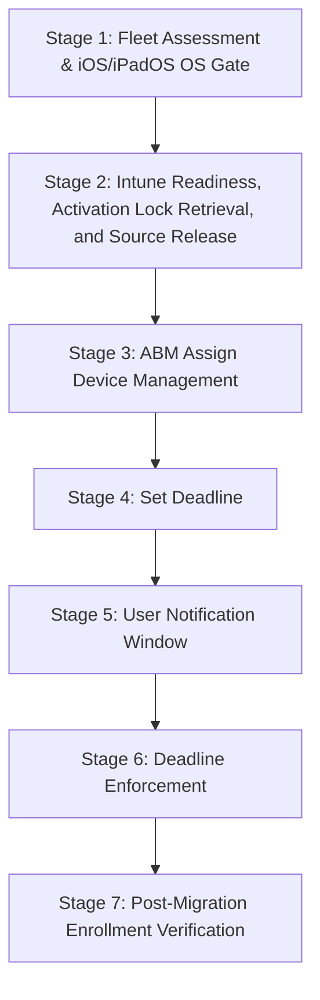

> **Platform gate:** This guide covers iOS/iPadOS MDM migration from Kandji/Iru to Microsoft Intune using the ABM "Assign Device Management" + Deadline in-place path (iOS/iPadOS 26 or later). For the underlying ADE enrollment pipeline (including the pre-26 wipe re-enroll path), see [iOS/iPadOS ADE Lifecycle](01-ade-lifecycle.md). For macOS MDM migration, see [macOS MDM Migration Walkthrough](../macos-lifecycle/02-mdm-migration-psso.md).

# iOS/iPadOS MDM Migration Walkthrough: In-Place Migration (iOS/iPadOS 26+)

This is a single-file operator walkthrough threading an iPhone or iPad through MDM migration from Kandji/Iru to Intune using the ABM "Assign Device Management" + Deadline in-place path. It serves all three roles: **L1 Service Desk** (use "What the Admin Sees" and "Watch Out For" for orientation and failure identification), **L2 Desktop Engineering** (use "Behind the Scenes" for protocol and MDM detail), and **Intune Admins** (use "What Happens" for the complete configuration workflow).

## Which Path Is Right for You?

| Path | iOS/iPadOS Requirement | Migration Type | Use When |
|------|------------------------|----------------|----------|
| **In-Place (ABM "Assign Device Management" + Deadline)** | iOS/iPadOS 26 or later (hard gate) | Wipe-free in-place; device restarts and re-enrolls automatically at deadline | Target devices confirmed running iOS/iPadOS 26+; wipe is operationally unacceptable |

> **Pre-26 devices:** iOS/iPadOS 25 or earlier requires a full device erase before re-enrolling via ADE. See [Pre-iOS/iPadOS-26: Wipe Required](#pre-iosipados-26-wipe-required) below for the short-form pointer.

> **Userless devices:** Devices enrolled without user affinity follow the same in-place migration path; however, this walkthrough covers user-affinity enrollments. For shared/kiosk (userless) devices, verify Intune ADE enrollment policy settings appropriate for no-affinity enrollment.

### Prerequisites

All prerequisites must be met before Stage 1. The ADE pipeline prerequisites (ABM account, ADE token, APNs certificate, Intune licenses, network endpoints) are covered in [iOS/iPadOS ADE Lifecycle — Prerequisites](01-ade-lifecycle.md).

**Prerequisites for in-place migration (iOS/iPadOS 26+):**

- [ ] Apple Business Manager account configured and ADE token uploaded to Intune
- [ ] Kandji/Iru source MDM has devices enrolled and managed (migration out of source MDM)
- [ ] Intune ADE enrollment policy configured with: User Affinity — Enroll with User Affinity; Authentication — Setup Assistant with modern authentication; Await Configuration: Yes; Locked Enrollment: Yes
- [ ] iOS/iPadOS 26 or later confirmed on all target devices (hard gate — in-place path not available on earlier iOS/iPadOS; route pre-26 devices to the wipe path)
- [ ] Intune ADE enrollment policy assigned to target device serial numbers in ABM, or set as the default for the ADE token, BEFORE triggering ABM "Assign Device Management"
- [ ] Network connectivity verified to required Intune and Apple ADE endpoints (see [iOS/iPadOS ADE Lifecycle](01-ade-lifecycle.md) for endpoint list)
- [ ] Activation Lock bypass codes retrieved from Kandji/Iru console BEFORE any device migration (permanently destroyed on Delete Device Record — see Stage 2)
- [ ] Pilot device identified for supervision-status verification before fleet migration

---

## The MDM Migration Pipeline

> All seven stages apply to the iOS/iPadOS 26+ in-place track. There is no pipeline fork — all in-place migration devices follow a single linear path. For devices running iOS/iPadOS 25 or earlier, a full device erase is required before re-enrolling via ADE; see [Pre-iOS/iPadOS-26: Wipe Required](#pre-iosipados-26-wipe-required).

---

## Stage Summary Table

| Stage | Actor | Location | What Happens | Key Pitfall | Path |
|-------|-------|----------|--------------|-------------|------|
| 1: Fleet Assessment & iOS/iPadOS OS Gate | Admin | Intune / device fleet | Confirm all target devices running iOS/iPadOS 26+ for in-place migration; pre-26 devices routed to wipe path | Setting deadline on a device running iOS/iPadOS 25 or earlier — in-place migration is not supported; device cannot complete enrollment | In-place |
| 2: Intune Readiness, Activation Lock Retrieval, and Source Release | Admin | Intune admin center + Kandji/Iru console | Verify Intune ADE enrollment policy assigned; retrieve Activation Lock bypass code; Delete Device Record; allow 15-min agent removal | Deleting Device Record BEFORE retrieving Activation Lock bypass code — permanently destroys the bypass code | In-place |
| 3: ABM "Assign Device Management" | Admin | Apple Business Manager | Assign device serial(s) to Intune MDM server in ABM; triggers migration workflow on device | Triggering before Intune readiness confirmed — device migrates with no enrollment policy and cannot complete re-enrollment | In-place |
| 4: Set Deadline | Admin | Apple Business Manager | Set migration deadline (1–90 day range) after Intune readiness confirmed | Setting deadline before ADE enrollment policy is assigned to device serial in Intune | In-place |
| 5: User Notification Window | User | On-device | User receives migration notifications (daily → hourly → 60/30/10/1 min) and can initiate enrollment voluntarily | User dismisses all notifications; deadline passes without enrollment initiated | In-place |
| 6: Deadline Enforcement | Device | On-device | iOS/iPadOS performs a forced device restart at the deadline; device reboots and re-enrolls with Intune automatically — no user-facing locked screen (unlike macOS, which displays a non-dismissible full-screen prompt) | Enrollment policy not assigned in Intune before deadline — device restarts but cannot complete re-enrollment | In-place |
| 7: Post-Migration Enrollment Verification | Admin | Intune admin center + on-device | Confirm device appears in Intune as enrolled; verify compliance status; confirm new Intune management profile present and Kandji/Iru profile absent in Settings | Missing VPP app re-assignment in Intune — managed apps may not be re-delivered post-migration without pre-assigning apps before the deadline | In-place |

---

## Stage 1: Fleet Assessment and iOS/iPadOS OS Gate

### What the Admin Sees

In the **Intune admin center**, navigate to **Devices > iOS/iPadOS > All Devices** to audit device OS versions for all migration candidates. Alternatively, use a Kandji/Iru fleet report or ABM device inventory to identify iOS/iPadOS versions. The goal is to classify every target device as either iOS/iPadOS 26+ (eligible for in-place migration) or iOS/iPadOS 25 or earlier (must use wipe path) before setting any deadline.

### What Happens

1. **Inventory target devices.** Compile a list of all devices targeted for migration from Kandji/Iru to Intune, with their serial numbers and current iOS/iPadOS version.

2. **OS gate classification.** For each device:
   - iOS/iPadOS 26 or later → eligible for in-place migration; continue through this guide.
   - iOS/iPadOS 25 or earlier → wipe required; see [Pre-iOS/iPadOS-26: Wipe Required](#pre-iosipados-26-wipe-required).

3. **Pilot device selection.** Identify one or more pilot devices for validating the in-place migration workflow before fleet-wide rollout. A pilot is strongly recommended before setting deadlines across the full fleet.

4. **Segment the migration wave.** Group devices by OS version. Plan separate migration waves for in-place eligible (iOS/iPadOS 26+) and wipe-required (iOS/iPadOS 25 or earlier) devices. Do not set a deadline on a mixed fleet without confirming OS versions first.

### Behind the Scenes

- The iOS/iPadOS 26 OS gate is a hard gate enforced by Apple. The ABM "Assign Device Management" migration workflow triggers an automatic forced restart and re-enrollment on iOS/iPadOS 26 or later. Devices running iOS/iPadOS 25 or earlier will not receive the in-place migration behavior — the ABM server-side reassignment takes effect only at next activation (Setup Assistant after wipe).
- iOS/iPadOS version auditing via Intune may lag by up to 8 hours depending on the device check-in cycle. Verify OS versions in ABM or Kandji/Iru for the most current data before setting deadlines.

### Watch Out For

- **Setting a deadline before confirming OS version.** If a device is running iOS/iPadOS 25 or earlier and the deadline is set, the in-place migration cannot complete on that device. Verify iOS/iPadOS versions for every device in the migration wave before setting any deadline.
- **Mixed-version fleet without segmentation.** Setting a single deadline across a fleet that includes both iOS/iPadOS 26+ and pre-26 devices will result in pre-26 devices being unable to complete in-place migration. Always segment by OS version before applying deadlines.

---

## Stage 2: Intune Readiness, Activation Lock Retrieval, and Source Release

*This is the shared pre-flight stage. Complete all steps in this stage BEFORE proceeding to Stage 3 for any device.*

### What the Admin Sees

In the **Intune admin center**, navigate to **Devices > Enrollment > Apple tab > Enrollment program tokens > [your token] > Devices** to confirm the target device serial numbers appear and have an enrollment policy assigned. In the **Kandji/Iru console**, navigate to the device record to retrieve the Activation Lock bypass code before initiating any deletion action.

> **Important:** Retrieve the Activation Lock bypass code from Kandji/Iru BEFORE performing Delete Device Record. The bypass code is **permanently destroyed** when the device record is deleted. There is no recovery path after deletion. Activation Lock bypass codes are only available within 30 days of the device being supervised — do not delay retrieval.

> **Note:** iOS Data Protection is hardware-tied and always-on — there is no MDM-escrowed FileVault recovery key on iOS/iPadOS. Unlike macOS, you do not need to retrieve a FileVault recovery key before deleting the device record. The only secret to retrieve before deletion is the Activation Lock bypass code.

### What Happens

1. **Intune readiness verification.** Confirm the following before triggering any ABM action:
   - ADE token is active and not expired in Intune.
   - ADE enrollment policy is assigned to the target device serial numbers **OR** set as the default policy for the ADE token in Intune.
   - CA exclusions and TLS inspection exemptions are in place for Intune and Apple ADE endpoints.

   > **Note:** iOS/iPadOS has no Platform SSO and no PSSO Settings Catalog policy. iOS Intune readiness requires only the ADE enrollment policy — there is no equivalent of the macOS PSSO Settings Catalog policy to configure before migration.

2. **VPP/Apps and Books token sequencing (if applicable).** If your organization is also migrating app licenses from Kandji/Iru to Intune: revoke app licenses in Kandji/Iru **first**, then remove the VPP token from Kandji/Iru, then upload the token to Intune. Pre-assign VPP apps to the target user or device groups in Intune **before** the migration deadline to minimize app disruption after migration. VPP licenses are not automatically transferred during migration.

3. **Activation Lock bypass code retrieval.** In the Kandji/Iru console, navigate to the device record and retrieve the Activation Lock bypass code. Record it securely — this code is permanently destroyed when the device record is deleted.

   > **Note:** As of 2026-07-01: `support.kandji.io` displays Iru branding ("Kandji is now Iru") and remains accessible. `docs.iru.com` is the authoritative Iru public docs domain. `support.iru.io` resolves but is a login-gated SPA — console navigation there is not verifiable without operator login credentials. The conceptual action is the same regardless of which portal you access: navigate to the device record, open the Device Action Menu, and access the Activation Lock bypass code before any deletion step. Verify current console labels on your own authoring day — both Kandji and Iru names may appear depending on the portal and rebranding progress.

4. **Source-side release — Delete Device Record.** After the Activation Lock bypass code is retrieved and Intune readiness is confirmed, perform the Delete Device Record action in the Kandji/Iru console for each device being migrated in this wave. The conceptual UI path is:
   - Navigate to **Devices**.
   - Click the target device.
   - Click the **Device Action Menu** (top right of device record).
   - Select **Delete Device Record**.
   - In the confirmation popup, type **DELETE** in the text field.
   - Click **Delete Device Record** to confirm.

   Verify exact labels in the current console on your authoring day — console navigation at `support.iru.io` is not verifiable without login; confirm via `docs.iru.com` if labels differ.

   After deletion: the Kandji/Iru agent receives notification at its next check-in (~15 minutes) and automatically uninstalls itself, removing all installed profiles. Allow approximately 15 minutes before proceeding to avoid profile conflicts.

### Behind the Scenes

- Activation Lock bypass codes are device-specific codes that allow an administrator to bypass Activation Lock if the supervising MDM is removed. These codes are generated when the device is supervised and are only available within 30 days of supervision.
- iOS/iPadOS uses Data Protection for at-rest encryption — it is hardware-tied, always-on, and does not use a software recovery key escrowed to the MDM. There is no iOS/iPadOS equivalent of the macOS FileVault recovery key; no FileVault key retrieval step is needed on iOS/iPadOS.
- After Delete Device Record, the Kandji/Iru agent on the device will receive an uninstall command at the next MDM check-in and remove itself. Until this occurs, the agent may attempt to contact Kandji/Iru servers — this is expected and resolves at the 15-minute check-in.

### Watch Out For

- **Deleting the device record before retrieving the Activation Lock bypass code.** The bypass code is permanently destroyed on Delete Device Record. No Apple or Kandji/Iru recovery path exists after deletion.
- **Triggering ABM migration before Intune ADE enrollment policy is assigned.** If the ADE enrollment policy is not assigned to the device serial number in Intune before the device attempts re-enrollment, the device will restart but cannot complete re-enrollment. ABM admin must cancel the migration to recover.
- **VPP app continuity.** VPP app licenses are not automatically transferred during migration. Pre-assign iOS apps in Intune before the migration deadline to minimize disruption after migration. If managed app data preservation is important, ensure Intune delivers the managed app via VPP before sending the `DeviceConfigured` command (controlled via the "Await Configuration" policy setting).

---

## Stage 3: ABM "Assign Device Management"

### What the Admin Sees

In **Apple Business Manager (ABM)**, navigate to **Devices** and locate the target device by serial number. Select the device, open the action menu (typically an ellipsis or "More" button), and select **"Assign Device Management"** (the action may be labeled "Re-assign Device Management" depending on the device's current assignment state — verify in the current ABM portal).

> **Note:** The ABM button label may read "Assign Device Management" or "Re-assign Device Management" depending on whether the device was previously assigned to another MDM server. Verify the current label in your ABM portal on authoring day. The conceptual action is the same regardless of label: assign the device's serial number to the Intune MDM server.

### What Happens

1. **ABM device assignment.** In ABM, select the target device serial number(s) and assign them to the Intune MDM server. This triggers the MDM migration workflow on the device. After assignment:
   - The device appears in the Intune enrollment device list after the next ABM sync (up to 24 hours for automatic sync; trigger manual sync via Intune admin center if needed, rate-limited to once per 15 minutes).
   - The migration deadline workflow becomes available for the device in ABM.

2. **Confirm device in Intune.** After sync, navigate to **Intune admin center > Devices > Enrollment > Apple > Enrollment program tokens > [your token] > Devices** and confirm the device serial number is listed with an enrollment policy assigned.

3. **Pre-deadline readiness check.** Before setting the deadline (Stage 4), confirm:
   - The device serial appears in Intune's enrollment list with the correct ADE enrollment policy assigned.
   - VPP apps have been pre-assigned to the target user or device group in Intune (if applicable).

### Behind the Scenes

- ABM "Assign Device Management" updates the device's MDM assignment record at Apple's servers. The device receives this assignment update when it next contacts Apple's device enrollment endpoints.
- The migration does not occur immediately at ABM assignment — the device must still reach the deadline enforcement stage (Stage 6) or the user must initiate enrollment voluntarily during the notification window (Stage 5).
- From Intune's perspective, the migrated iOS/iPadOS device re-enrolls as a fresh ADE enrollment using the existing ADE enrollment policy assigned to the device serial number in Intune.

### Watch Out For

- **Assigning to Intune before deleting the device record in Kandji/Iru.** If the Kandji/Iru device record is still active when the device contacts ABM, the Kandji/Iru agent may interfere with the Intune enrollment. Complete Stage 2 (Activation Lock bypass code retrieval, Delete Device Record, allow ~15 min agent removal) before triggering ABM assignment.
- **No enrollment policy assigned.** If ABM "Assign Device Management" is completed but the Intune ADE enrollment policy is not assigned to the device serial, the device will restart at the deadline with nowhere to enroll.
- **Sync lag.** Allow up to 24 hours for the device to appear in Intune's enrollment list after ABM assignment. Trigger a manual sync in the Intune admin center for time-sensitive migrations.

---

## Stage 4: Set Deadline

### What the Admin Sees

In **Apple Business Manager (ABM)**, navigate to the device record or the pending migration entry. Set a migration deadline within the 1–90 day range. The deadline triggers a countdown on the device with notifications leading up to enforcement.

> **Note:** Set the deadline ONLY after confirming Intune readiness (Stage 3 pre-deadline check): the ADE enrollment policy must be assigned to the device serial number in Intune. A deadline on a device without a valid enrollment policy results in a device restart that cannot complete re-enrollment.

### What Happens

1. **Deadline selection.** Set the deadline in ABM for the target device(s). Recommended approach:
   - For initial pilots: use a generous deadline (14+ days) to allow time to observe the notification cadence and validate the enrollment process before fleet rollout.
   - For fleet migrations: work with users and operations to select a deadline that provides adequate advance notice while meeting organizational migration timelines.
   - Do NOT set the deadline before Intune readiness (ADE enrollment policy assigned) is confirmed.

2. **Pilot validation.** After setting the deadline on a pilot device, monitor the Intune admin center to confirm the device appears in the enrollment list and the enrollment policy is shown as assigned. Watch for the first notification on the pilot device (daily cadence begins immediately after deadline is set).

3. **Fleet deadline rollout.** After validating the pilot device migration end-to-end (through Stage 7), set deadlines for the remaining fleet devices.

### Behind the Scenes

- The ABM deadline mechanism is part of Apple's managed device migration feature (iOS/iPadOS 26+). The deadline is held at Apple's ABM servers and enforced on the device.
- The deadline can be modified or removed via ABM before enforcement. Once the deadline is reached, iOS/iPadOS performs a forced device restart — the device reboots and completes enrollment automatically. Unlike macOS, there is no post-deadline "locked screen" state that can be cancelled via ABM while a user is stuck on it.

### Watch Out For

- **Setting the deadline before Intune ADE enrollment policy is confirmed.** If the enrollment policy is not assigned and the deadline is reached, the device restarts but cannot complete re-enrollment.
- **Too-short deadline on initial pilot.** A very short deadline (1–2 days) on a pilot device leaves no time to identify and resolve enrollment policy issues before enforcement. Use 14+ days for initial pilots.
- **VPP app pre-assignment timing.** VPP apps should be assigned in Intune before the migration deadline is set (or at minimum before the deadline is reached), to maximize the chance that apps are available when the device re-enrolls.

---

## Stage 5: User Notification Window

### What the Admin Sees

After the deadline is set in ABM, the device begins displaying migration notifications to the user according to the fixed notification cadence. In the **Intune admin center**, the device's enrollment status remains "Not enrolled" until the user initiates enrollment or the deadline is enforced. Monitor the Intune admin center for enrollment events.

### What Happens

1. **Notification cadence.** After the deadline is set, iOS/iPadOS sends migration notifications to the user on the following schedule:
   - **Daily** until 24 hours before the deadline.
   - **Hourly** in the last 24 hours before the deadline.
   - **Every 60, 30, 10, and 1 minute(s)** in the last hour before the deadline.

2. **User-initiated enrollment.** The user can tap "Start Enrollment" on any notification to begin the migration process before the deadline. Early adoption is encouraged — the notification prompt gives users an opportunity to migrate at a convenient time rather than waiting for the automatic restart at deadline.

3. **Deadline approaches.** If the user takes no action, the notification cadence intensifies. No enrollment action from the user results in deadline enforcement at Stage 6.

### Behind the Scenes

- The notification cadence is fixed by Apple and cannot be customized. Notifications are presented via the iOS/iPadOS notification system.
- The user can dismiss individual notifications without initiating enrollment. All dismissals are non-permanent — the next notification in the cadence will appear at the scheduled time.
- Users who initiate enrollment voluntarily (before the deadline) proceed through the ADE re-enrollment flow without experiencing the automatic forced restart at the deadline.

> **Note:** iOS/iPadOS has no PSSO Settings Catalog policy to monitor during the notification window. Enrollment readiness on iOS/iPadOS requires only the ADE enrollment policy assigned to the device serial number in Intune — no additional policy delivery verification is needed during Stage 5.

### Watch Out For

- **Users dismissing all notifications.** Users who habitually dismiss notifications may reach the deadline without acting. Communicate the migration timeline and the consequences of the deadline (automatic device restart) to users in advance.
- **User-initiated enrollment before Intune readiness.** If a user attempts enrollment before the Intune ADE enrollment policy is confirmed assigned, enrollment will fail. Ensure Intune readiness (Stage 3) is complete before the first notification appears on devices.

---

## Stage 6: Deadline Enforcement

### What the Admin Sees

At the deadline time, iOS/iPadOS performs an automatic forced restart — the device reboots and re-enrolls with Intune without any user interaction. Unlike macOS, there is no visible locked screen for the admin or user to monitor; the device simply restarts and re-enrolls in the background. In the **Intune admin center**, the device's enrollment status transitions from "Not enrolled" to "Enrolled" after the restart completes and the ADE enrollment policy is applied.

From **ABM**, an admin can cancel or modify the migration deadline before enforcement reaches the device (see Watch Out For for recovery options if enrollment cannot complete post-restart).

### What Happens

1. **Deadline enforcement on iOS/iPadOS:** At the deadline, iOS/iPadOS performs a **forced device restart** — the device reboots and completes enrollment in Intune automatically. Unlike macOS (which displays a non-dismissible full-screen prompt), there is no locked screen on iOS/iPadOS requiring active user input at deadline time. After the restart, the device re-enrolls with Intune using the ADE enrollment policy assigned to the device serial number.

2. **Automatic ADE re-enrollment.** After the forced restart, the device contacts Apple's ADE endpoints and Intune during startup. The device re-enrolls under the Intune ADE enrollment policy assigned to its serial number. The process is automatic and requires no user action.

3. **Admin recovery (if enrollment cannot complete after restart).** If the device restarts but cannot complete re-enrollment (for example, because the enrollment policy was not assigned):
   - **Before the deadline (preferred):** In ABM, navigate to the device and cancel or modify the deadline to give time to fix the Intune enrollment policy assignment.
   - **After restart (enrollment failed):** Correct the Intune-side enrollment issue (confirm ADE enrollment policy is assigned to the device serial number; confirm network connectivity). The device can attempt re-enrollment at its next check-in. If re-enrollment cannot complete, contact Apple Business Support or escalate to L2 for ABM-level recovery.

   > **Note:** ABM admin recovery for an iOS/iPadOS device that has restarted but failed to re-enroll is MEDIUM confidence. Verify current ABM documentation for the exact recovery UI path, or contact Apple Business Support.

### Behind the Scenes

- The iOS/iPadOS 26 forced-restart enforcement is the device-platform equivalent of the macOS 26 non-dismissible full-screen prompt — both enforce MDM migration at the deadline — but the enforcement mechanism differs fundamentally. macOS presents a full-screen lock that the user must actively resolve; iOS/iPadOS reboots the device automatically and re-enrolls without user interaction.
- After the restart, the iOS/iPadOS device contacts Apple's ADE servers (the same activation flow as initial ADE enrollment) and retrieves the Intune ADE enrollment profile assigned in ABM.
- The forced restart is silent from the user's perspective beyond the reboot itself — the device does not display a migration prompt or enrollment wizard after restarting. Enrollment completes in the background during the boot sequence.

### Watch Out For

- **Enrollment policy not assigned before deadline.** If the Intune ADE enrollment policy is not assigned to the device serial number, the device will restart but cannot complete re-enrollment. The result is a device that is unmanaged post-restart, with no Kandji/Iru or Intune management profile present.
- **Network unavailability at restart.** If the device cannot reach Apple's ADE endpoints or Intune endpoints during the restart and re-enrollment, enrollment will fail. Ensure network connectivity (Wi-Fi) is available at the expected deadline time, or adjust the deadline to a time when devices are reliably on a managed network.
- **Assuming macOS recovery paths apply.** On macOS, a deadline-locked device can be recovered via ABM cancellation while the user is on the locked screen. On iOS/iPadOS, the enforcement is an automatic restart — there is no locked-screen state to cancel post-restart. Recovery on iOS/iPadOS after a failed re-enrollment requires fixing the Intune configuration and waiting for the next check-in.

---

## Stage 7: Post-Migration Enrollment Verification

### What the Admin Sees

After the device restarts and re-enrolls, the admin verifies enrollment status in the **Intune admin center** and the user verifies the management profile on-device. There is no terminal command available on iOS/iPadOS to check SSO or management state — all verification is portal-based and on-device via Settings.

### What Happens

1. **Intune admin center verification.** Navigate to **Intune admin center > Devices > iOS/iPadOS > All Devices**. Confirm:
   - The device appears with enrollment status **Enrolled**.
   - The device's compliance status reaches **Compliant** once compliance policies evaluate (may take up to 15 minutes after enrollment).
   - The device serial number matches the expected device.

2. **On-device Settings verification.** On the device, navigate to **Settings > General > VPN & Device Management**. Confirm:
   - The new Intune management profile is present (labeled with your organization's name or Intune branding).
   - The Kandji/Iru management profile is absent.

3. **Company Portal verification (if deployed).** Open the **Company Portal** app on the device. Confirm:
   - The device appears as enrolled.
   - The organization name is visible.
   - No compliance alerts are shown (once policies have evaluated).

   > **Note:** Platform SSO is macOS-only — it does not exist on iOS/iPadOS. iOS/iPadOS enrollment verification is portal-first and on-device Settings only. No terminal or command-line enrollment verification step exists on iOS/iPadOS.

4. **Pilot sign-off before fleet migration.** After verifying the pilot device through all seven stages, confirm the following before setting deadlines for the remaining fleet:
   - Enrollment status: Enrolled.
   - Compliance status: Compliant.
   - Intune management profile: present in Settings.
   - Kandji/Iru management profile: absent.
   - Assigned VPP apps: re-delivered (if applicable).

### Behind the Scenes

- After the forced restart, iOS/iPadOS completes ADE enrollment using the same activation flow as initial ADE enrollment. The device serial number is looked up in ABM, and the Intune MDM enrollment profile assigned to that serial is delivered.
- Unlike macOS migration (which results in "profile-based enrollment"), iOS/iPadOS migration results in a standard ADE enrollment — the device re-enrolls through Setup Assistant equivalents handled silently at boot.
- Supervision state is re-established as part of the ADE re-enrollment. The device remains supervised after migration (supervision is set at ADE enrollment time on iOS/iPadOS).

### Watch Out For

- **VPP app re-delivery.** VPP-licensed apps assigned in Intune are re-delivered after enrollment. If apps were not pre-assigned in Intune before migration, the user may see previously managed apps become unmanaged or require re-installation. Pre-assigning apps (Stage 2) minimizes this disruption.
- **Compliance policy evaluation delay.** After re-enrollment, the device may show as "Not compliant" for up to 15 minutes while compliance policies evaluate. This is expected — do not escalate unless the device remains non-compliant after 30 minutes.
- **Kandji/Iru profile not removed.** If the Kandji/Iru management profile is still visible in Settings after migration, the Delete Device Record action in Stage 2 may not have completed, or the Kandji/Iru agent removal did not propagate before the migration deadline. In this case, escalate to L2 for manual MDM profile removal investigation.

---

## Pre-iOS/iPadOS-26: Wipe Required

> **Pre-iOS/iPadOS-26 wipe-and-re-enroll — required for all devices running iOS/iPadOS 25 or earlier.**
>
> The in-place ABM "Assign Device Management" + Deadline migration path is not available on iOS/iPadOS 25 or earlier. For pre-26 devices, a full device erase is required; the device re-enrolls via ADE in Setup Assistant after the wipe.
>
> **Before wiping:** Retrieve the Activation Lock bypass code from Kandji/Iru and perform Delete Device Record (same sequencing as Stage 2 above). The bypass code is permanently destroyed on device-record deletion.
>
> For the complete ADE re-enroll pipeline after wipe, see [iOS/iPadOS ADE Lifecycle](01-ade-lifecycle.md).

---

## See Also

**Terminology and Concepts:**

- [Apple Provisioning Glossary](../_glossary-macos.md) -- MDM migration, ABM, Activation Lock, ADE, Kandji/Iru, Deadline terminology (shared Apple glossary covering iOS/iPadOS terms)

**Related Guides:**

- [iOS/iPadOS ADE Lifecycle](01-ade-lifecycle.md) -- Complete ADE enrollment pipeline; base ADE prerequisites and mechanics; pre-26 wipe re-enroll path
- [iOS/iPadOS Enrollment Path Overview](00-enrollment-overview.md) -- Enrollment path comparison and selection guidance for iOS/iPadOS
- [macOS MDM Migration Walkthrough](../macos-lifecycle/02-mdm-migration-psso.md) -- macOS parallel migration walkthrough (B1 in-place + B2 wipe-and-re-enroll); includes macOS-specific post-migration stages for FileVault key management and Platform SSO provisioning that have no iOS/iPadOS equivalent

---

## Glossary Quick Reference

Key terms used throughout this guide. Full definitions are in the [Apple Provisioning Glossary](../_glossary-macos.md).

| Term | Definition | First Appears |
|------|-----------|---------------|
| [ABM "Assign Device Management"](../_glossary-macos.md#assign-device-management) | Apple Business Manager action that assigns a device's serial number to an MDM server, triggering the managed device migration workflow on iOS/iPadOS 26+ | Stage 3 |
| [Deadline](../_glossary-macos.md#deadline) | Migration enforcement date set in ABM (1–90 day range); at the deadline, iOS/iPadOS performs a forced device restart and re-enrolls automatically | Stage 4 |
| [Activation Lock bypass code](../_glossary-macos.md#activation-lock-bypass) | Device-specific code enabling an admin to bypass Activation Lock if the supervising MDM is removed; permanently destroyed on Delete Device Record; only available within 30 days of supervision | Stage 2 |
| [Kandji / Iru](../_glossary-macos.md#kandji-iru) | macOS and iOS/iPadOS MDM platform; rebranded from Kandji to Iru in October 2025; `support.kandji.io` hosts Iru-branded KB articles (verified accessible 2026-07-01); `docs.iru.com` is the new authoritative public docs domain; `support.iru.io` resolves but is a login-gated SPA | Stage 2 |
| [Delete Device Record](../_glossary-macos.md#delete-device-record) | Kandji/Iru console action that removes the device from MDM management and permanently destroys associated secrets; triggers agent self-removal at next check-in (~15 min) | Stage 2 |

---

## Version History

| Date | Change |
|------|--------|
| 2026-07-01 | Phase 110: initial iOS/iPadOS MDM migration walkthrough (in-place path, iOS/iPadOS 26+) |
