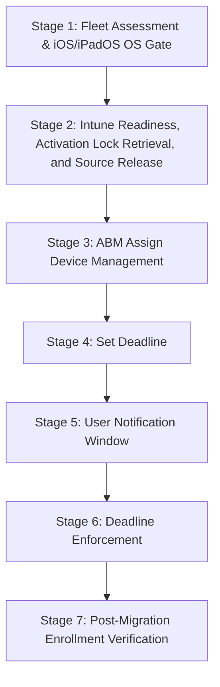

> **Platform gate:** This guide covers iOS/iPadOS MDM migration from Kandji/Iru to Microsoft Intune using the ABM "Assign Device Management" + Deadline in-place path (iOS/iPadOS 26 or later). For the underlying ADE enrollment pipeline (including the pre-26 wipe re-enroll path), see [iOS/iPadOS ADE Lifecycle](01-ade-lifecycle.md). For macOS MDM migration, see [macOS MDM Migration Walkthrough](../macos-lifecycle/02-mdm-migration-psso.md).

# iOS/iPadOS MDM Migration Walkthrough: In-Place Migration (iOS/iPadOS 26+)

This is a single-file operator walkthrough threading an iPhone or iPad through MDM migration from Kandji/Iru to Intune using the ABM "Assign Device Management" + Deadline in-place path. It serves all three roles: **L1 Service Desk** (use "What the Admin Sees" and "Watch Out For" for orientation and failure identification), **L2 Desktop Engineering** (use "Behind the Scenes" for protocol and MDM detail), and **Intune Admins** (use "What Happens" for the complete configuration workflow).

## Which Path Is Right for You?

| Path | iOS/iPadOS Requirement | Migration Type | Use When |
|------|------------------------|----------------|----------|
| **In-Place (ABM "Assign Device Management" + Deadline)** | iOS/iPadOS 26 or later (hard gate) | Wipe-free in-place; device restarts and re-enrolls automatically at deadline | Target devices confirmed running iOS/iPadOS 26+; wipe is operationally unacceptable |

> **Pre-26 devices:** iOS/iPadOS 25 or earlier requires a full device erase before re-enrolling via ADE. See [Pre-iOS/iPadOS-26: Wipe Required](#pre-iosipados-26-wipe-required) below for the short-form pointer.

> **Userless devices:** Devices enrolled without user affinity follow the same in-place migration path; however, this walkthrough covers user-affinity enrollments. For shared/kiosk (userless) devices, verify Intune ADE enrollment policy settings appropriate for no-affinity enrollment.

### Prerequisites

All prerequisites must be met before Stage 1. The ADE pipeline prerequisites (ABM account, ADE token, APNs certificate, Intune licenses, network endpoints) are covered in [iOS/iPadOS ADE Lifecycle — Prerequisites](01-ade-lifecycle.md).

**Prerequisites for in-place migration (iOS/iPadOS 26+):**

- [ ] Apple Business Manager account configured and ADE token uploaded to Intune
- [ ] Kandji/Iru source MDM has devices enrolled and managed (migration out of source MDM)
- [ ] Intune ADE enrollment policy configured with: User Affinity — Enroll with User Affinity; Authentication — Setup Assistant with modern authentication; Await Configuration: Yes; Locked Enrollment: Yes
- [ ] iOS/iPadOS 26 or later confirmed on all target devices (hard gate — in-place path not available on earlier iOS/iPadOS; route pre-26 devices to the wipe path)
- [ ] Intune ADE enrollment policy assigned to target device serial numbers in ABM, or set as the default for the ADE token, BEFORE triggering ABM "Assign Device Management"
- [ ] Network connectivity verified to required Intune and Apple ADE endpoints (see [iOS/iPadOS ADE Lifecycle](01-ade-lifecycle.md) for endpoint list)
- [ ] Activation Lock bypass codes retrieved from Kandji/Iru console BEFORE any device migration (permanently destroyed on Delete Device Record — see Stage 2)
- [ ] Pilot device identified for supervision-status verification before fleet migration

---

## The MDM Migration Pipeline

> All seven stages apply to the iOS/iPadOS 26+ in-place track. There is no pipeline fork — all in-place migration devices follow a single linear path. For devices running iOS/iPadOS 25 or earlier, a full device erase is required before re-enrolling via ADE; see [Pre-iOS/iPadOS-26: Wipe Required](#pre-iosipados-26-wipe-required).

---

## Stage Summary Table

| Stage | Actor | Location | What Happens | Key Pitfall | Path |
|-------|-------|----------|--------------|-------------|------|
| 1: Fleet Assessment & iOS/iPadOS OS Gate | Admin | Intune / device fleet | Confirm all target devices running iOS/iPadOS 26+ for in-place migration; pre-26 devices routed to wipe path | Setting deadline on a device running iOS/iPadOS 25 or earlier — in-place migration is not supported; device cannot complete enrollment | In-place |
| 2: Intune Readiness, Activation Lock Retrieval, and Source Release | Admin | Intune admin center + Kandji/Iru console | Verify Intune ADE enrollment policy assigned; retrieve Activation Lock bypass code; Delete Device Record; allow 15-min agent removal | Deleting Device Record BEFORE retrieving Activation Lock bypass code — permanently destroys the bypass code | In-place |
| 3: ABM "Assign Device Management" | Admin | Apple Business Manager | Assign device serial(s) to Intune MDM server in ABM; triggers migration workflow on device | Triggering before Intune readiness confirmed — device migrates with no enrollment policy and cannot complete re-enrollment | In-place |
| 4: Set Deadline | Admin | Apple Business Manager | Set migration deadline (1–90 day range) after Intune readiness confirmed | Setting deadline before ADE enrollment policy is assigned to device serial in Intune | In-place |
| 5: User Notification Window | User | On-device | User receives migration notifications (daily → hourly → 60/30/10/1 min) and can initiate enrollment voluntarily | User dismisses all notifications; deadline passes without enrollment initiated | In-place |
| 6: Deadline Enforcement | Device | On-device | iOS/iPadOS performs a forced device restart at the deadline; device reboots and re-enrolls with Intune automatically — no user-facing locked screen (unlike macOS, which displays a non-dismissible full-screen prompt) | Enrollment policy not assigned in Intune before deadline — device restarts but cannot complete re-enrollment | In-place |
| 7: Post-Migration Enrollment Verification | Admin | Intune admin center + on-device | Confirm device appears in Intune as enrolled; verify compliance status; confirm new Intune management profile present and Kandji/Iru profile absent in Settings | Missing VPP app re-assignment in Intune — managed apps may not be re-delivered post-migration without pre-assigning apps before the deadline | In-place |

---
