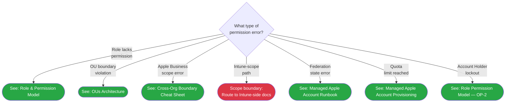

> **Platform gate:** This guide covers Apple Business permission errors across the Apple Business delegated governance surface (iOS/macOS/Shared iPad/Apple TV scoped via Apple Business Organizational Units). For Windows Autopilot, see [L2 Runbooks](00-index.md). For Android Enterprise, see [Android L2 Runbooks](00-index.md#android-l2-runbooks).

# Apple Business Permission Denied Investigation

L2 investigation runbook for Apple Business permission denied errors across all delegation actions. Use this runbook when L1 escalates an Apple Business permission error, or when the Apple Business Quick Reference ([quick-ref-l2.md](../quick-ref-l2.md#apple-business-quick-reference)) routes here.

This runbook contains a 7-leaf Mermaid decision tree (DA-9 LOCKED — 7 leaves). Start at the root, follow the matching branch, then click the leaf to the target runbook (Apple-Business-scoped leaves route via `click` to existing corpus docs) or follow the inline scope-boundary callout (Intune-scope leaf — C15-safe, no `click`). Per-leaf deep-dives live in the routed-to docs; content is not duplicated here (D-04 anti-redundancy). This is the only v1.6 L2 runbook for Apple Business permission errors (#26 cap, Phase 65 CI-5 invariant).

## When to Use

- Apple Business portal returns a "permission denied" error on any delegation action (role assignment, passcode reset, device management, content distribution)
- Sub-org admin cannot perform an action they expect to be allowed (blank UI, disabled button, or explicit error)
- Cross-OU action returns a scope error (admin in OU-A attempts action on OU-B resource)
- Federation handshake failure blocking Managed Apple Account authentication
- Managed Apple Account quota limit reached (provisioning blocked)
- Account Holder unable to perform an action they are expected to own (lockout scenario)
- L1 escalates via [34: Apple Business Shared iPad Passcode Reset](../l1-runbooks/34-apple-business-shared-ipad-passcode-reset.md) with Path A, B, or C failure

## 7-Leaf Decision Tree

## Leaf Reference

### ABPDR1 — Role lacks permission

The user's role does not include the required permission for the action they attempted. Apple Business uses a 7-subgroup permission catalog; the "Reset Shared iPad passcode" and other per-device/per-user actions require explicit grants in the sub-org admin's custom role.

**Next step:** Verify the user's role assignment in Apple Business portal: **Settings** > **People** > [user] > **Role**. Compare against the 7-subgroup permission catalog in [01-role-permission-model.md](../cross-platform/apple-business/01-role-permission-model.md). Confirm the correct permission is listed under the matching subgroup for the user's OU.

### ABPDR2 — OU boundary violation

The admin's role is scoped to one OU but the action targets a resource in a different OU. Apple Business roles are OU-scoped; cross-OU actions fail with permission denied regardless of the role's permission set.

**Next step:** Confirm the failing action's target OU vs the user's OU-scoped role assignment. See [02-ous-architecture.md](../cross-platform/apple-business/02-ous-architecture.md) for the OU primitive and scope rules. Use the pool-owner lookup at [05-sub-org-admin-onboarding.md#which-admin-owns-this-pool](../cross-platform/apple-business/05-sub-org-admin-onboarding.md#which-admin-owns-this-pool) to confirm which admin holds the correct OU scope for the target resource.

### ABPDR3 — Apple Business scope error

The action crosses the Apple Business vs Intune scope boundary — the user is attempting an action that belongs to the Apple Business permission surface but hitting a configuration gap, or mistaking an Intune-side action for an Apple Business action (or vice versa).

**Next step:** Determine whether the failing action is Apple-Business-scoped or Intune-scoped. See [18-cross-org-boundary-cheat-sheet.md](../cross-platform/apple-business/18-cross-org-boundary-cheat-sheet.md) for the full Apple-Business-vs-Intune responsibility table. If the action involves Edit-without-View (OP-3 companion view dependency producing blank UI), see [01-role-permission-model.md](../cross-platform/apple-business/01-role-permission-model.md) Edit-without-View table.

### ABPDE1 — Intune-scope path (out of Apple Business surface)

> **Scope boundary:** This path involves MDM commands (ClearPasscode / EraseDevice) that are issued from the Intune admin center, outside the Apple Business permission surface. See [18-cross-org-boundary-cheat-sheet.md](../cross-platform/apple-business/18-cross-org-boundary-cheat-sheet.md) for the full Apple-Business-vs-Intune responsibility table.

For Intune-side permission errors (MDM action access, device management role assignments, compliance policy authoring), engage an Intune admin center operator with the appropriate role. This runbook covers the Apple Business delegation surface only (per REQUIREMENTS.md:89 and the v1.6 scope boundary).

### ABPDR5 — Federation state error

The Managed Apple Account federation handshake (SCIM or OIDC sync) is in an error state, preventing authentication or account provisioning.

**Next step:** Check the SCIM/OIDC sync status in Apple Business: **Settings** > **Accounts**. See [16-managed-apple-account-runbook.md](../cross-platform/apple-business/16-managed-apple-account-runbook.md) for the 60-day federation collision section and sync error investigation steps.

### ABPDR6 — Quota limit reached

The Managed Apple Account provisioning quota is exhausted; new accounts cannot be created or existing accounts cannot be expanded.

**Next step:** Check the Managed Apple Account quota in the provisioning runbook: [08-managed-apple-account-provisioning.md](../cross-platform/apple-business/08-managed-apple-account-provisioning.md). Confirm the quota ceiling and current usage, then engage Apple Business support if the quota requires an increase.

### ABPDR7 — Account Holder lockout

The Account Holder account is locked out, blocked, or inaccessible. This is a high-severity incident — the Account Holder is the only identity that can re-accept Apple Terms of Service, manage federation root, and recover lost IT Administrator passwords at the tenant level.

**Next step:** See [01-role-permission-model.md](../cross-platform/apple-business/01-role-permission-model.md) OP-2 callout (`:39-58`) — Account Holder DO-NOT-delegate. Account Holder lockout recovery requires Apple Support engagement via an Apple Enterprise Support paid ticket and identity verification; there is no self-service path. A dedicated lockout-recovery runbook is deferred to v1.7+.

## Investigation Checklist

Before routing to a leaf, collect the following L2 diagnostic data:

1. Portal screenshot of the exact error message (full screen — include the action context)
2. Exact error string from the Apple Business portal (copy the error text verbatim)
3. User UPN (Managed Apple Account) of the user experiencing the error
4. User's current role assignment in Apple Business portal (Settings > People > [user] > Role)
5. OU of the action target (the resource the user was trying to act on)
6. OU scope of the user's role assignment (which OU(s) the role covers)
7. Timestamp of the failed action
8. Prior L1 escalation context if applicable (which L1 runbook routed here, what data was collected per the "Before escalating, collect:" checklist)

## Cross-References

- [01-role-permission-model.md](../cross-platform/apple-business/01-role-permission-model.md) — Apple Business 7-subgroup permission catalog; OP-2 Account Holder DO-NOT-DELEGATE; OP-3 Edit-without-View table (ABPDR1 + ABPDR7 targets)
- [02-ous-architecture.md](../cross-platform/apple-business/02-ous-architecture.md) — OU primitive; flat-by-default; OU-scoped resource coverage (ABPDR2 target)
- [18-cross-org-boundary-cheat-sheet.md](../cross-platform/apple-business/18-cross-org-boundary-cheat-sheet.md) — Apple-Business-vs-Intune responsibility table (ABPDR3 target + ABPDE1 scope-boundary reference)
- [16-managed-apple-account-runbook.md](../cross-platform/apple-business/16-managed-apple-account-runbook.md) — Managed Apple Account federation and SCIM/OIDC sync (ABPDR5 target)
- [08-managed-apple-account-provisioning.md](../cross-platform/apple-business/08-managed-apple-account-provisioning.md) — Managed Apple Account quota and provisioning (ABPDR6 target)
- [34-apple-business-shared-ipad-passcode-reset.md](../l1-runbooks/34-apple-business-shared-ipad-passcode-reset.md) — L1 #34 Path A handoff source; L1 staff route here when Path A, B, or C fails
- [12-shared-ipad-passcode-reset.md](../cross-platform/apple-business/12-shared-ipad-passcode-reset.md) — canonical admin-context 3-path matrix for Shared iPad passcode reset (Paths B/C MDM detail)

## Version History

| Date | Change | Author |
|------|--------|--------|
| 2026-05-22 | Phase 65 plan 65-02: initial authoring — L2 Apple Business Permission Denied Investigation; 7-leaf Mermaid tree (DA-9 LOCKED); hybrid leaf behavior per D-02 (6 route + 1 inline Intune-scope) | -- |
