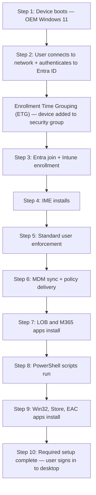
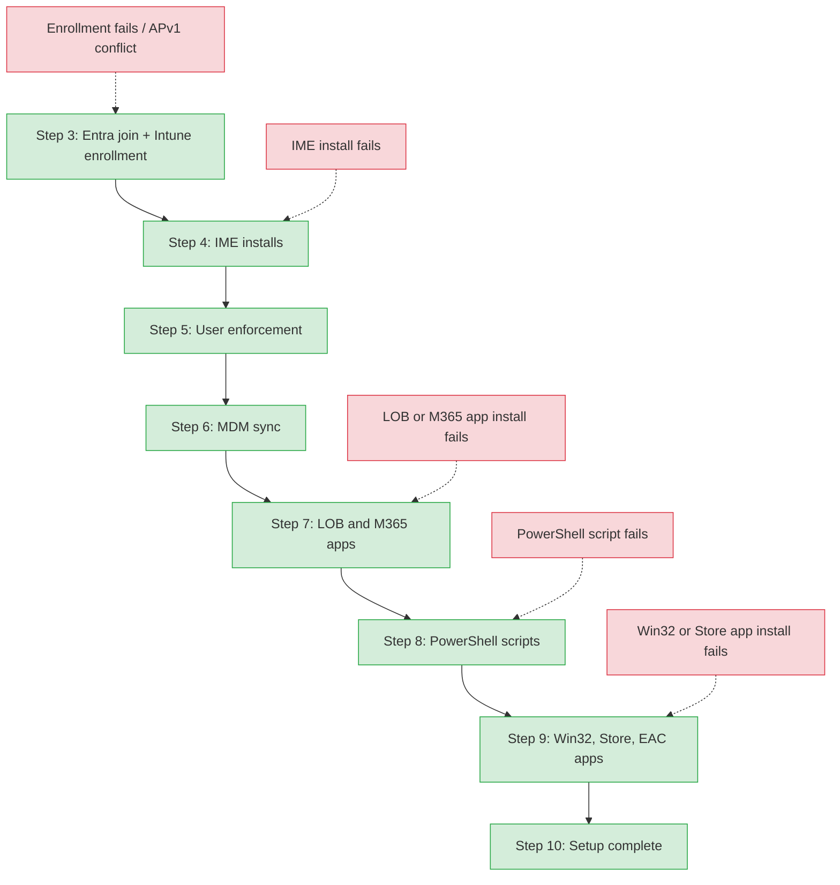

> **Version gate:** This guide covers Windows Autopilot Device Preparation (APv2).
> For Windows Autopilot (classic), see [Autopilot Lifecycle Overview](../lifecycle/00-overview.md).
> For framework selection, see [APv1 vs APv2](../apv1-vs-apv2.md).

# APv2 User-Driven Deployment Flow

## How to Use This Guide

This is the 10-step deployment process for Windows Autopilot Device Preparation (APv2) in user-driven mode. Each step is explained below with what happens, what can fail, and where to look when it does. For prerequisites and configuration requirements, see [APv2 Prerequisites](01-prerequisites.md). For automatic mode (Windows 365 Cloud PCs), see [APv2 Automatic Mode](03-automatic-mode.md).

## Level 1 — Happy Path

> ETG (Enrollment Time Grouping) is the core mechanism that replaces APv1's hardware hash pre-staging. The device is added to a pre-defined security group at enrollment time — no prior device registration required.

## Level 2 — Failure Points

The following diagram shows where common failures surface across the deployment flow. Green nodes are steps; red nodes are failure categories connected to the step where they first appear.

## Step-by-Step Breakdown

### Step 1: Device boots with OEM-preinstalled Windows 11

**What happens:** The device powers on with the OEM-preinstalled Windows 11 image. The Out-of-Box Experience (OOBE) begins and prompts the user for region, keyboard layout, and network connection.

**What can go wrong:** If the device runs Windows 10 or an unsupported Windows 11 version (below 22H2 without KB5035942), the APv2 Device Preparation policy will not activate. The device enrolls without APv2 configuration.

**Key detail:** APv2 requires Windows 11, version 22H2 with KB5035942 or later. April 2024 media and later includes this KB. Windows 10 is not supported.

### Step 2: User connects to network and authenticates

**What happens:** The user selects a network connection (Wi-Fi or Ethernet) and authenticates with their Microsoft Entra credentials during OOBE. This authentication triggers the APv2 deployment process.

**What can go wrong:** Network connectivity issues prevent reaching Entra ID or Intune endpoints. Smart card or certificate-based authentication is not supported during OOBE.

**Key detail:** The first user to sign in must have Microsoft Entra join permissions. If the user lacks join permissions, enrollment fails.

### Step 3: Entra join and Intune enrollment

**What happens:** The device joins Microsoft Entra ID and enrolls in Intune. At enrollment, the device is added to the Enrollment Time Grouping (ETG) security group. This is the ETG mechanism: the Intune Provisioning Client (AppID `f1346770-5b25-470b-88bd-d5744ab7952c`) adds the device to the pre-configured security group at enrollment time, bypassing dynamic group evaluation delays entirely.

**What can go wrong:** Enrollment fails if the device is already registered as an APv1 Autopilot device — the APv1 profile silently takes precedence. Enrollment also fails if Microsoft Entra automatic enrollment (MDM scope) is not configured, or if the ETG security group does not have the Intune Provisioning Client as owner.

**Key detail:** If both an APv1 profile and an APv2 policy exist for a device, APv1 wins silently. Deregister from Autopilot before attempting APv2 deployment. See [APv2 Prerequisites](01-prerequisites.md) for the deregistration procedure.

### Step 4: Intune Management Extension (IME) installs

**What happens:** The Intune Management Extension installs on the device. IME is required for deploying Win32 apps, PowerShell scripts, and other advanced content types.

**What can go wrong:** IME installation can fail due to network issues or service availability problems. Without IME, subsequent app and script installations cannot proceed.

**Key detail:** IME must install successfully before any Win32 apps or PowerShell scripts can be delivered.

### Step 5: Standard user enforcement

**What happens:** If the user was added to the local Administrators group during Entra join, they are removed if the Device Preparation policy configures the account as a standard user. This enforcement happens before app installation.

**What can go wrong:** If the Entra ID Local Administrator settings conflict with the Device Preparation policy, the user may retain admin rights or lose them unexpectedly.

**Key detail:** This step enforces the admin/standard user setting from the Device Preparation policy. Check the Entra ID portal for Local Administrator settings if user permission levels are incorrect.

### Step 6: MDM sync and policy delivery

**What happens:** The deployment syncs with Intune. All MDM policies sync to the device (but policy application is not individually tracked during the deployment). The sync checks for LOB and Microsoft 365 apps selected in the Device Preparation policy.

**What can go wrong:** Sync delays or network interruptions can stall the deployment. MDM policy conflicts may cause unexpected behavior after deployment completes.

**Key detail:** Unlike APv1's Enrollment Status Page (ESP), APv2 does not track individual MDM policy application during deployment. Only app and script installations are tracked and can cause deployment failure.

### Step 7: LOB and Microsoft 365 apps install

**What happens:** Line-of-business (LOB) apps and Microsoft 365 apps selected in the Device Preparation policy are installed. These are the essential apps required before the user reaches the desktop.

**What can go wrong:** App installation failures at this step cause the entire deployment to fail. Common causes include app packaging errors, content delivery network issues, or app dependencies not met. **Failure here fails the deployment.**

**Key detail:** Only apps explicitly selected in the Device Preparation policy are installed during this step. Apps assigned to the device group but not selected in the policy install post-deployment (after Step 10).

### Step 8: PowerShell scripts run

**What happens:** PowerShell scripts selected in the Device Preparation policy execute on the device. These typically configure device settings, security baselines, or environment variables required before the user signs in.

**What can go wrong:** Script execution failures at this step cause the entire deployment to fail. Scripts that exit with a non-zero exit code, throw unhandled exceptions, or time out will trigger a failure. **Failure here fails the deployment.**

**Key detail:** Up to 10 PowerShell scripts can be selected in the Device Preparation policy. Scripts run in the SYSTEM context.

### Step 9: Win32, Store, and EAC apps install

**What happens:** Win32 apps, Microsoft Store apps, and Enterprise App Catalog apps selected in the Device Preparation policy are installed. This is the final app installation phase before the deployment completes.

**What can go wrong:** App installation failures at this step cause the entire deployment to fail. Win32 app detection rules, Store app availability, or catalog connectivity issues are common causes. **Failure here fails the deployment.**

**Key detail:** Up to 25 total apps (across all types: LOB, M365, Win32, Store, EAC) can be selected in the Device Preparation policy. This limit was raised from 10 on January 30, 2026.

### Step 10: Required setup complete

**What happens:** The "Required setup complete" page displays to the user. The user dismisses the page and is signed in to the Windows desktop. A second sync delivers remaining configurations.

**What can go wrong:** The post-deployment sync may take additional time if many apps, scripts, or policies are assigned to the device group outside the Device Preparation policy selection.

**Key detail:** Deployment is considered successful at this point. Remaining apps, scripts, MDM policies, and user-based configurations continue applying in the background after the user reaches the desktop.

## Post-Deployment Sync

After the user dismisses the "Required setup complete" page and signs in to the desktop:

- **Apps and scripts** assigned to the ETG device group but NOT selected in the Device Preparation policy continue deploying in the background.
- **Additional MDM policies** that synced during Step 6 continue applying.
- **User-based configurations** (apps and policies targeted to user groups) begin deploying.

This background processing is invisible to the user but may cause brief performance impacts or require a restart for certain policies (e.g., BitLocker encryption).

## Note on Windows Quality Updates

Windows quality updates may install after the device preparation page completes, adding 20-40 minutes and a possible restart to the total provisioning time. This behavior is subject to change — check [What's New in Windows Autopilot Device Preparation](https://learn.microsoft.com/en-us/autopilot/device-preparation/whats-new) for the latest update on this feature.

L2 detail: MDM policy tracking vs app tracking

During APv2 deployment, MDM policies sync but their application is NOT individually tracked. Only app and script installations are tracked and can cause deployment failure. This is a key difference from APv1's ESP, which tracks both policy and app installation.

In the Intune admin center, the APv2 deployment status shows progress for app installations and script executions, but does not show individual policy application status. If a policy fails to apply, it will not be reflected in the deployment status — the failure surfaces later as a compliance or configuration issue.

## See Also

- [APv2 Overview](00-overview.md)
- [APv2 Prerequisites](01-prerequisites.md)
- [APv2 Automatic Mode](03-automatic-mode.md)
- [APv1 vs APv2 Comparison](../apv1-vs-apv2.md)
- [APv1 Lifecycle Overview](../lifecycle/00-overview.md)

---

*Deployment flow sourced from [Microsoft Learn — APv2 User-Driven Workflow](https://learn.microsoft.com/en-us/autopilot/device-preparation/tutorial/user-driven/entra-join-workflow), verified April 2026.*
