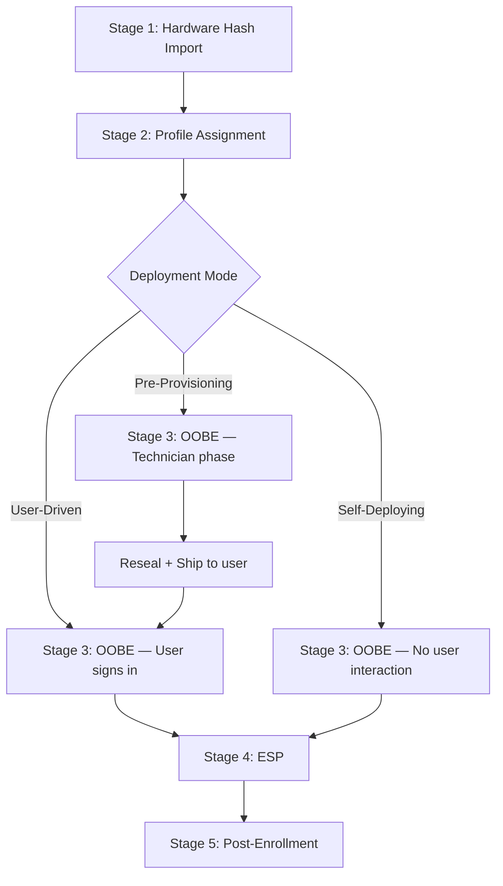
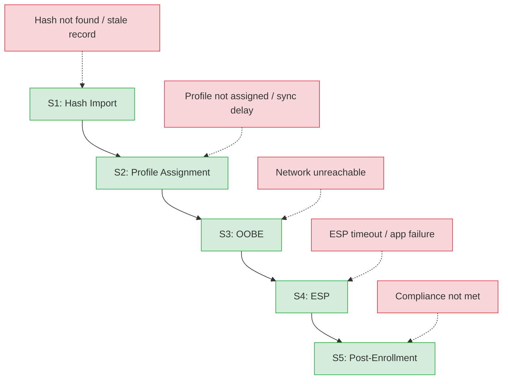

> **Version gate:** This guide primarily covers Windows Autopilot (classic). APv2 (Device Preparation) differences are noted inline. For a full comparison, see [APv1 vs APv2 disambiguation](../apv1-vs-apv2.md).

# Autopilot Lifecycle Overview

## How to Use This Guide

This overview provides the end-to-end picture of the Windows Autopilot deployment lifecycle across five sequential stages. Each stage has a dedicated guide linked from the diagrams and table below — when troubleshooting a reported failure, identify which stage the failure occurred in and navigate directly to that guide. L2 technical details (registry keys, API calls, log paths) appear as callout blocks within each stage guide, keeping the main narrative accessible to L1 readers. Start here to orient yourself, then go to the relevant stage guide for actionable steps.

## The Deployment Pipeline

### Level 1 — Happy Path

> This diagram shows the [APv1](../_glossary.md#apv1) (classic) flow. For the [APv2](../_glossary.md#apv2) (Device Preparation) flow, see [APv1 vs APv2](../apv1-vs-apv2.md).

### Level 2 — Failure Points

The following diagram shows where common failures surface across the pipeline. Green nodes are stages; red nodes are failure categories that connect to the stage where they first appear.

## Stage Summary

| Stage | Primary Actor | What Happens | Guide |
|-------|--------------|--------------|-------|
| 1: Hardware Hash Import | Admin / OEM / Partner | Device fingerprint uploaded to Intune | [Stage 1](01-hardware-hash.md) |
| 2: Profile Assignment | Admin | Autopilot profile matched to device via AAD group | [Stage 2](02-profile-assignment.md) |
| 3: OOBE | User / Technician / None | Deployment mode activates; device joins Azure AD | [Stage 3](03-oobe.md) |
| 4: ESP | Background (MDM) | Device and user apps/policies installed | [Stage 4](04-esp.md) |
| 5: Post-Enrollment | Admin verifies | Deployment confirmed; device handed off | [Stage 5](05-post-enrollment.md) |

## Prerequisites

All prerequisites must be met before Stage 1. Missing any prerequisite causes failures that surface at Stage 2 or 3.

- [ ] Azure AD tenant configured with Intune
- [ ] Appropriate licenses assigned (Microsoft 365 Business Premium, E3, E5, or standalone Intune)
- [ ] Autopilot deployment profile created and assigned to a group
- [ ] Network connectivity to required [Autopilot endpoints](../reference/endpoints.md)
- [ ] Device [hardware hash](../_glossary.md#hardware-hash) registered in Autopilot service

## Related Documentation

- [Glossary](../_glossary.md) — Autopilot terminology reference
- [APv2 Lifecycle Overview](../lifecycle-apv2/00-overview.md) — APv2 deployment flow, prerequisites, and automatic mode
- [APv1 vs APv2 Disambiguation](../apv1-vs-apv2.md) — Framework comparison
- [Registry Paths Reference](../reference/registry-paths.md) — All Autopilot registry locations
- [Network Endpoints Reference](../reference/endpoints.md) — Required URLs and test commands
- [PowerShell Function Reference](../reference/powershell-ref.md) — Diagnostic and remediation functions
- [Architecture Overview](../architecture.md) — System design context

## Version History

| Date | Change |
|------|--------|
| 2026-04-13 | Added APv2 lifecycle overview cross-reference | -- |
| 2026-03-14 | Initial version |
