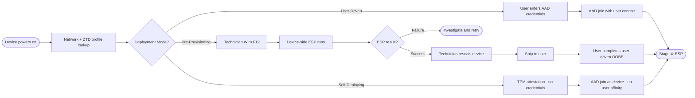

> **Version gate:** This guide primarily covers Windows Autopilot (classic). APv2 (Device Preparation) differences are noted inline. For a full comparison, see [APv1 vs APv2 disambiguation](../apv1-vs-apv2.md).

# Stage 3: OOBE and Deployment Mode Selection

## Context

Stage 3 of 5. [OOBE](../_glossary.md#oobe) is where Windows Autopilot becomes visible to the end user or technician. The device powers on for the first time, the Autopilot service delivers the assigned profile, and the deployment mode branches into one of three paths: user-driven, pre-provisioning, or self-deploying.

Every path eventually produces a managed, enrolled device — but the steps, actors, and [TPM](../_glossary.md#tpm) requirements differ significantly.

**Depends on:** Profile Assignment (Stage 2) — device must have an assigned profile ready for lookup at OOBE.

**Feeds into:** Stage 4 — Enrollment Status Page (ESP).

> **Autopilot Reset note:** [Autopilot Reset](../_glossary.md#autopilot-reset) re-enters at Stage 3, skipping Stages 1 and 2. The device already has its registration and profile; Reset re-triggers OOBE provisioning on an already-deployed device.

---

## What the User / Technician Sees

### User-Driven Mode

The user powers on the device and sees customized OOBE screens based on the assigned profile: company logo and branding (if configured), optional welcome text, and a reduced set of setup screens (privacy settings, license agreements, and other screens may be skipped per profile configuration). The user is presented with an Azure AD sign-in prompt and enters their organization credentials to begin provisioning.

### Pre-Provisioning Mode

The technician (or OEM) powers on the device and sees a standard first OOBE screen. Before entering credentials, the technician presses **Win+F12** to invoke the provisioning flow. A blue "Windows Autopilot provisioning" screen appears with device details. The device runs the device-side [ESP](../_glossary.md#esp) phase in full — policies, certificates, and apps are deployed to the device scope. When complete, the screen shows a "Success" or "Error" result. On success, the technician reseals the device (shuts down for shipping). The end user later powers on and completes a shortened user-driven OOBE.

### Self-Deploying Mode

The user (or automated process) powers on the device and sees minimal OOBE screens with no credential prompt. The device progresses automatically through network detection, profile lookup, [TPM attestation](../_glossary.md#tpm-attestation), and Azure AD device join — all without user input. This mode is designed for kiosks, shared devices, and digital signage.

---

## What Happens

### Common Path (All Modes)

1. **Device powers on.** Windows begins first-run setup.
2. **Regional and keyboard settings.** These screens may appear depending on profile configuration (can be skipped).
3. **Network connection.** Device connects to available Wi-Fi or Ethernet. A [WinHTTP proxy](../_glossary.md#winhttp-proxy) is required if network access is proxy-gated; user-level proxy settings are not available at this point.
4. **ZTD profile check.** Device contacts `ztd.dds.microsoft.com` with its hardware hash. If a matching profile is found, it is downloaded and [OOBE](../_glossary.md#oobe) customizations apply.
5. **Mode branch.** Based on the deployment mode in the profile, OOBE follows one of the three paths below.

### User-Driven Path

- User sees the Azure AD sign-in screen and enters their organizational credentials.
- Device performs Azure AD join using the user's credentials.
- [MDM enrollment](../_glossary.md#mdm-enrollment) begins automatically after successful Azure AD join.
- [ESP](../_glossary.md#esp) launches and blocks desktop access until required apps and policies are applied (Stage 4).

### Pre-Provisioning Path

- Technician presses **Win+F12** at the first OOBE screen to invoke pre-provisioning.
- The "Windows Autopilot provisioning" screen appears showing device serial, profile name, and tenant.
- [TPM attestation](../_glossary.md#tpm-attestation) is performed — the device proves its TPM identity to Microsoft's attestation service.
- Device-side ESP runs: device-targeted apps, policies, and certificates are installed (the [device phase](../_glossary.md#device-phase)).
- On success, technician reseals (shuts down) the device and ships to user.
- End user powers on, sees shortened user-driven OOBE, signs in with Azure AD credentials, [user phase](../_glossary.md#user-phase) of ESP completes.

### Self-Deploying Path

- No user credential prompt appears.
- [TPM attestation](../_glossary.md#tpm-attestation) authenticates the device to Azure AD — the device joins as a device object with no user affinity.
- [MDM enrollment](../_glossary.md#mdm-enrollment) begins immediately after device join.
- Only the device phase of ESP runs — no user phase (no user to log in).

### Deployment Mode Comparison

The following diagram shows how the three paths diverge at mode selection and where they reconverge at ESP.

### TPM Requirements

| Deployment Mode | TPM Required | Reason |
|---|---|---|
| User-Driven | No | AAD join uses user credentials; no hardware attestation required |
| Pre-Provisioning | Yes — TPM 2.0 | Device-side provisioning requires TPM attestation to prove device identity to Azure AD without user credentials |
| Self-Deploying | Yes — TPM 2.0 | Entire flow is credential-less; TPM is the only authentication mechanism |

---

## Behind the Scenes

> **L2 Note:**
>
> - At OOBE start, the device contacts `ztd.dds.microsoft.com` to look up its profile by hardware hash. If no profile is found, standard Windows setup proceeds. See [endpoints.md](../reference/endpoints.md).
> - Azure AD join (user-driven and pre-provisioning user phase) authenticates against `login.microsoftonline.com`. Credential prompts, MFA, and Conditional Access policies apply at this step.
> - TPM attestation (pre-provisioning and self-deploying) contacts `*.microsoftaik.azure.net` to validate the device's TPM endorsement key certificate. [Firmware TPM (fTPM)](../_glossary.md#firmware-tpm-ftpm) devices may also require manufacturer-specific EK certificate endpoints (Intel, AMD, Qualcomm). See [endpoints.md](../reference/endpoints.md) for the full list.
> - For [hybrid join](../_glossary.md#hybrid-join) scenarios, the device additionally requires line-of-sight to an on-premises domain controller during OOBE to complete the Offline Domain Join ([ODJ](../_glossary.md#odj)) blob exchange. Hybrid join detail is covered in Phase 6.

---

## Success Indicators

- Autopilot profile is detected at OOBE (customized screens appear, or "Windows Autopilot provisioning" screen for pre-provisioning)
- Correct deployment mode activates (based on profile configuration)
- Azure AD join completes without error (user-driven, self-deploying)
- Pre-provisioning: "Provisioning was successful" message displayed; technician can proceed to reseal
- TPM attestation completes without error (pre-provisioning, self-deploying)
- Device progresses to ESP (Stage 4) after mode-specific steps complete

---

## Failure Indicators

- **No profile at OOBE.** Device shows standard Windows setup. Causes: device not in assigned group, profile not yet propagated, ZTD service unreachable.
- **TPM attestation fails.** Fatal for pre-provisioning and self-deploying. Causes: TPM not present, TPM not version 2.0, fTPM manufacturer endpoint blocked, Secure Boot disabled, TPM not cleared after prior use.
- **Network unreachable.** Device cannot contact `ztd.dds.microsoft.com` or other required endpoints. Common in proxy-gated environments where WinHTTP proxy is not configured.
- **Wrong deployment mode activates.** Profile assigned to wrong group, or conflicting profiles result in incorrect mode.
- **Hybrid join DC unreachable.** ODJ Connector cannot obtain a domain join blob because the on-premises DC is not reachable from the network segment used during provisioning.

Error code reference: (available after Phase 3)
Remediation runbooks: (available after Phase 5)
Hybrid join deep-dive: (available after Phase 6)

---

## Typical Timeline

- **OOBE to mode detection:** 1–3 minutes (network connection + ZTD profile lookup).
- **User-Driven sign-in to ESP launch:** 2–5 minutes (AAD join + MDM enrollment initiation).
- **Pre-provisioning device phase (ESP):** 15–60 minutes depending on number of apps, app sizes, and network speed. Large app deployments may exceed default timeouts.
- **Self-deploying OOBE to ESP:** Similar to pre-provisioning device phase timing; no user phase.

---

## Watch Out For

- **TPM not ready for pre-provisioning or self-deploying.** Check `Get-TPMStatus` before attempting these modes. The TPM must be present, enabled, activated, and version 2.0. If the device uses fTPM, verify manufacturer EK certificate endpoints are reachable.
- **Network or proxy blocking required endpoints.** Devices at OOBE cannot use user-level proxy settings. If the network requires a proxy, configure `WinHTTP proxy` settings in the OS image or use WPAD. The ZTD and AAD endpoints must be reachable before any OOBE interaction.
- **Hybrid join requires DC reachability.** Hybrid join (Azure AD + on-premises AD) requires the device to reach a domain controller during OOBE for the ODJ process. Devices on isolated network segments or guest Wi-Fi will fail. Plan network routing accordingly before deploying hybrid join profiles.

---

## Tool References

- [`Get-AutopilotRegistrationState`](../reference/powershell-ref.md#get-autopilotregistrationstate) — Confirms the device downloaded its Autopilot profile (registry key populated after successful OOBE profile detection).
- [`Get-TPMStatus`](../reference/powershell-ref.md#get-tpmstatus) — Checks TPM presence, readiness, and attestation capability before attempting pre-provisioning or self-deploying modes.
- [`Test-AutopilotConnectivity`](../reference/powershell-ref.md#test-autopilotconnectivity) — Tests connectivity to the 5 core Autopilot endpoints. Run before OOBE to confirm network access is in place. For the full 13-endpoint list including TPM attestation endpoints, see [endpoints.md](../reference/endpoints.md).

**Further Reading:**

- [Microsoft Learn: Windows Autopilot user-driven mode](https://learn.microsoft.com/en-us/autopilot/user-driven)
- [Microsoft Learn: Windows Autopilot for pre-provisioned deployment](https://learn.microsoft.com/en-us/autopilot/pre-provision)
- [Microsoft Learn: Windows Autopilot self-deploying mode](https://learn.microsoft.com/en-us/autopilot/self-deploying)

> **APv2 Note:** Windows Autopilot Device Preparation does not include a pre-provisioning mode. There is no Win+F12 technician flow. The technician provisioning scenario is handled through assignment policy rather than a separate deployment mode. Self-deploying mode is also not available in APv2. See [APv1 vs APv2 disambiguation](../apv1-vs-apv2.md) for a full feature comparison.

---

## Navigation

Previous: [Stage 2: Profile Assignment](02-profile-assignment.md) | Next: [Stage 4: ESP](04-esp.md)

---

## Version History

| Date | Change |
|------|--------|
| 2026-03-14 | Initial version |
