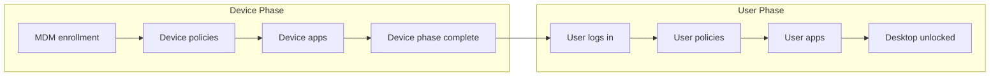

> **Version gate:** This guide primarily covers Windows Autopilot (classic). APv2 (Device Preparation) differences are noted inline. For a full comparison, see [APv1 vs APv2 disambiguation](../apv1-vs-apv2.md).

# Stage 4: Enrollment Status Page

## Context

Stage 4 of 5. The [ESP](../_glossary.md#esp) is the progress screen that tracks policy and app installation before unlocking the desktop. It runs after [MDM enrollment](../_glossary.md#mdm-enrollment) completes and before the user can access the Windows desktop.

The ESP has two sequential phases: the [device phase](../_glossary.md#device-phase) runs before any user logs in and applies device-targeted configuration; the [user phase](../_glossary.md#user-phase) runs after the user authenticates and applies user-targeted configuration.

**Depends on:** OOBE (Stage 3)
**Feeds into:** Post-Enrollment Verification (Stage 5)

---

## What the User Sees

The ESP displays a progress screen with three labeled sections: "Identifying...", "Device setup", and "Account setup". Each section shows a progress indicator that advances as the corresponding work completes.

During **Device setup**, the screen is visible but the user cannot interact with it — no login prompt appears until device-phase work finishes. During **Account setup**, the user has already authenticated and sees progress on user-targeted app and policy installation before the desktop is released.

In self-deploying mode, the user phase display does not appear because there is no user to authenticate. The device moves directly from device-phase completion to a usable state (for kiosk or shared scenarios).

---

## What Happens

### Device Phase

Runs before user login. The device processes all device-targeted configuration assigned to it.

1. [MDM](../_glossary.md#mdm) enrollment completes — device receives its enrollment [GUID](../_glossary.md#ztdid) and begins receiving policy assignments.
2. Device-targeted configuration profiles and compliance policies are applied.
3. Device-targeted apps install — Win32 apps via the Intune Management Extension (IME/sidecar) and LOB/MSI apps via the MDM pipeline.
4. SCEP and PKCS certificate profiles are applied to the device certificate store.
5. Device-context PowerShell scripts run to completion.
6. The `FirstSync\IsServerProvisioningDone` registry value is set to `true`, signaling device-phase completion.

### User Phase

Runs after the user enters credentials on the ESP login screen.

1. User enters Azure AD credentials on the ESP login prompt.
2. User-targeted configuration profiles and compliance policies are applied.
3. User-targeted apps install via the same IME pipeline.
4. User-targeted scripts and certificates are applied.
5. Desktop is unlocked and the user reaches the Windows shell.

### App Type Tracking

Not all app types block the ESP. The following table shows which app types are tracked:

| App Type | Tracked by ESP | Required vs Available | Blocks Desktop |
|----------|----------------|----------------------|----------------|
| Win32 (required) | Yes | Required | Yes |
| Win32 (available) | No | Available | No |
| LOB/MSI (required) | Yes | Required | Yes |
| LOB/MSI (available) | No | Available | No |
| Microsoft Store (required) | Yes | Required | Yes |
| Microsoft Store (available) | No | Available | No |
| PowerShell scripts (device) | Yes | Required | Yes |
| Certificates (device) | Yes | Required | Yes |

**Available apps do NOT block the ESP. Only required apps configured to track in ESP block the desktop. This is the most frequent source of confusion.**

### Process Flow

---

## Behind the Scenes

> **L2 Note:** Technical details for deeper investigation.
>
> - **FirstSync checkpoint:** `HKLM:\SOFTWARE\Microsoft\Enrollments\{GUID}\FirstSync` tracks whether the server has finished provisioning the device side. When `IsServerProvisioningDone` becomes `true`, the device phase is considered complete. See [registry paths reference](../reference/registry-paths.md) for full path details.
> - **ESP tracking root:** `HKLM:\SOFTWARE\Microsoft\Windows\Autopilot\EnrollmentStatusTracking` is the root key where the ESP tracks expected vs. received policies and apps. Subkeys like `ExpectedPolicies` and `Sidecar` contain diagnostic data. See [registry paths reference](../reference/registry-paths.md).
> - **IME/Sidecar process:** Win32 app installation and tracking is handled by the Intune Management Extension (also called the sidecar process). It runs as a background service and reports installation status back to the ESP. If Win32 apps stall, the sidecar log at `%ProgramData%\Microsoft\IntuneManagementExtension\Logs\` is the first diagnostic target.
> - **ExpectedPolicies subkey:** The ESP compares received policy GUIDs against the `ExpectedPolicies` list. Apps and policies are only tracked if their assignment is configured for ESP enrollment tracking. This is why available-assignment apps never appear in this key.

---

## Success Indicators

- Both device phase and user phase complete without error dialogs
- Desktop unlocks and user reaches the Windows shell
- All required apps show installation state "Installed" in Intune device view
- No timeout error displayed (default 60-minute threshold not exceeded)
- ESP screen clears normally without the "Something went wrong" message

---

## Failure Indicators

- ESP stuck at a percentage (common: "46%" or "86%" during app installs)
- Timeout error after 60 minutes — default limit exceeded
- App installation failure with error code displayed on ESP screen
- Policy application error with partial completion
- "Something went wrong" message with error code

Forward-links: see [Phase 3 error codes](../error-codes/00-index.md), [L1 ESP runbook](../l1-runbooks/02-esp-stuck-or-failed.md), [L2 ESP deep-dive](../l2-runbooks/02-esp-deep-dive.md)

---

## Typical Timeline

- **Device phase:** 15–45 minutes, depending on the number of required apps and their sizes
- **User phase:** 5–15 minutes, typically faster because fewer user-targeted apps are tracked
- **Total:** 20–60 minutes for a typical deployment
- **Default timeout:** 60 minutes (configurable up to 120 minutes in the ESP configuration profile)

Timeline variability increases significantly with large Win32 app counts or slow download speeds.

---

## Watch Out For

- **Too many required apps causing timeout:** If device-phase app installation exceeds 60 minutes, the ESP times out and may leave the device in a partially provisioned state. Review which apps are assigned as required vs. available, and consider increasing the timeout in the ESP profile (maximum 120 minutes).

- **Available apps misconfigured as required:** Apps set to required assignment but not strictly needed during provisioning will block the ESP unnecessarily. Audit app assignments against the app type tracking table above before deployment.

- **Co-management differences:** If the device is enrolled in both Intune and Configuration Manager (co-management), app tracking behavior differs. Configuration Manager-delivered apps are not tracked by the Intune ESP. Stalls attributed to app installs may actually be waiting on ConfigMgr workloads. A brief co-management workload audit is warranted when standard ESP troubleshooting does not resolve the issue.

- **ESP context disambiguation:** There are two distinct ESP contexts. The OOBE ESP runs during initial provisioning (this guide). A separate post-enrollment ESP can also trigger when additional policies are pushed after enrollment; its behavior is similar but it does not block the initial desktop unlock. Ensure diagnostic notes specify which ESP context is being described.

---

## Tool References

- [`Get-AutopilotDeviceStatus`](../reference/powershell-ref.md#get-autopilotdevicestatus) — captures a comprehensive device state snapshot including ESP tracking state and enrollment GUID
- [`Restart-EnrollmentStatusPage`](../reference/powershell-ref.md#restart-enrollmentstatuspage) — remediation function that restarts the ESP process and clears ESP state; see [L2 ESP deep-dive](../l2-runbooks/02-esp-deep-dive.md) for usage guidance
- [`Get-AutopilotLogs`](../reference/powershell-ref.md#get-autopilotlogs) — collects MDM diagnostic logs and Event Viewer channels relevant to ESP failures

**Further Reading:**

- [Microsoft Learn — Enrollment Status Page overview](https://learn.microsoft.com/en-us/mem/intune/enrollment/windows-enrollment-status)
- [Microsoft Learn — Troubleshoot the Enrollment Status Page](https://learn.microsoft.com/en-us/troubleshoot/mem/intune/device-enrollment/understand-troubleshoot-esp)
- [Microsoft Learn — Intune Management Extension overview](https://learn.microsoft.com/en-us/mem/intune/apps/intune-management-extension)

---

> **APv2 Note:** APv2 (Device Preparation) does not have an ESP in the APv1 sense. Progress tracking is integrated directly into the deployment policy configuration. The desktop unlocks immediately after enrollment and apps install in the background without blocking user access. For details, see [APv1 vs APv2 disambiguation](../apv1-vs-apv2.md).

---

## Navigation

Previous: [Stage 3: OOBE](03-oobe.md) | Next: [Stage 5: Post-Enrollment Verification](05-post-enrollment.md)

---

## Version History

| Date | Change |
|------|--------|
| 2026-03-14 | Initial version |
