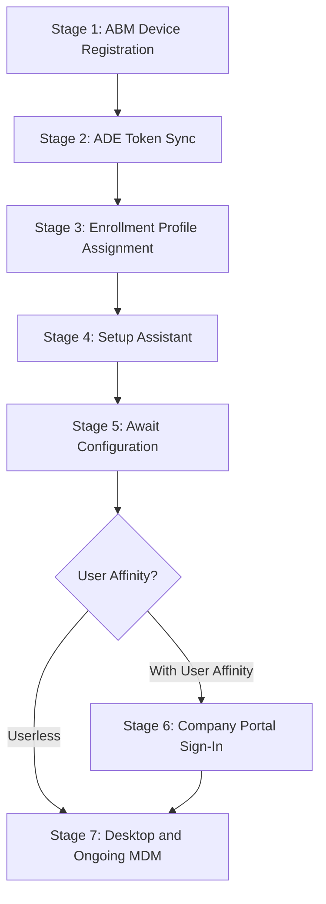

> **Version gate:** This guide covers macOS Automated Device Enrollment (ADE) via Apple Business Manager and Microsoft Intune. For Windows Autopilot, see [Autopilot Lifecycle Overview](../lifecycle/00-overview.md). For terminology, see the [macOS Provisioning Glossary](../_glossary-macos.md).

# macOS ADE Lifecycle: Automated Device Enrollment End-to-End

## How to Use This Guide

This is a single-file narrative covering the complete macOS Automated Device Enrollment pipeline from Apple Business Manager registration through desktop delivery and ongoing MDM management. Unlike the Windows Autopilot lifecycle (which branches by deployment mode across multiple files), macOS ADE follows a single linear pipeline with one conditional branch at Stage 6 (user affinity).

**Audience:** This guide serves all three roles:

- **L1 Service Desk:** Use the "What the Admin Sees" and "Watch Out For" sections for quick orientation and common failure identification.
- **L2 Desktop Engineering:** Use the "Behind the Scenes" sections for endpoint details, daemon behavior, and log references.
- **Intune Admins:** Use "What Happens" sections for the complete configuration workflow and "Watch Out For" sections for misconfiguration prevention.

Each of the seven stages below contains four subsections:

- **What the Admin Sees** -- Portal views and device-side screens the admin or user encounters at this stage.
- **What Happens** -- The technical sequence of events, including numbered steps and configuration details.
- **Behind the Scenes** -- Deeper technical detail for L2 troubleshooters: endpoints, protocols, agent behavior, and filesystem references.
- **Watch Out For** -- Common pitfalls, misconfigurations, and failure modes specific to this stage, with remediation guidance.

**Navigation:**

- Start at **Stage 1** if you are setting up ADE for the first time.
- Jump to a **specific stage** if you are troubleshooting a failure at a known point in the enrollment pipeline.
- Use the **Stage Summary Table** below the pipeline diagram for a quick overview of all stages.
- See the **See Also** section at the bottom for cross-references to diagnostic commands, log paths, and network endpoints.

### Prerequisites

All prerequisites must be met before Stage 1. Missing any prerequisite causes failures that surface at Stages 2-4.

- [ ] Apple Business Manager account configured and verified
- [ ] At least one MDM server configured in ABM and linked to Microsoft Intune
- [ ] ADE token (.p7m) downloaded from ABM and uploaded to Intune
- [ ] Apple Push Notification certificate configured in Intune (Tenant administration > Connectors and tokens)
- [ ] Appropriate Intune licenses assigned to target users (Microsoft 365 Business Premium, E3, E5, or standalone Intune)
- [ ] Network connectivity to required [Apple ADE endpoints](../reference/endpoints.md#macos-ade-endpoints) and [Microsoft Intune endpoints](../reference/endpoints.md)
- [ ] Enrollment profile created and assigned in Intune (Stage 3)

---

## The ADE Pipeline



> Stage 6 only applies when the enrollment profile is configured for "Enroll with User Affinity" and modern authentication. Userless enrollments skip directly to Stage 7.

---

## Stage Summary Table

| Stage | Actor | Location | What Happens | Key Pitfall |
|-------|-------|----------|--------------|-------------|
| 1: ABM Device Registration | Admin | ABM Portal | Device serial numbers assigned to MDM server in Apple Business Manager | Device not assigned to correct MDM server; non-ABM-linked reseller |
| 2: ADE Token Sync | System/Intune | Intune admin center | Intune syncs device list from ABM via .p7m token (auto every 24h) | Token expired; Apple ID inaccessible; ABM T&C changed |
| 3: Enrollment Profile Assignment | Admin | Intune admin center | Enrollment profile assigned to devices (defines user affinity, auth, screens) | No profile assigned before device powers on |
| 4: Setup Assistant | Device/User | On-device | Device contacts Apple ADE endpoints, enrolls in MDM, runs Setup Assistant screens | Firewall blocks ADE endpoints; APNs certificate expired |
| 5: Await Configuration | System/Intune | On-device | Device pauses at "Awaiting final configuration" while Intune pushes policies | Misconfigured profile blocks release; APNs connectivity issues |
| 6: Company Portal Sign-In | Device/User | On-device | User signs into Company Portal to register device with Entra ID | Company Portal not deployed; user skips sign-in |
| 7: Desktop and Ongoing MDM | System/Intune | On-device | Desktop delivered; dual management channels (MDM + IME) operate in parallel | APNs certificate renewal missed; IME agent not installed |

---

## Stage 1: ABM Device Registration

### What the Admin Sees

In [Apple Business Manager](https://business.apple.com) (ABM), navigate to **Devices** and use the **Assign to MDM Server** action to associate device serial numbers with your Intune MDM server. Devices can be viewed by serial number, and bulk assignment is available for large batches. Devices assigned by Apple resellers at purchase appear automatically in your ABM account without manual action.

### What Happens

1. **Device identity established.** The admin or OEM assigns one or more device serial numbers to the MDM server configured in [ABM](../_glossary-macos.md#abm). The serial number is the device identity for macOS [ADE](../_glossary-macos.md#ade) -- unlike Windows Autopilot, which uses a 4KB hardware hash.

2. **MDM server association.** The assignment links the physical device (by serial number) to the Intune MDM server that was configured during ABM setup. This is a one-to-one relationship: each device is assigned to exactly one MDM server.

3. **OEM pre-assignment.** Devices can be pre-assigned by Apple resellers at the time of purchase. When the reseller is linked to your ABM account, purchased devices appear in your device list automatically.

4. **Bulk operations.** ABM supports filters and bulk assignment for large batches of devices, enabling fleet-scale onboarding.

### Behind the Scenes

- The serial number is the sole identity mechanism for macOS ADE enrollment. There is no equivalent to the Windows hardware hash -- the serial number printed on the device chassis is the same value ABM uses to identify it.
- MDM server assignment in ABM creates a server-side record that Apple's ADE service checks when the device contacts `deviceenrollment.apple.com` during [Setup Assistant](../_glossary-macos.md#setup-assistant) (Stage 4). If the device is not assigned to any MDM server, the ADE discovery check returns no enrollment profile and the device proceeds through standard (non-managed) Setup Assistant.
- ABM supports multiple MDM servers within a single organization. Devices can be reassigned between servers, but the reassignment only takes effect before the device enrolls.
- Unlike Windows Autopilot where devices are identified by a 4KB hardware hash uploaded to Intune, macOS ADE relies entirely on the ABM-side serial number assignment. This means there is no "hash collection" step for macOS -- the serial number is already known at purchase.
- Devices added to ABM via Apple Configurator (e.g., devices not purchased through ABM-linked channels) follow the same assignment workflow but require a physical USB connection to a Mac running Apple Configurator for initial ABM enrollment.

### Watch Out For

- **Device not assigned to the correct MDM server.** If your organization has multiple MDM servers in ABM (e.g., test and production), verify the device is assigned to the intended server before shipping. You can check and change the assignment in ABM under **Devices > [serial number] > Edit MDM Server**.
- **Non-ABM-linked reseller.** Devices purchased from a reseller that is not linked to your ABM account will not appear in ABM. Contact the reseller to establish the ABM relationship, or use Apple Configurator to manually add devices to ABM (requires physical access and a Mac).
- **Reseller forgot device transfer.** The reseller purchased the device through their own ABM account but did not transfer it to your organization's ABM. The device will not appear in your device list until the transfer is completed by the reseller. Follow up with the reseller and provide your ABM organization ID.
- **Device already enrolled in another MDM.** If the device was previously enrolled in a different MDM solution and not properly removed, it may still be assigned to the previous MDM server in ABM. The previous organization must release the device before it can be reassigned.

---

## Stage 2: ADE Token Sync

### What the Admin Sees

In the **Intune admin center**, navigate to **Devices > Enrollment > Apple tab > Enrollment program tokens**. This blade shows your ADE tokens with their status, expiration dates, and the number of synced devices. You can trigger a manual sync from this view or check the last sync timestamp.

### What Happens

1. **Token establishes the connection.** The ADE token (enrollment program token, a .p7m file) connects Intune to [ABM](../_glossary-macos.md#abm). The [ABM Token](../_glossary-macos.md#abm-token) is downloaded from ABM and uploaded to Intune to authorize the sync relationship.

2. **Automatic sync every 24 hours.** Intune syncs device information from ABM automatically once per 24 hours. Newly assigned devices in ABM appear in Intune after the next sync cycle.

3. **Manual sync available.** Admins can trigger a manual sync from the Intune admin center. Manual sync is rate-limited to once per 15 minutes. A full sync (re-syncing all devices, not just changes) can only be triggered once per 7 days.

4. **Device list populated.** After sync, devices assigned to your MDM server in ABM appear in the Intune enrollment device list, ready for profile assignment (Stage 3).

### Behind the Scenes

- The .p7m token file is cryptographically signed by Apple. It contains the authorization for Intune to query ABM's device list for the specified MDM server.
- The token is tied to a specific Apple ID. If a personal Apple ID was used to create the token and that person leaves the organization, the token cannot be renewed. Always use a Managed Apple ID for token creation.
- Token renewal is annual. A lapsed token silently stops new device syncing -- existing enrolled devices continue to function, but new devices assigned in ABM will not appear in Intune until the token is renewed.
- The 24-hour automatic sync and 15-minute manual rate limit are service-side enforcements by Microsoft. The 7-day full sync cooldown prevents excessive load on the ABM-Intune integration.
- Each ADE token in Intune corresponds to exactly one MDM server in ABM. Organizations with multiple ABM MDM servers (e.g., production vs. test) will have multiple tokens in Intune.
- The sync operation is incremental by default -- only changes (new assignments, removals) since the last sync are pulled. A full sync re-fetches the entire device list and is subject to the 7-day cooldown.

**Token renewal process summary:**

1. Download a new public key from the Intune admin center (Enrollment program tokens > [token] > Renew token)
2. Upload the public key to ABM (Settings > MDM Servers > [server] > Upload token)
3. Download the renewed .p7m token from ABM
4. Upload the renewed token back to Intune

> **Operational note:** Set a recurring calendar reminder 30 days before token expiration. The Intune admin center shows the expiration date on the Enrollment program tokens blade.

### Watch Out For

- **Token expired.** The ADE token must be renewed annually. Expiration is silent -- no alerts are generated by default. Set a calendar reminder 30 days before expiration. Check the token status regularly in the Intune admin center.
- **Apple ID inaccessible.** The Apple ID used to create the token is no longer accessible (employee left, password lost). The token cannot be renewed without the original Apple ID. Use a Managed Apple ID tied to a shared organizational role.
- **ABM terms and conditions changed.** Apple occasionally updates ABM terms. If the new terms are not accepted in ABM, Apple suspends syncing until they are acknowledged.
- **Full sync rate limit hit.** If a full sync was triggered within the last 7 days, the full sync button is grayed out. Wait for the cooldown period, or rely on the incremental 24-hour auto-sync for newly assigned devices.

---

## Stage 3: Enrollment Profile Assignment

### What the Admin Sees

In the **Intune admin center**, navigate to **Devices > Enrollment > Apple tab > Enrollment program tokens > [your token] > Profiles**. Here you create and manage enrollment profiles. Each profile defines user affinity, authentication method, [Await Configuration](../_glossary-macos.md#await-configuration) behavior, and which [Setup Assistant](../_glossary-macos.md#setup-assistant) screens to show or hide. A default profile can be set for the token so all synced devices receive it automatically.

### What Happens

1. **Profile creation.** The admin creates an enrollment profile specifying:
   - **User affinity:** Enroll with User Affinity (recommended for user-assigned devices) or without (for shared/kiosk devices).
   - **Authentication method:** "Setup Assistant with modern authentication" (recommended, default since late 2024) or "Setup Assistant (legacy)".
   - **Await Configuration:** Yes (default since late 2024) or No -- controls whether the device pauses after Setup Assistant to receive policies before the user reaches the desktop.
   - **Setup Assistant screens:** Select which screens to show or hide (Apple ID, Siri, Privacy, FileVault, etc.).
   - **Local account settings:** Account name, auto-login behavior.

2. **Profile assignment.** The profile is assigned to specific devices or set as the default for the token. Assignment is over-the-air -- the device does not need to be present or powered on.

3. **Profile delivery timing.** The assigned profile is stored server-side. When the device contacts Apple's ADE endpoints during Setup Assistant (Stage 4), Apple's service redirects it to Intune, which delivers the enrollment profile to the device.

### Behind the Scenes

- The enrollment profile is an Intune-side configuration that maps to Apple's MDM enrollment profile specification. When the device checks in during Setup Assistant, Intune generates the MDM enrollment payload based on these profile settings.
- "Setup Assistant with modern authentication" presents an Entra credential prompt within a Setup Assistant web view to collect user credentials during the first-run experience. This method is supported on macOS 10.15 and later and is the recommended authentication method as of late 2024. On macOS 14 and later, Platform SSO can extend this authentication for single sign-on after enrollment, but the ADE enrollment authentication step itself uses the same web-based credential prompt on all supported OS versions.
- A default profile assigned to the token ensures that any newly synced device automatically receives a profile without manual per-device assignment. This is the recommended approach for fleet-scale deployments.
- Profile assignment must occur before the device is powered on for the first time (or after a wipe). If the device reaches Setup Assistant before a profile is assigned, it will proceed through standard (non-managed) Setup Assistant without MDM enrollment.
- The enrollment profile settings map to Apple's MDM enrollment profile specification as follows:

| Intune Setting | Apple MDM Equivalent | Effect |
|---------------|---------------------|--------|
| User Affinity: With | *(Intune-side setting; no direct Apple protocol key)* | Device associated with signing-in user; Company Portal sign-in required |
| User Affinity: Without | *(Intune-side setting; no direct Apple protocol key)* | Shared/kiosk device, no user association |
| Await Configuration: Yes | `await_device_configured: true` | Device pauses after Setup Assistant (Stage 5) |
| Modern Authentication | OAuth2 flow during Setup Assistant | Entra credential prompt in first-run |
| Locked Enrollment | `is_mdm_removable: false` | Management profile cannot be removed by user |

### Watch Out For

- **No profile assigned before device powers on.** This is the most common Stage 3 failure. If the device starts Setup Assistant before a profile is assigned in Intune, the device will not enroll in MDM. The fix is to wipe the device, assign the profile, and then re-image.
- **Wrong authentication method.** Selecting "Setup Assistant (legacy)" when the tenant expects modern authentication (or vice versa) causes credential prompts to fail or show unexpected UI.
- **Await Configuration disabled.** If Await Configuration is set to No, the device proceeds directly to the desktop after Setup Assistant without waiting for policies. Users may reach an unconfigured desktop and encounter compliance failures or missing configurations. The default is Yes for new profiles since late 2024.
- **Profile conflicts.** If a device has both a per-device assignment and a default token profile, the per-device assignment takes precedence. Verify which profile is active for a specific device in the Intune admin center.

---

## Stage 4: Setup Assistant

### What the Admin Sees

On the physical device, [Setup Assistant](../_glossary-macos.md#setup-assistant) presents the macOS first-run experience. The screens shown depend on the enrollment profile configuration (Stage 3). Common screens include Language, Region, Accessibility, Wi-Fi, and (if not hidden) Apple ID, Siri, and Privacy. If modern authentication is configured, an Entra credential prompt appears during Setup Assistant.

### What Happens

1. **ADE discovery.** On first power-on (or after wipe), the device contacts Apple's [ADE](../_glossary-macos.md#ade) endpoints to check whether it is ABM-managed:
   - `deviceenrollment.apple.com` -- Initial ADE discovery. The device sends its serial number and receives a redirect to the assigned MDM server.
   - `iprofiles.apple.com` -- Profile download service. Retrieves the MDM enrollment profile from the assigned server.
   - `mdmenrollment.apple.com` -- Enrollment upload. Completes the MDM enrollment handshake.

2. **MDM enrollment profile installs silently.** The device downloads and installs the MDM enrollment profile in the background while the user progresses through Setup Assistant screens. The enrollment profile establishes the management relationship between the device and Intune.

3. **Setup Assistant screens.** The device presents the configured subset of Setup Assistant screens. The admin can hide screens like Apple ID, Siri, and Privacy via the enrollment profile (Stage 3). Required screens (Language, Region, Wi-Fi) cannot be hidden.

4. **Modern authentication credential entry.** If the enrollment profile uses "Setup Assistant with modern authentication", the user signs in with their Entra credentials during Setup Assistant. This authenticates the user and establishes user affinity with the device.

5. **ACME certificate issuance.** On macOS 13.1 and later, an ACME certificate is issued during enrollment, replacing the older SCEP-based certificate mechanism. This certificate authenticates the device to the MDM service for subsequent check-ins.

### Behind the Scenes

- The ADE discovery flow is initiated by `cloudconfigurationd`, the macOS system daemon responsible for DEP/ADE activation checks. It runs automatically on first boot and after a wipe.
- The device must reach the three Apple ADE endpoints (`deviceenrollment.apple.com`, `iprofiles.apple.com`, `mdmenrollment.apple.com`) and the APNs endpoints (`*.push.apple.com`) during this stage. Firewall rules must allow HTTPS (TCP 443) to these domains.
- Apple Push Notification service (APNs) is required for all ongoing MDM communication. The APNs certificate on the Intune side is separate from the ADE token and must also be renewed annually.
- With modern authentication, the Entra sign-in happens within the Setup Assistant flow itself -- the user does not need to open a separate app or browser. On macOS 14+, this uses a native authentication broker.
- The MDM enrollment profile installs a management profile that grants Intune permission to push configuration profiles, install apps, and enforce compliance policies on the device.
- The ACME certificate (macOS 13.1+) replaces the older SCEP-based identity certificate for device-to-MDM authentication. This is handled automatically during enrollment -- no admin action is required beyond ensuring the device runs macOS 13.1 or later.

**Key endpoints contacted during Stage 4:**

| Endpoint | Protocol | Purpose |
|----------|----------|---------|
| `deviceenrollment.apple.com` | HTTPS (443) | ADE discovery -- device checks if it is ABM-managed |
| `iprofiles.apple.com` | HTTPS (443) | MDM enrollment profile download |
| `mdmenrollment.apple.com` | HTTPS (443) | Enrollment handshake completion |
| `*.push.apple.com` | TCP 443, 2197, 5223 | APNs -- ongoing MDM push notifications |
| `login.microsoftonline.com` | HTTPS (443) | Entra authentication (modern auth) |
| `manage.microsoft.com` | HTTPS (443) | Intune service endpoint |

### Watch Out For

- **Firewall blocks ADE endpoints.** The device cannot reach `deviceenrollment.apple.com`, `iprofiles.apple.com`, or `mdmenrollment.apple.com`. Setup Assistant proceeds without MDM enrollment. Verify that the network allows HTTPS traffic to all required Apple endpoints. See [Network Endpoints Reference](../reference/endpoints.md#macos-ade-endpoints) for the full list.
- **Device not in ABM or wrong MDM server.** The device contacts Apple's ADE service but no MDM server is associated with its serial number (Stage 1 was not completed). Setup Assistant runs in non-managed mode.
- **No enrollment profile assigned.** The device is in ABM and assigned to the correct MDM server, but no enrollment profile was created or assigned in Intune (Stage 3 incomplete). The device cannot enroll.
- **APNs certificate expired on Intune side.** The Apple Push Notification certificate in Intune has expired. New enrollments may fail or experience delayed policy delivery. Renew the APNs certificate in the Intune admin center under **Tenant administration > Connectors and tokens > Apple push notification certificate**.

---

## Stage 5: Await Configuration

### What the Admin Sees

On the device, the user sees an **"Awaiting final configuration"** screen with a progress indicator after Setup Assistant screens complete but before the desktop loads. The device is locked at this screen while Intune pushes critical configuration profiles via the APNs/MDM channel.

### What Happens

1. **Hold triggered.** After Setup Assistant screens complete, if the enrollment profile has [Await Configuration](../_glossary-macos.md#await-configuration) set to Yes, the device enters a locked state displaying "Awaiting final configuration."

2. **Policy delivery.** Intune pushes critical configuration profiles through the Apple MDM channel (via APNs). This includes Wi-Fi profiles, VPN configurations, security policies, and any configuration profiles marked for delivery during enrollment.

3. **Progress indication.** The device may show downloading progress as policies are applied. The specific policies being installed are not itemized on-screen.

4. **Release signal.** When Intune determines that all critical policies have been delivered, it sends a release signal to the device. The "Awaiting final configuration" screen dismisses and the enrollment flow continues.

### Behind the Scenes

- "Await final configuration" is the official Intune terminology. The glossary term [Await Configuration](../_glossary-macos.md#await-configuration) follows the project convention for brevity.
- There is no Intune-enforced minimum or maximum time limit for this stage. Duration depends on the number and complexity of configuration profiles assigned to the device.
- Microsoft testing shows most devices are released from this screen within approximately 15 minutes under typical policy loads.
- Await Configuration is supported on macOS 10.11 (El Capitan) and later.
- The locked experience prevents users from changing settings, opening applications, or accessing restricted content during policy delivery. This is conceptually similar to the Windows [Enrollment Status Page](../_glossary.md#esp), but without the explicit device-phase and user-phase distinction.
- **Re-enrollment behavior:** Await Configuration only fires once per enrollment event. If a device is re-enrolled (e.g., after a management profile removal and re-enrollment), the Await Configuration screen does not appear again.

**Comparison with Windows Enrollment Status Page:**

| Aspect | macOS Await Configuration | Windows Enrollment Status Page |
|--------|--------------------------|-------------|
| Phases | Single hold point | Device phase + User phase |
| Progress detail | Generic "Awaiting" message | Itemized app/policy list with status |
| Timeout | No enforced timeout | Configurable timeout (default 60 min) |
| Retry option | No user-facing retry | "Reset" button after timeout |
| Re-enrollment | Does not fire on re-enrollment | Fires on every enrollment |
| Minimum OS | macOS 10.11+ | Windows 10 1903+ |

### Watch Out For

- **Device stuck on "Awaiting final configuration" indefinitely.** This is typically caused by:
  - A misconfigured or undeliverable configuration profile blocking the release signal. Check the Intune admin center for profile delivery errors.
  - APNs connectivity issues preventing policy delivery. Verify the device can reach `*.push.apple.com` on TCP 443, 2197, and 5223.
  - Token sync errors causing Intune to lose track of the device's enrollment state.
- **Await Configuration disabled when it should be enabled.** If the enrollment profile has Await Configuration set to No, the device skips this stage entirely and the user reaches the desktop before all policies are applied. Review the enrollment profile settings in Stage 3 if users report missing configurations immediately after setup.
- **No Await Configuration on re-enrollment.** If a device was previously enrolled and is being re-enrolled (not a full wipe), the Await Configuration screen does not appear. Policies are delivered in the background after the user reaches the desktop.

---

## Stage 6: Company Portal Sign-In

### What the Admin Sees

On the device, after Await Configuration completes (or after Setup Assistant if Await Configuration is disabled), the user is prompted to open the **Company Portal** app and sign in with their organizational Entra credentials (e.g., user@contoso.com). This stage only applies when the enrollment profile is configured for "Enroll with User Affinity" and modern authentication.

### What Happens

1. **Company Portal launch.** The Company Portal app must be deployed to the device as a required app via Intune. It is not pre-installed on macOS. The app can be deployed via [VPP](../_glossary-macos.md#vpp) (Apps and Books in [ABM](../_glossary-macos.md#abm)) for silent installation.

2. **Entra sign-in.** The user opens Company Portal and signs in with their Entra credentials. This authenticates the user and registers the device with Microsoft Entra ID.

3. **Device registration.** Company Portal sign-in registers the device with Entra ID and adds it to the user's device record. This enables Conditional Access evaluation -- the device can now be checked for compliance before granting access to protected resources.

4. **Compliance evaluation begins.** After registration, Intune evaluates the device against compliance policies. If the device meets all requirements, access to Conditional Access-protected resources (email, SharePoint, Teams, etc.) is granted.

### Behind the Scenes

- Company Portal must be deployed as a required app. The recommended deployment method is through VPP (Apps and Books) for silent, license-managed installation. Alternatively, it can be deployed as a DMG or PKG app through Intune.
- If the user does not complete Company Portal sign-in, the device is enrolled in Intune (MDM management is active) but is not registered with Entra ID. This means Conditional Access policies that require device registration or compliance will block the user from accessing protected resources.
- If the user skips Company Portal sign-in initially, they are redirected to it when they first attempt to open any Conditional Access-protected application (e.g., Outlook, Teams). This is a "soft block" -- the user can use the device for non-protected tasks but cannot access organizational resources.
- Userless enrollments (without User Affinity) skip this stage entirely. These devices are managed by Intune but have no user association and cannot participate in user-based Conditional Access policies.

### Watch Out For

- **Company Portal not deployed.** The user cannot find the Company Portal app because it was not deployed as a required app in Intune. Deploy Company Portal via VPP/Apps and Books or as a standalone DMG/PKG app.
- **User sign-in blocked by Conditional Access.** A chicken-and-egg scenario: the user needs to sign into Company Portal to register the device, but a Conditional Access policy requires the device to be registered/compliant before allowing sign-in. Ensure Conditional Access policies exclude the Company Portal app or the device enrollment flow from their scope.
- **User skips sign-in and loses access.** The user dismisses or ignores the Company Portal sign-in prompt. They can use the device but cannot access email, Teams, SharePoint, or other Conditional Access-protected resources until they complete the sign-in. Communicate the sign-in requirement to users during device deployment.

---

## Stage 7: Desktop and Ongoing MDM

### What the Admin Sees

The user reaches the standard macOS desktop. In the background, Intune continues to apply configuration profiles and deploy apps. In the **Intune admin center**, the device appears under **Devices > macOS** with its compliance status, installed apps, and configuration profile delivery status.

### What Happens

1. **Desktop delivery.** The macOS desktop loads and the user can begin working. Background policy application and app installation continue.

2. **Dual management channels.** Two parallel management channels operate on the device:

   | Channel | Transport | Manages | Agent |
   |---------|-----------|---------|-------|
   | Apple MDM | APNs push notifications | Configuration profiles, compliance, FileVault, firewall, Gatekeeper, restrictions | Built-in macOS MDM client (`mdmclient`) |
   | Intune Management Extension (IME) | HTTPS polling to Intune service | Shell scripts, DMG/PKG apps, custom compliance scripts, custom attributes | `/Library/Intune/Microsoft Intune Agent.app` |

   These two channels operate independently. A failure in one channel does not affect the other.

3. **Ongoing MDM check-ins.** The device checks in with Intune periodically via APNs push notifications. Configuration profile changes, new app deployments, and compliance policy updates are delivered during these check-ins.

4. **Security policy enforcement.** FileVault disk encryption, macOS Application Firewall, Gatekeeper (app notarization enforcement), and compliance policies are enforced via MDM profiles. Local admin password (LAPS) rotation occurs every 6 months if configured.

### Behind the Scenes

- The Intune Management Extension (IME) agent is installed at `/Library/Intune/Microsoft Intune Agent.app`. It is a separate agent from the MDM enrollment profile and handles functionality that the native Apple MDM protocol does not support (shell scripts, certain app types).
- The MDM channel uses APNs for push-triggered check-ins. The APNs certificate on the Intune side must be renewed annually -- this is a separate renewal from the ADE token (Stage 2). Failure to renew the APNs certificate disrupts all MDM communication for all enrolled devices, not just new enrollments.
- LAPS (Local Administrator Password Solution) for macOS rotates the local admin password on a configurable schedule (default: every 6 months). The current password is escrowed to Intune and retrievable by authorized admins.
- FileVault recovery key escrow sends the FileVault recovery key to Intune, where it is stored and accessible to authorized admins for device recovery scenarios.
- Compliance policy evaluation runs on a schedule. If a device falls out of compliance (e.g., OS version too old, encryption disabled), Conditional Access can block access to protected resources until the device is remediated.

### Watch Out For

- **APNs certificate renewal missed.** The Apple Push Notification certificate in Intune expires annually. If it lapses, all MDM communication to all macOS (and iOS) devices stops -- not just new enrollments. Renew at **Tenant administration > Connectors and tokens > Apple push notification certificate**. This is separate from the ADE token renewal (Stage 2).
- **IME agent not installed or not running.** Shell scripts and certain app deployments fail if the Intune Management Extension agent at `/Library/Intune/Microsoft Intune Agent.app` is not installed or not running. Check with:
  ```bash
  pgrep -il "^IntuneMdm"
  ```
- **Confusion between MDM and IME channels.** Configuration profiles (Wi-Fi, VPN, restrictions) are delivered via the MDM channel (APNs). Shell scripts and DMG/PKG apps are delivered via the IME channel. Troubleshooting the wrong channel for the wrong payload type leads to dead ends.
- **FileVault not enabled.** If FileVault was not enforced during Await Configuration (Stage 5) and the compliance policy requires it, the device may be marked non-compliant after reaching the desktop. Users will see a prompt to enable FileVault.
- **Stale compliance state.** Compliance evaluation runs on a schedule, not in real-time. A device may appear compliant for a short period after a policy change before the next evaluation cycle flags it.

---

## See Also

**Terminology and Concepts:**

- [macOS Provisioning Glossary](../_glossary-macos.md) -- ADE, ABM, Setup Assistant, VPP terminology with Windows equivalents
- [Windows vs macOS Concept Comparison](../windows-vs-macos.md) -- Platform enrollment mechanism mapping and diagnostic tool comparison

**Technical References:**

- [macOS Terminal Commands Reference](../reference/macos-commands.md) -- Diagnostic commands for enrollment verification, profile inspection, and log analysis
- [macOS Log Paths Reference](../reference/macos-log-paths.md) -- Log file locations for Intune agent, Company Portal, and MDM subsystems
- [Network Endpoints Reference](../reference/endpoints.md#macos-ade-endpoints) -- Required Apple and Microsoft URLs for ADE enrollment

**Related Guides:**

- [Autopilot Lifecycle Overview](../lifecycle/00-overview.md) -- Windows Autopilot 5-stage deployment pipeline (for comparison)
- [Documentation Hub](../index.md) -- Role-based entry points for all platforms

---

## Glossary Quick Reference

Key terms used throughout this guide. Full definitions with Windows equivalents are in the [macOS Provisioning Glossary](../_glossary-macos.md).

| Term | Definition | First Appears |
|------|-----------|---------------|
| [ADE](../_glossary-macos.md#ade) | Automated Device Enrollment -- Apple's zero-touch enrollment mechanism | Stage 1 |
| [ABM](../_glossary-macos.md#abm) | Apple Business Manager -- Apple's device and app management portal | Stage 1 |
| [ABM Token](../_glossary-macos.md#abm-token) | Server token (.p7m) connecting Intune to ABM for device sync | Stage 2 |
| [Setup Assistant](../_glossary-macos.md#setup-assistant) | macOS first-run configuration experience | Stage 3 |
| [Await Configuration](../_glossary-macos.md#await-configuration) | Post-Setup-Assistant hold while Intune delivers policies | Stage 5 |
| [VPP](../_glossary-macos.md#vpp) | Volume Purchase Program (Apps and Books) for app deployment | Stage 6 |

---

## Version History

| Date | Change |
|------|--------|
| 2026-04-14 | Initial version -- complete 7-stage ADE lifecycle narrative |
