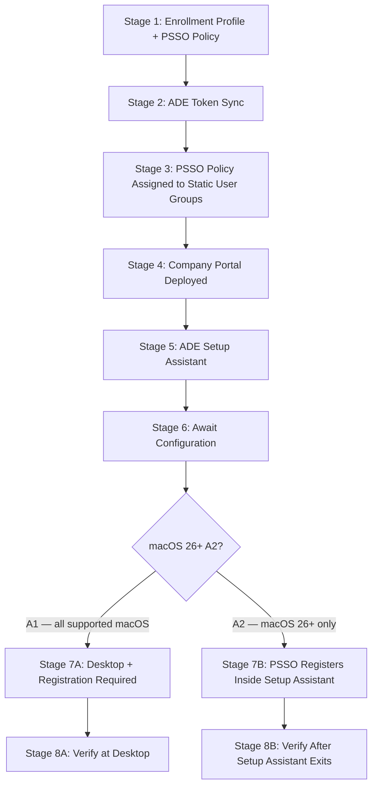

> **Platform gate:** This guide covers macOS Platform SSO provisioning via Microsoft Intune and Apple Business Manager, for both the standard post-enrollment path (A1, all supported macOS) and the ADE-during-Setup-Assistant zero-click path (A2, macOS 26+ only). For the underlying ADE enrollment pipeline, see [macOS ADE Lifecycle](00-ade-lifecycle.md). For Platform SSO policy configuration, see [Platform SSO Setup](../admin-setup-macos/07-platform-sso-setup.md).

# macOS Platform SSO Provisioning Walkthrough: A1 Standard and A2 ADE-during-Setup-Assistant

This is a single-file operator walkthrough threading a Mac from enrollment through PSSO registration, serving all three roles: **L1 Service Desk** (use "What the Admin Sees" and "Watch Out For" for orientation and failure identification), **L2 Desktop Engineering** (use "Behind the Scenes" for endpoint and daemon detail), and **Intune Admins** (use "What Happens" for the complete configuration workflow).

## Which Path Is Right for You?

| Path | macOS Requirement | Company Portal | PSSO Registers | Use When |
|------|-------------------|----------------|----------------|----------|
| **A1 — Standard post-enrollment** | macOS 13+ | 5.2404.0+ (VPP) | At desktop, after "Registration Required" notification | Most deployments; all supported macOS versions |
| **A2 — ADE-during-Setup-Assistant** | macOS 26+ (hard gate) | 5.2604.0+ (LOB only — NOT VPP) | Inside Setup Assistant; no desktop notification | New enrollments on macOS 26+ requiring zero-click PSSO |

> **Userless devices:** Devices enrolled without user affinity never reach PSSO registration — no WPJ key is written and no Secure Enclave entry is created. This walkthrough covers user-affinity enrollments only. For userless (shared/kiosk) devices, see [macOS ADE Lifecycle](00-ade-lifecycle.md).

### Prerequisites

All prerequisites must be met before Stage 1. The ADE pipeline prerequisites (ABM account, ADE token, APNs certificate, Intune licenses, network endpoints) are covered in [macOS ADE Lifecycle — Prerequisites](00-ade-lifecycle.md).

**Common prerequisites (A1 and A2):**

- [ ] Apple Business Manager account configured and ADE token uploaded to Intune
- [ ] Enrollment profile created with: User Affinity — Enroll with User Affinity; Authentication — Setup Assistant with modern authentication; Await Configuration: Yes; Locked Enrollment: Yes
- [ ] Platform SSO Settings Catalog policy created and configured (see [Platform SSO Setup](../admin-setup-macos/07-platform-sso-setup.md) for field-level detail)
- [ ] Platform SSO policy assigned to **Assigned (static) user groups** — not device groups, not dynamic groups

**A2-only hard-gate prerequisites (macOS 26+ path):**

- [ ] macOS 26 or later confirmed on target devices (hard gate — A2 does not function on earlier macOS)
- [ ] Company Portal version 5.2604.0+ deployed as a **line-of-business (LOB) app** — NOT via VPP
- [ ] `Enable Registration During Setup` field enabled in the Platform SSO Settings Catalog policy: **Authentication > Extensible single sign-on > Platform SSO > Enable Registration During Setup: Enabled**
- [ ] SmartCard authentication method NOT selected for A2 devices — use Secure Enclave (recommended) or Password
- [ ] All three A2 policies assigned to the **exact same Assigned (static) user groups**: PSSO Settings Catalog policy + Company Portal LOB app + ADE enrollment profile

---

## The PSSO Provisioning Pipeline



> Stages 1–6 are the shared spine, applicable to both paths. The pipeline branches at the macOS 26+ check: A1 devices continue to Stage 7A (desktop "Registration Required" notification), while A2 devices complete PSSO registration inside Setup Assistant before the desktop is delivered (Stage 7B). The A2 path requires all prerequisites — especially the three-policy same-static-user-group rule — to be met before enrollment starts.

---

## Stage Summary Table

| Stage | Actor | Location | What Happens | Key Pitfall | Path |
|-------|-------|----------|--------------|-------------|------|
| 1: Enrollment Profile + PSSO Policy | Admin | Intune admin center | Enrollment profile configured (user affinity, modern auth, Await Config: Yes); PSSO Settings Catalog policy created | PSSO policy assigned to device groups or wrong group type | Both |
| 2: ADE Token Sync | System/Intune | Intune admin center | Device appears in Intune after ABM sync | Token expired; sync lag up to 24h | Both |
| 3: PSSO Policy Assigned to Static User Groups | Admin | Intune admin center | Policy assigned to Assigned (static) user groups containing the target users | Dynamic groups or device groups break A2; also breaks A1 | Both |
| 4: Company Portal Deployed | Admin | Intune admin center | CP deployed as required app (VPP for A1; LOB for A2) | Wrong deployment method for path; version below floor | Both |
| 5: ADE Setup Assistant | Device/User | On-device | Device enrolls, Entra credential prompt; ACME cert issued | Firewall blocks ADE endpoints; CP not installed before SA credential prompt (A2) | Both |
| 6: Await Configuration | System/Intune | On-device | Device holds at "Awaiting final configuration" while PSSO policy delivers | PSSO policy not delivered before release; stuck screen | Both |
| 7A: Desktop + "Registration Required" | User | On-device | User taps Notification Center prompt → MFA → WPJ Secure Enclave key written | User dismisses notification; wrong verification command | A1 |
| 7B: PSSO Registers Inside Setup Assistant | Device/User | On-device (SA) | PSSO registers in SA before desktop; user prompted for Entra credentials at least twice | Three-policy group mismatch; CP LOB not deployed; SmartCard configured | A2 |
| 8A: Verify at Desktop | Admin/User | On-device | `app-sso platform -s` → both REGISTERED lines | False negative from `security find-certificate` | A1 |
| 8B: Verify After Setup Assistant Exits | Admin/User | On-device | `app-sso platform -s` → both REGISTERED lines | A2 gate must run after SA exits — no "Registration Required" notification | A2 |

---

## Stage 1: Enrollment Profile + PSSO Policy

### What the Admin Sees

In the **Intune admin center**, navigate to **Devices > Enrollment > Apple tab > Enrollment program tokens > [your token] > Profiles** to create or verify the enrollment profile. Navigate to **Devices > Manage devices > Configuration > Create > New policy > Platform: macOS, Profile type: Settings catalog** to create or verify the Platform SSO Settings Catalog policy.

### What Happens

1. **Enrollment profile creation.** Create an enrollment profile with the following required settings for PSSO provisioning:
   - **User Affinity:** Enroll with User Affinity
   - **Authentication:** Setup Assistant with modern authentication
   - **Await final configuration:** Yes
   - **Locked enrollment:** Yes (recommended — prevents management profile removal)

2. **Platform SSO Settings Catalog policy.** Create a Settings Catalog policy with the Platform SSO extension configured. See [Platform SSO Setup](../admin-setup-macos/07-platform-sso-setup.md) for every field and value — this walkthrough links to that reference rather than reproducing the Settings Catalog table.

3. **Authentication method selection.** Choose Secure Enclave (recommended), Password, or SmartCard (A1 only — not supported on A2). The authentication method determines how the WPJ key is stored post-registration.

### Behind the Scenes

- The enrollment profile maps to Apple's MDM enrollment profile specification. For field-by-field detail, see [Enrollment Profile Configuration](../admin-setup-macos/02-enrollment-profile.md).
- The Platform SSO Settings Catalog policy delivers the `com.apple.extensiblesso` payload, which configures the Enterprise SSO plug-in. See [Platform SSO Setup](../admin-setup-macos/07-platform-sso-setup.md) for payload detail and the ACME certificate dependency.
- Await Configuration: Yes is required to ensure the PSSO policy reaches the device before the user arrives at the desktop. Without it, the "Registration Required" notification may fire before the policy is applied, causing immediate re-registration loops.

### Watch Out For

- **PSSO policy assigned to device groups.** The Platform SSO Settings Catalog policy must be assigned to user groups for devices with user affinity. Device group assignment is explicitly unsupported by Microsoft — users may be unable to access Conditional Access-protected resources even if the policy shows "Succeeded" in the Intune portal. See [Platform SSO Setup](../admin-setup-macos/07-platform-sso-setup.md) Step 4 for assignment guidance.
- **Await Configuration: No.** If disabled, the device skips Stage 6 and users may reach the desktop before the PSSO policy is delivered. Set to Yes for all PSSO deployments.
- **SmartCard selected for A2 target devices.** SmartCard is not supported on the A2 ADE-during-Setup-Assistant path. Use Secure Enclave or Password for any device that may enroll on macOS 26+ via the A2 path.

---

## Stage 2: ADE Token Sync

### What the Admin Sees

In the **Intune admin center**, navigate to **Devices > Enrollment > Apple tab > Enrollment program tokens**. After the device is assigned to your MDM server in Apple Business Manager, it appears in the Intune device list following the next sync (automatic every 24 hours; manual sync available, rate-limited to once per 15 minutes).

### What Happens

1. **ABM device assignment.** The device serial number is assigned to your Intune MDM server in Apple Business Manager (ABM), either by the admin or pre-assigned by the Apple reseller at purchase.

2. **Intune sync.** Intune syncs device information from ABM automatically every 24 hours, or on demand via manual sync in the Intune admin center.

3. **Device appears in Intune.** After sync, the device appears in the Intune enrollment device list, ready to receive an enrollment profile assignment.

### Behind the Scenes

- The ADE token (.p7m file) authorizes Intune to query the ABM device list for your MDM server. Full token lifecycle details are in [macOS ADE Lifecycle — Stage 2](00-ade-lifecycle.md).
- Sync lag of up to 24 hours is expected for automatically-synced devices. For time-sensitive deployments, trigger a manual sync immediately after ABM assignment.
- Token renewal is annual. A lapsed token silently stops new device syncing. See [macOS ADE Lifecycle](00-ade-lifecycle.md) for renewal steps.

### Watch Out For

- **Sync lag.** Newly-assigned devices in ABM may not appear in Intune for up to 24 hours. Trigger a manual sync if the device is not visible.
- **Token expired.** The ADE token must be renewed annually. Expiration is silent — no alerts are generated by default. Check the token status in the Intune admin center regularly.
- **Device assigned to wrong MDM server.** If your organization has multiple ABM MDM servers, verify the device is assigned to the Intune server before it is powered on.

---

## Stage 3: PSSO Policy Assigned to Static User Groups

### What the Admin Sees

In the **Intune admin center**, navigate to **Devices > Manage devices > Configuration > [PSSO Settings Catalog policy] > Properties > Assignments**. Verify that the policy is assigned to one or more **Assigned (static) user groups** that include the target users. The assignment page shows group type (Assigned vs. Dynamic) and whether the scope is User or Device.

### What Happens

1. **Policy assignment verification.** Confirm the Platform SSO Settings Catalog policy is assigned to static user groups. Dynamic user groups and all device groups are not supported for Platform SSO policies on user-affinity devices.

2. **A2 three-policy alignment check.** For A2 deployments, confirm that the PSSO Settings Catalog policy, the Company Portal LOB app assignment (Stage 4), and the ADE enrollment profile are all assigned to the **same Assigned (static) user groups**. Misaligned groups require a device wipe to recover.

3. **Scope confirmation.** The assignment scope must be User (not Device). A policy assigned with Device scope to a device group does not deliver Platform SSO to user-affinity devices correctly.

### Behind the Scenes

- Microsoft's Platform SSO documentation explicitly states that the policy must be assigned to user groups for devices with user affinity. Device-group assignments are unsupported for this payload type. See [Platform SSO Setup](../admin-setup-macos/07-platform-sso-setup.md) for the authoritative assignment guidance.
- For the A2 path, the three-policy same-group alignment is a hard requirement. The PSSO extension needs all three policies (PSSO catalog, CP LOB, enrollment profile) to reach the device in sync via the same group membership. A group mismatch causes the PSSO registration to fail during Setup Assistant with no in-place recovery path.

### Watch Out For

- **Dynamic group assigned to PSSO policy.** Dynamic groups are explicitly not supported for the A2 path. For A1, dynamic groups may work but create race conditions where group membership has not yet resolved when the device enrolls. Use Assigned (static) groups for reliability on both paths.
- **Three-policy group drift (A2).** After initial setup, an admin adds new devices to a different group or reassigns one of the three A2 policies to a broader group. New A2 enrollments for users in the new group fail. Recovery requires a device wipe. Audit all three policy assignments before any A2 enrollment wave.

---

## Stage 4: Company Portal Deployed

### What the Admin Sees

In the **Intune admin center**, navigate to **Apps > All Apps** and locate your Company Portal deployment. For A1, verify it is deployed via **VPP** (Apps and Books, Licenses) with a minimum version requirement of 5.2404.0. For A2, verify it is deployed as a **line-of-business (LOB) PKG app** with a minimum version of 5.2604.0 — it must NOT be deployed via VPP for the A2 group.

### What Happens

1. **A1 deployment (VPP).** Company Portal version 5.2404.0 or later is deployed via Apple VPP (Apps and Books) as a required app to the target user group. VPP enables silent, license-managed installation.

2. **A2 deployment (LOB).** Company Portal version 5.2604.0 or later is deployed as a line-of-business (LOB) PKG app via **Apps > All Apps > Add > Line-of-business app** with Platform: macOS. LOB deployment is required for A2 — VPP is not supported on the A2 path. VPP and LOB Company Portal deployments can coexist in the fleet as long as each path's group receives the correct deployment type.

3. **Assignment to static user groups.** The Company Portal app assignment must target the same Assigned (static) user groups as the PSSO Settings Catalog policy and ADE enrollment profile (A2 requirement). For A1, the Company Portal assignment must reach the target users before Stage 7A.

### Behind the Scenes

- The Company Portal app serves as the delivery mechanism for the PSSO extension installation package. On A2, the LOB PKG format is required because the PSSO extension setup runs inside Setup Assistant before the App Store is available — VPP licensing requires App Store access that does not exist at that point.
- On A2, if Company Portal has not finished installing when the user first attempts to sign in during Setup Assistant, the user sees "Unable to sign in" with a registration error. The user should tap "Try Again" to allow Company Portal to finish downloading and retry registration. This is expected behavior, not a failure.
- For A1, Company Portal sign-in at Stage 6 in the ADE lifecycle completes Entra device registration. For PSSO specifically, the PSSO registration is triggered separately at Stage 7A by the "Registration Required" Notification Center prompt — they are two distinct events.

### Watch Out For

- **VPP Company Portal deployed to A2 group.** This is the second-most-common A2 misconfiguration (after the three-policy group mismatch). A2 requires Company Portal as a LOB app. If VPP Company Portal is the only deployment reaching A2 devices, PSSO registration in Setup Assistant fails.
- **Company Portal version below floor.** The A1 floor is 5.2404.0; the A2 floor is 5.2604.0. Verify the installed version on enrolled devices. If the version is below the floor, update the app deployment in Intune and allow time for the update to propagate.
- **LOB deployment delay.** LOB app deployments can take longer to install than VPP apps, especially on newly-enrolled devices. If A2 enrollment fails with "Unable to sign in" and "Try Again" does not resolve it after several minutes, check Company Portal installation status in the Intune admin center under the device's app install report.

---

## Stage 5: ADE Setup Assistant

### What the Admin Sees

On the physical device, Setup Assistant presents the macOS first-run experience. If modern authentication is configured in the enrollment profile (required for PSSO), an Entra credential prompt appears during Setup Assistant. For A2 devices, the user is prompted for Entra credentials at least twice during Setup Assistant — once for the standard enrollment authentication and once in the Company Portal authentication flow for the SSO extension.

### What Happens

1. **ADE discovery.** On first power-on (or after wipe), the device contacts Apple's ADE endpoints to check whether it is ABM-managed and retrieves the enrollment profile. See [macOS ADE Lifecycle — Stage 4](00-ade-lifecycle.md) for the full endpoint list and discovery sequence.

2. **MDM enrollment.** The device downloads and installs the MDM enrollment profile, establishing the management relationship with Intune. An ACME certificate (macOS 13.1+) is issued during enrollment.

3. **Entra credential prompt.** With modern authentication enabled, the user signs in with their Entra credentials during Setup Assistant. This authenticates the user and establishes user affinity.

4. **A2: PSSO registration in Setup Assistant.** For A2 devices (macOS 26+ with `EnableRegistrationDuringSetup`), PSSO registration occurs inside Setup Assistant at this stage. The Company Portal LOB app authenticates the SSO extension and the WPJ Secure Enclave key is written before the user reaches the desktop. See the A2 divergence callout below for the complete A2 requirements and risks.

5. **A1: Setup Assistant completes without PSSO registration.** For A1 devices, Setup Assistant completes and the device proceeds to Stage 6 (Await Configuration). PSSO registration does not occur during Setup Assistant on A1.

### Behind the Scenes

- ADE discovery, ACME certificate issuance, and MDM enrollment mechanics are documented in [macOS ADE Lifecycle — Stage 4](00-ade-lifecycle.md). This walkthrough does not reproduce those details.
- The `cloudconfigurationd` daemon initiates ADE discovery automatically on first boot and after a wipe.
- For A2, the `EnableRegistrationDuringSetup` Settings Catalog field signals to the PSSO extension that it should attempt registration during Setup Assistant rather than waiting for the "Registration Required" notification at the desktop.

### Watch Out For

- **Firewall blocks ADE endpoints.** The device cannot reach `deviceenrollment.apple.com`, `iprofiles.apple.com`, or `mdmenrollment.apple.com`. Setup Assistant proceeds without MDM enrollment. See [macOS ADE Lifecycle — Stage 4](00-ade-lifecycle.md) and [Network Endpoints Reference](../reference/endpoints.md#macos-ade-endpoints).
- **A2: "Unable to sign in" during Setup Assistant.** If Company Portal has not finished downloading when the PSSO extension attempts to authenticate, the user sees "Unable to sign in." Tap "Try Again" — this is expected when Company Portal is still installing. If the error persists after multiple retries, verify the Company Portal LOB deployment is targeting the correct group.
- **Do NOT use `security find-certificate` to verify PSSO at this stage.** New registrations from August 2025 use Secure Enclave storage by default. `security find-certificate` returns false negatives for Secure Enclave-stored keys. Always use `app-sso platform -s` (Stage 8A or 8B) for verification.

---

## Stage 6: Await Configuration

### What the Admin Sees

On the device, the user sees an **"Awaiting final configuration"** screen after Setup Assistant screens complete but before the desktop loads. The device holds at this screen while Intune delivers configuration profiles, including the PSSO Settings Catalog policy.

### What Happens

1. **Hold triggered.** With Await Configuration set to Yes in the enrollment profile, the device enters a locked state after Setup Assistant screens complete.

2. **PSSO policy delivery.** Intune pushes the Platform SSO Settings Catalog policy via the Apple MDM channel (APNs). This is the stage at which the PSSO extension configuration reaches the device. The policy must be delivered before the user reaches the desktop.

3. **Release.** When Intune determines all critical policies have been delivered, it sends a release signal. The device proceeds to the desktop (A1) or, for A2, Setup Assistant has already registered PSSO before this stage is reached.

### Behind the Scenes

- The mechanics of Await Configuration (APNs delivery, release signal timing, re-enrollment behavior) are documented in [macOS ADE Lifecycle — Stage 5](00-ade-lifecycle.md).
- If the PSSO Settings Catalog policy is not delivered during this stage (e.g., due to group assignment errors or APNs connectivity issues), the A1 "Registration Required" notification at Stage 7A may fire before the policy is applied, resulting in a registration error.

### Watch Out For

- **Device stuck on "Awaiting final configuration."** Typically caused by an undeliverable configuration profile or APNs connectivity issues. Check the Intune admin center for profile delivery errors. See [macOS ADE Lifecycle — Stage 5](00-ade-lifecycle.md) for detailed troubleshooting.
- **PSSO policy not delivered before release.** If the PSSO Settings Catalog policy is not in the "Awaiting final configuration" delivery set (e.g., due to a group mismatch at Stage 3), the device is released to the desktop without the PSSO extension configured. The "Registration Required" notification will not appear until the policy arrives — which may take an additional MDM check-in cycle.

---

## Stage 7A: Desktop + "Registration Required" (Path A1)

*This stage applies to A1 (standard post-enrollment, all supported macOS). For A2, see the A2 divergence callout below.*

### What the Admin Sees

The user reaches the standard macOS desktop. In the **Notification Center** (top-right of the screen), a notification appears with the text **"Registration Required"** from the Company Portal or Microsoft Enterprise SSO extension. This notification prompts the user to complete PSSO registration.

### What Happens

1. **"Registration Required" notification.** After Await Configuration releases and the user reaches the desktop, the PSSO extension detects that registration is required and presents a Notification Center notification.

2. **User taps the notification.** The user taps the notification to begin the PSSO registration flow. A web authentication sheet appears prompting for Entra credentials and MFA.

3. **MFA completion.** The user completes multi-factor authentication. This is a distinct authentication event from the Setup Assistant Entra sign-in at Stage 5.

4. **WPJ Secure Enclave key written.** After MFA completes, the Platform SSO extension writes a Workplace Join (WPJ) key to the device's Secure Enclave. The device and user are both registered with Entra ID via the PSSO extension.

5. **REGISTERED state achieved.** Both Device Registration and User Registration transition to REGISTERED. The PSSO extension is now active for SSO token issuance.

### Behind the Scenes

- The WPJ key written to the Secure Enclave is the cryptographic credential used for PSSO token requests. It is not accessible to any user-space process — only the PSSO extension (Enterprise SSO plug-in) can use it.
- The PRT (Primary Refresh Token) associated with this registration renews automatically every 4 hours under normal operation.
- From August 2025, new registrations default to Secure Enclave key storage. The `security find-certificate` command does not show Secure Enclave-stored keys and returns false negatives. Always use `app-sso platform -s` for registration verification.
- If the Platform SSO extension destroys the WPJ key (e.g., MDM-forced password reset, FileVault recovery key reset), the user receives a new "Registration Required" notification and must complete the registration flow again. See [macOS ADE Lifecycle — Stage 7 Watch Out For](00-ade-lifecycle.md) for the Secure Enclave key destruction warning.

### Watch Out For

- **User dismisses the "Registration Required" notification.** The notification can be dismissed without completing registration. If dismissed, the user must open Company Portal manually and trigger registration, or wait for the next Notification Center prompt (which may not reappear immediately). Train users to complete this step during device setup.
- **MFA not completed.** If the user starts the registration flow but abandons it before MFA completes, the WPJ key is not written. Registration remains incomplete.
- **Wrong verification command.** Do NOT use `security find-certificate` to verify PSSO registration. From August 2025, new registrations use Secure Enclave storage, and `security find-certificate` returns false negatives. Use `app-sso platform -s` (Stage 8A).
- **macOS 15.0–15.2 re-registration loop.** A known bug in macOS Sequoia 15.0–15.2 can cause repeated "Registration Required" notifications after a successful registration. Fixed in macOS 15.3. See [Platform SSO Setup — Prerequisites](../admin-setup-macos/07-platform-sso-setup.md) for the minimum OS recommendation.

### What the User Sees

After reaching the macOS desktop, a **"Registration Required"** notification appears in Notification Center. Tapping it opens a web authentication sheet requesting Entra credentials and MFA. After completing MFA, no further screen appears — the registration completes silently in the background. The user can verify the result by running `app-sso platform -s` in Terminal (Stage 8A).

### How to Verify

Open Terminal and run:

```bash
app-sso platform -s
```

Confirm both lines appear in the output:

```
Device Registration: REGISTERED
User Registration: REGISTERED
```

If either line shows a different value, wait and re-run the command — registration may still be in progress. If the values do not transition to REGISTERED after several minutes, escalate to:

- [L1 #35 macOS SSO Sign-In Failure](../l1-runbooks/35-macos-sso-sign-in-failure.md)
- [L1 #36 macOS Secure Enclave Key](../l1-runbooks/36-macos-secure-enclave-key.md)
- [L2 #27 macOS SSO Investigation](../l2-runbooks/27-macos-sso-investigation.md)

Do not attempt inline triage — these runbooks contain the authoritative investigation steps.

---

## Stage 8A: Verify at Desktop (Path A1)

### What the Admin Sees

From the Intune admin center, navigate to **Devices > macOS > [device name] > Overview** to confirm the device appears as enrolled and compliant. Device-side verification runs in Terminal.

### What Happens

The final A1 verification gate confirms that both Device Registration and User Registration are in the REGISTERED state. This is the definitive confirmation that PSSO provisioning is complete for the A1 path.

### Behind the Scenes

- `app-sso platform -s` queries the Platform SSO extension's local state store. REGISTERED indicates that the WPJ key is present in the Secure Enclave and the extension can issue SSO tokens for the registered user.
- The Intune admin center compliance view reflects policy compliance separately from PSSO registration state. A device can show "Compliant" in Intune while PSSO registration is still in progress or has failed — use `app-sso platform -s` as the authoritative PSSO verification command.

### Watch Out For

- **`security find-certificate` used instead of `app-sso platform -s`.** This is Pitfall 6 from the research data. `security find-certificate` cannot see Secure Enclave-stored keys and will report no certificate even when PSSO is correctly registered. Always use `app-sso platform -s`.

### How to Verify

Open Terminal and run:

```bash
app-sso platform -s
```

Confirm both lines appear in the output:

```
Device Registration: REGISTERED
User Registration: REGISTERED
```

If either line shows a different value, wait and re-run. If REGISTERED does not appear after the user has completed the "Registration Required" flow at Stage 7A, escalate to:

- [L1 #35 macOS SSO Sign-In Failure](../l1-runbooks/35-macos-sso-sign-in-failure.md)
- [L1 #36 macOS Secure Enclave Key](../l1-runbooks/36-macos-secure-enclave-key.md)
- [L2 #27 macOS SSO Investigation](../l2-runbooks/27-macos-sso-investigation.md)

---

## A2 Path: ADE-during-Setup-Assistant (macOS 26+)

> **macOS 26+ ADE-during-Setup-Assistant path (A2) — diverges at Stage 4 (Company Portal) and extends through Stage 7B.**
>
> All requirements below must be met BEFORE enrollment starts. A single misconfiguration requires a **device wipe** to recover — there is no in-place fix.
>
> ---
>
> **Most prominent risk — three-policy same-Assigned-static-user-group rule:**
>
> The Platform SSO Settings Catalog policy, the Company Portal LOB app assignment, and the ADE enrollment profile must all be assigned to the **same Assigned (static) user groups**. This is a hard constraint with no workaround:
>
> - **Dynamic groups break this.** Microsoft explicitly states this feature does not work with dynamic groups.
> - **Device groups break this.** Microsoft explicitly states this feature does not work with device groups.
> - **Different groups for different policies break this.** All three policies must share exactly the same group membership.
> - **Recovery: wipe and re-enroll.** There is no in-place fix for a group mismatch. The device must be wiped and re-enrolled with correct group assignments.
>
> Create dedicated Assigned (static) user groups for the A2 path before any device enrolls. Assign all three policies to exactly those groups.
>
> ---
>
> **A2 Requirements Summary:**
>
> | A2 Requirement | Value |
> |----------------|-------|
> | macOS version | macOS 26+ (hard gate — A2 does not function on earlier macOS) |
> | Company Portal version | 5.2604.0+ (LOB app — NOT VPP) |
> | Company Portal deployment method | Line-of-business (LOB) PKG app via **Apps > All Apps > Add > Line-of-business app** |
> | Additional Settings Catalog field | Authentication > Extensible single sign-on > Platform SSO > Enable Registration During Setup: Enabled |
> | Group type | Assigned (static) user groups only |
> | Three-policy same-group | PSSO Settings Catalog policy + Company Portal LOB app + ADE enrollment profile → same Assigned (static) user groups |
> | SmartCard | NOT supported on A2 path — use Secure Enclave (recommended) or Password |
> | Misconfiguration recovery | Device wipe required — no in-place fix |
> | PSSO registration event | Inside Setup Assistant — no "Registration Required" notification at desktop |
>
> For Company Portal LOB setup detail and the `Enable Registration During Setup` Settings Catalog field configuration, see [Platform SSO Setup — ADE-during-Setup-Assistant section](../admin-setup-macos/07-platform-sso-setup.md#advanced--optional-ade-during-setup-assistant).
>
> ---
>
> **A2 Stage 7B: PSSO Registers Inside Setup Assistant**
>
> On A2 devices (macOS 26+ with `EnableRegistrationDuringSetup` enabled and all three policies aligned to the same static user groups), PSSO registration completes **inside Setup Assistant before the desktop is delivered**. This is the defining behavioral difference from A1:
>
> - There is **no "Registration Required" notification** on A2 devices. The registration happens silently inside Setup Assistant.
> - The user arrives at the desktop **already signed in** with PSSO active.
> - Verification runs **after Setup Assistant exits** (Stage 8B below), not at a Notification Center prompt.
>
> **What the user experiences during A2 Setup Assistant:**
>
> The user is prompted for their Microsoft Entra organizational credentials at least twice during Setup Assistant — once for the standard enrollment authentication and once in the Company Portal authentication flow for the SSO extension. For the exact screen-by-screen flow, see [Platform SSO Setup — ADE-during-Setup-Assistant section](../admin-setup-macos/07-platform-sso-setup.md#advanced--optional-ade-during-setup-assistant). If the user sees "Unable to sign in" during Setup Assistant, tap "Try Again" — Company Portal may still be downloading. If "Try Again" does not resolve the error after several retries, verify the Company Portal LOB deployment and the three-policy group alignment before wiping the device.
>
> **SmartCard exclusion:** SmartCard authentication is not available on the A2 path. If SmartCard is required for a user population, those devices must use the A1 standard path. For A2 devices, configure Secure Enclave (recommended) or Password as the authentication method in the Platform SSO Settings Catalog policy. Attempting SmartCard on A2 causes enrollment to stall during Setup Assistant.
>
> ---
>
> **A2 Stage 8B: Verify After Setup Assistant Exits**
>
> **What the user sees:** The user arrives at the standard macOS desktop already signed in — there is no "Registration Required" notification. PSSO is already active.
>
> After the desktop is delivered, open Terminal and run:
>
> ```bash
> app-sso platform -s
> ```
>
> Confirm both lines appear in the output:
>
> ```
> Device Registration: REGISTERED
> User Registration: REGISTERED
> ```
>
> If either line shows a different value after the desktop is delivered, the A2 registration did not complete during Setup Assistant. Common causes: three-policy group mismatch (most likely — requires wipe), Company Portal LOB not deployed or below version floor, `EnableRegistrationDuringSetup` not enabled, SmartCard configured. Review the A2 requirements table above. If a group mismatch is confirmed, wipe the device and re-enroll with corrected group assignments. For investigation guidance, escalate to:
>
> - [L1 #35 macOS SSO Sign-In Failure](../l1-runbooks/35-macos-sso-sign-in-failure.md)
> - [L1 #36 macOS Secure Enclave Key](../l1-runbooks/36-macos-secure-enclave-key.md)
> - [L2 #27 macOS SSO Investigation](../l2-runbooks/27-macos-sso-investigation.md)
>
> Do not attempt inline triage — wipe-only recovery means early escalation is essential.
>
> ---
>
> _Section provenance — `last_verified: 2026-06-24` / `review_by: 2026-09-24`. This section covers macOS 26-gated features (ADE-during-Setup-Assistant PSSO, Company Portal 5.2604.0 LOB floor). Re-confirm macOS 26 GA status and CP 5.2604.0 LOB floor against current Microsoft Learn / Apple documentation at each 90-day review._

---

## See Also

**Terminology and Concepts:**

- [macOS Provisioning Glossary](../_glossary-macos.md) -- PSSO, WPJ, Secure Enclave, ADE, Setup Assistant, LOB terminology
- [Windows vs macOS Concept Comparison](../windows-vs-macos.md) -- Platform enrollment mechanism mapping and auth-method comparison

**Technical References:**

- [macOS Terminal Commands Reference](../reference/macos-commands.md) -- Diagnostic commands including `app-sso platform -s` and enrollment verification
- [macOS Log Paths Reference](../reference/macos-log-paths.md) -- Log file locations for Company Portal, PSSO extension, and MDM subsystems
- [Network Endpoints Reference](../reference/endpoints.md#macos-ade-endpoints) -- Required Apple and Microsoft URLs for ADE enrollment and PSSO

**Related Guides:**

- [macOS ADE Lifecycle Overview](00-ade-lifecycle.md) -- Complete 7-stage ADE enrollment pipeline that this walkthrough threads PSSO through
- [Platform SSO Setup](../admin-setup-macos/07-platform-sso-setup.md) -- Settings Catalog policy configuration reference for the PSSO extension
- [Enrollment Profile Configuration](../admin-setup-macos/02-enrollment-profile.md) -- Enrollment profile field-level reference for ADE provisioning
- [L1 #35 macOS SSO Sign-In Failure](../l1-runbooks/35-macos-sso-sign-in-failure.md) -- L1 escalation runbook for PSSO sign-in failures
- [L1 #36 macOS Secure Enclave Key](../l1-runbooks/36-macos-secure-enclave-key.md) -- L1 escalation runbook for Secure Enclave key issues
- [L2 #27 macOS SSO Investigation](../l2-runbooks/27-macos-sso-investigation.md) -- L2 deep-dive investigation runbook for macOS SSO failures
- [macOS MDM Migration Walkthrough](02-mdm-migration-psso.md) -- B1 in-place (macOS 26+) and B2 wipe migration from Kandji/Iru, including the post-migration PSSO re-registration handoff back to this guide

---

## Glossary Quick Reference

Key terms used throughout this guide. Full definitions with Windows equivalents are in the [macOS Provisioning Glossary](../_glossary-macos.md).

| Term | Definition | First Appears |
|------|-----------|---------------|
| [PSSO / Platform SSO](../_glossary-macos.md#platform-sso) | Platform Single Sign-On -- macOS extension enabling Entra ID SSO via the Enterprise SSO plug-in | Stage 1 |
| [ADE](../_glossary-macos.md#ade) | Automated Device Enrollment -- Apple's zero-touch enrollment mechanism via ABM | Stage 1 |
| [WPJ (Workplace Join)](../_glossary-macos.md#wpj) | Workplace Join -- cryptographic registration of a device with Entra ID; key stored in Secure Enclave | Stage 7A |
| [Secure Enclave](../_glossary-macos.md#secure-enclave) | Apple hardware security module storing cryptographic keys inaccessible to user-space processes | Stage 7A |
| [app-sso platform -s](../_glossary-macos.md#app-sso) | macOS built-in command to check Platform SSO extension registration state | Stage 8A |
| [Setup Assistant](../_glossary-macos.md#setup-assistant) | macOS first-run configuration experience presented on initial power-on or after wipe | Stage 5 |
| [LOB app](../_glossary-macos.md#lob-app) | Line-of-business app -- PKG/DMG app uploaded directly to Intune, as opposed to VPP/App Store distribution | Stage 4 |
| [VPP](../_glossary-macos.md#vpp) | Volume Purchase Program (Apps and Books) -- Apple's license-managed app distribution via ABM | Stage 4 |

---

## Version History

| Date | Change |
|------|--------|
| 2026-06-24 | Phase 90 (MIG-04): added reciprocal See Also link to 02-mdm-migration-psso.md (bidirectional PSSO re-registration junction) |
| 2026-06-24 | Phase 89 (PROV-01..04): initial PSSO provisioning walkthrough (A1 + A2 paths) |
