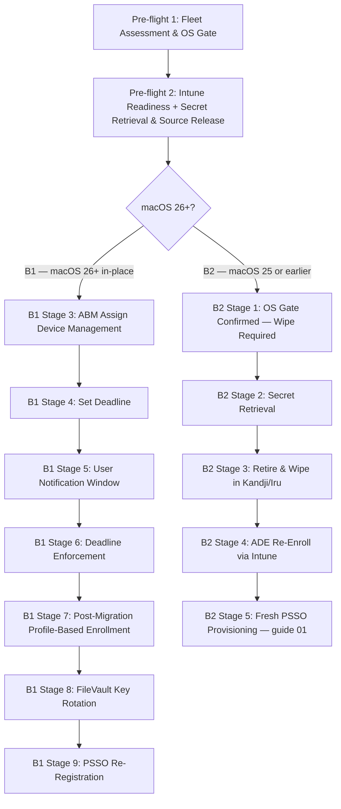

> **Platform gate:** This guide covers macOS MDM migration from Kandji/Iru to Microsoft Intune with Platform SSO (PSSO), for both the wipe-free in-place path (B1, macOS 26+) and the wipe-and-re-enroll fallback path (B2, macOS 25 or earlier). For the underlying ADE enrollment pipeline, see [macOS ADE Lifecycle](00-ade-lifecycle.md). For post-migration PSSO registration on a fresh enrollment, see [macOS Platform SSO Provisioning Walkthrough](01-psso-provisioning-walkthrough.md).

# macOS MDM Migration Walkthrough: B1 In-Place (macOS 26+) and B2 Wipe-and-Re-Enroll

This is a single-file operator walkthrough threading a Mac through MDM migration from Kandji/Iru to Intune with PSSO, serving all three roles: **L1 Service Desk** (use "What the Admin Sees" and "Watch Out For" for orientation and failure identification), **L2 Desktop Engineering** (use "Behind the Scenes" for endpoint and daemon detail), and **Intune Admins** (use "What Happens" for the complete configuration workflow).

## Which Path Is Right for You?

| Path | macOS Requirement | Migration Type | PSSO Re-registration | Use When |
|------|-------------------|----------------|----------------------|----------|
| **B1 — macOS 26 in-place** | macOS 26 or later (hard gate) | Wipe-free in-place; genuine unenroll + reenroll via profile-based enrollment | Always required — MDM unenrollment = IdP unregistration; new Secure Enclave key created | Target devices confirmed running macOS 26+; wipe is operationally unacceptable |
| **B2 — Pre-macOS-26 wipe** | macOS 25 or earlier | Retire/wipe/re-enroll; fresh ADE enrollment via Intune | Fresh PSSO provisioning from scratch (link to guide 01) | Target devices running macOS 25 or earlier; B1 in-place path not available |

> **Userless devices:** Devices enrolled without user affinity never reach PSSO registration — no WPJ key is written and no Secure Enclave entry is created. This walkthrough covers user-affinity enrollments only. For userless (shared/kiosk) devices, see [macOS ADE Lifecycle](00-ade-lifecycle.md).

### Prerequisites

All prerequisites must be met before Stage 1. The ADE pipeline prerequisites (ABM account, ADE token, APNs certificate, Intune licenses, network endpoints) are covered in [macOS ADE Lifecycle — Prerequisites](00-ade-lifecycle.md).

**Common prerequisites (B1 and B2):**

- [ ] Apple Business Manager account configured and ADE token uploaded to Intune
- [ ] Kandji/Iru source MDM has devices enrolled and managed (migration out of source MDM)
- [ ] Intune ADE enrollment policy configured with: User Affinity — Enroll with User Affinity; Authentication — Setup Assistant with modern authentication; Await Configuration: Yes; Locked Enrollment: Yes
- [ ] Platform SSO Settings Catalog policy created and assigned to target user groups (see [Platform SSO Setup](../admin-setup-macos/07-platform-sso-setup.md) for field-level detail)
- [ ] Network connectivity verified to required Intune and Apple ADE endpoints (see [macOS ADE Lifecycle](00-ade-lifecycle.md) for endpoint list)
- [ ] FileVault recovery keys retrieved from Kandji/Iru console BEFORE any device migration (permanently destroyed on Delete Device Record — see Stage 2)
- [ ] Activation Lock bypass codes retrieved from Kandji/Iru console BEFORE any device migration (permanently destroyed on Delete Device Record — see Stage 2)

**B1-only prerequisites (macOS 26+ in-place path):**

- [ ] macOS 26 or later confirmed on all target devices (hard gate — B1 in-place path not available on earlier macOS; route those devices to B2)
- [ ] Intune ADE enrollment policy assigned to target device serial numbers in ABM, or set as the default for the ADE token, BEFORE triggering ABM "Assign Device Management"
- [ ] PSSO Settings Catalog policy assigned to target user groups and confirmed ready to deliver at re-enrollment
- [ ] CA exclusions and TLS inspection exemptions in place for Intune and Apple endpoints
- [ ] VPP/Apps and Books token sequencing confirmed: if migrating app licenses, revoke in Kandji/Iru FIRST, then upload to Intune (see Stage 2: Intune Readiness)
- [ ] Pilot device identified for supervision-status verification before fleet migration

---

## The MDM Migration Pipeline



> Stages 1–2 (fleet assessment + Intune readiness, secret retrieval, source release) are the shared pre-flight, applicable to both paths. The pipeline forks at the macOS 26+ gate: B1 devices continue to the 9-stage in-place track; B2 devices (macOS 25 or earlier) follow the 5-stage retire/wipe/re-enroll track ending with a link-not-copy handoff to [macOS Platform SSO Provisioning Walkthrough](01-psso-provisioning-walkthrough.md).

---

## Stage Summary Table

| Stage | Actor | Location | What Happens | Key Pitfall | Path |
|-------|-------|----------|--------------|-------------|------|
| 1: Fleet Assessment & OS Gate | Admin | Intune / device fleet | Confirm all target devices running macOS 26+ for B1; macOS 25 or earlier routed to B2 | Setting deadline on a device running macOS <26 causes non-dismissible lockout with no in-place B1 recovery | Both |
| 2: Intune Readiness + Secret Retrieval & Source Release | Admin | Intune admin center + Kandji/Iru console | Verify Intune ADE enrollment policy + PSSO policy assigned; retrieve FileVault keys + Activation Lock bypass codes; Delete Device Record; allow 15-min agent removal | Deleting Device Record BEFORE retrieving secrets — permanently destroys both key types | Both |
| 3: ABM "Assign Device Management" | Admin | Apple Business Manager | Assign device serial(s) to Intune MDM server in ABM; triggers migration workflow on device | Triggering before Intune readiness confirmed — device migrates with no enrollment policy and hits lockout | B1 |
| 4: Set Deadline | Admin | Apple Business Manager | Set migration deadline (1–90 day range) after Intune readiness confirmed | Setting deadline before ADE enrollment policy is assigned to device serial in Intune | B1 |
| 5: User Notification Window | User | On-device | User receives migration notifications (daily → hourly → 60/30/10/1 min) and can initiate enrollment voluntarily | User dismisses all notifications; deadline passes without enrollment initiated | B1 |
| 6: Deadline Enforcement | Device | On-device | Non-dismissible full-screen migration prompt at deadline; device locked until enrollment completes | Enrollment cannot complete because of policy misconfiguration — ABM admin must cancel deadline to recover | B1 |
| 7: Post-Migration Profile-Based Enrollment | Device/System | On-device + Intune | Genuine unenroll from Kandji/Iru MDM + reenroll via profile-based enrollment; ACME cert reissued; Intune delivers enrollment policy + PSSO Settings Catalog | PSSO Settings Catalog not assigned to user groups before migration — delays PSSO delivery | B1 |
| 8: FileVault Key Rotation | System/Admin | Intune admin center | Intune's FileVault escrow policy generates new recovery key post-enrollment | Pre-migration FileVault key from Kandji/Iru is no longer valid after migration | B1 |
| 9: PSSO Re-Registration | User | On-device | "Registration Required" notification appears; user completes MFA; new Secure Enclave key written; verify with `app-sso platform -s` | PSSO key does NOT survive migration — re-registration is always required; MFA cannot be skipped | B1 |
| B2-1: OS Gate — Wipe Required | Admin | Kandji/Iru + fleet audit | Confirm device running macOS 25 or earlier; communicate wipe requirement to user; route B1-eligible devices back to Stage 1 | Attempting B1 in-place path on a device that cannot support it | B2 |
| B2-2: Secret Retrieval | Admin | Kandji/Iru console | FileVault recovery key + Activation Lock bypass code retrieved from Kandji/Iru console before Delete Device Record | Deleting device record before retrieving secrets — permanently destroys both key types | B2 |
| B2-3: Retire & Wipe | Admin/Device | Kandji/Iru + on-device | Delete Device Record in Kandji/Iru; Erase Mac; device enters Setup Assistant | Using `profiles renew` instead of a full wipe — not a supported ADE migration shortcut | B2 |
| B2-4: ADE Re-Enroll via Intune | Device | On-device (Setup Assistant) | Device contacts ABM during Setup Assistant; retrieves Intune ADE enrollment profile; ACME certificate issued | ADE enrollment policy not assigned to device serial number in ABM before wipe | B2 |
| B2-5: Fresh PSSO Provisioning | User | On-device | Standard PSSO provisioning from scratch via [macOS Platform SSO Provisioning Walkthrough (guide 01)](01-psso-provisioning-walkthrough.md) — A1 path | Skipping the guide 01 handoff; attempting to document PSSO provisioning inline here | B2 |

---

## Stage 1: Fleet Assessment and OS Gate

### What the Admin Sees

In the **Intune admin center**, navigate to **Devices > macOS > All Devices** to audit device OS versions. Alternatively, use a Kandji/Iru fleet report or ABM to identify OS versions for all migration candidates. The goal is to sort every target device into one of two groups before setting any deadline: macOS 26+ (eligible for B1 in-place) or macOS 25 or earlier (must use B2 wipe-and-re-enroll).

### What Happens

1. **Inventory target devices.** Compile a list of all devices targeted for migration from Kandji/Iru to Intune, with their serial numbers and current macOS version.

2. **OS gate classification.** For each device:
   - macOS 26 or later → eligible for B1 in-place migration; continue through this guide.
   - macOS 25 or earlier → must use B2 wipe-and-re-enroll; see [B2 Path: Pre-macOS-26 Wipe-and-Re-Enroll](#b2-path-pre-macos-26-wipe-and-re-enroll).

3. **Pilot device selection.** Identify one or more pilot devices for validating the B1 workflow before fleet-wide migration. A pilot is strongly recommended before setting deadlines across the full fleet.

4. **Segment the migration wave.** Group devices by OS version and plan separate migration waves for B1 and B2 devices. Do not set a B1 deadline on a mixed fleet without confirming OS versions first.

### Behind the Scenes

- The macOS 26 OS gate is a hard gate enforced by Apple. The ABM "Assign Device Management" migration workflow only triggers the non-dismissible full-screen enrollment prompt on macOS 26 or later. Devices on macOS 25 or earlier will not receive the in-place migration prompt regardless of ABM assignment.
- Devices on macOS 25 or earlier that are assigned to Intune in ABM will receive the enrollment profile during their next Setup Assistant (after wipe) — not via the in-place migration flow.

### Watch Out For

- **Setting a B1 deadline before confirming OS version.** If a device is running macOS 25 or earlier and receives the deadline, the device will display the non-dismissible lock screen at the deadline but cannot complete the in-place enrollment. The only recovery is ABM admin cancellation of the migration (see L2 #30 Track A).
- **Devices enrolled into ABM while running macOS <26 (MEDIUM confidence).** If your fleet devices were added to ABM while running macOS 25 or earlier and have since been upgraded to macOS 26, the first migration attempt may require a one-time wipe-and-re-enroll through Setup Assistant before subsequent wipe-free migrations become available for those devices. Verify with a pilot device before fleet migration.

  > **Note:** This behavior (one-time wipe for devices ABM-enrolled on pre-26 macOS) is based on community experience (MEDIUM confidence) — verify on a pilot device before fleet migration.

---

## Stage 2: Intune Readiness, Secret Retrieval, and Source Release

*This is the shared pre-flight stage applicable to both B1 and B2 paths. Complete all steps in this stage BEFORE proceeding to either track.*

### What the Admin Sees

In the **Intune admin center**, navigate to **Devices > Enrollment > Apple tab > Enrollment program tokens > [your token] > Devices** to confirm the target device serial numbers appear and have an enrollment policy assigned. In the **Kandji/Iru console**, navigate to the device record to retrieve FileVault recovery keys and Activation Lock bypass codes before initiating any deletion or migration action.

> **Important:** Retrieve ALL secrets from Kandji/Iru BEFORE performing Delete Device Record. FileVault recovery keys and Activation Lock bypass codes are **permanently destroyed** when the device record is deleted. There is no recovery path after deletion. Activation Lock bypass codes are only available within 30 days of the device being supervised — do not delay retrieval.

### What Happens

1. **Intune readiness verification.** Confirm the following before triggering any ABM action:
   - ADE token is active and not expired in Intune.
   - ADE enrollment policy is assigned to the target device serial numbers **OR** set as the default policy for the ADE token in Intune.
   - PSSO Settings Catalog policy is created and assigned to the target user groups (not device groups). The policy must be ready to deliver at the moment the device re-enrolls.
   - CA exclusions and TLS inspection exemptions are in place for Intune and Apple ADE endpoints.

2. **VPP/Apps and Books token sequencing (if applicable).** If your organization is also migrating app licenses from Kandji/Iru to Intune: revoke app licenses in Kandji/Iru **first**, then remove the VPP token from Kandji/Iru, then upload the token to Intune. Do NOT use the "Take control of token" shortcut — this causes stale license conflicts.

   > **Note:** After assigning the device to Intune in ABM (Stage 3), allow up to 24 hours for automatic ABM-to-Intune sync, or trigger a manual sync (rate-limited to once per 15 minutes; 7-day full cooldown between full syncs).

3. **FileVault recovery key retrieval.** In the Kandji (rebranded **Iru**, October 2025; support portal URL unchanged at support.kandji.io) console, navigate to the device record and retrieve the FileVault recovery key. Record it securely — this key is permanently destroyed when the device record is deleted.

4. **Activation Lock bypass code retrieval.** In the Kandji/Iru console, retrieve the Activation Lock bypass code for the device. This code is only available within 30 days of the device being supervised, and is permanently destroyed on Delete Device Record.

   > **Note:** Verify current Iru console labels on authoring day — the October 2025 rebrand may cause console navigation to differ from the support.kandji.io documentation, which still displays "Kandji" branding. The conceptual action is: navigate to the device record, open the Device Action Menu, and access the secret-retrieval options before any deletion step.

5. **Source-side release — Delete Device Record.** After all secrets are retrieved and Intune readiness is confirmed, perform the Delete Device Record action in the Kandji/Iru console for each device being migrated in this wave. The conceptual steps (verify in current Iru console — exact UI labels may differ from support.kandji.io documentation):
   - Navigate to Devices.
   - Select the device.
   - Open the Device Action Menu.
   - Select Delete Device Record.
   - Confirm deletion in the popup.
   
   After deletion: the Kandji/Iru agent receives notification at its next check-in (~15 minutes) and automatically uninstalls itself, removing all installed profiles. Allow approximately 15 minutes before proceeding to avoid profile conflicts.

### Behind the Scenes

- FileVault recovery keys are MDM-held cryptographic keys that allow decryption of the device's FileVault-encrypted startup disk. When the Kandji/Iru device record is deleted, the source MDM's copy of the key is destroyed. After migration, Intune's FileVault escrow policy generates a new recovery key (Stage 8).
- Activation Lock bypass codes are device-specific codes that allow an administrator to bypass Activation Lock if the supervising MDM is removed. These codes are generated when the device is supervised and are only available within 30 days of supervision.
- After Delete Device Record, the Kandji/Iru agent (`/Library/Kandji/Kandji Agent.app` and associated LaunchDaemons) will receive an uninstall command at the next MDM check-in and remove itself. Until this occurs, the agent may attempt to contact the Kandji/Iru servers — this is expected and resolves at the 15-minute check-in.

### Watch Out For

- **Deleting the device record before retrieving secrets.** This is the most critical sequencing error in the migration workflow. Both FileVault recovery keys and Activation Lock bypass codes are permanently destroyed on Delete Device Record. No Apple or Kandji/Iru recovery path exists after deletion.
- **Triggering ABM migration before Intune ADE enrollment policy is assigned.** If the ADE enrollment policy is not assigned to the device serial number in Intune before the device attempts re-enrollment, the device will proceed to the deadline enforcement screen (Stage 6) with no enrollment policy to receive. ABM admin must cancel the migration to recover (see L2 #30 Track A).
- **VPP token "Take control" shortcut.** If your organization migrates VPP app licenses using the "Take control" option without first revoking licenses in Kandji/Iru, stale license conflicts may cause app delivery failures post-migration.
- **Kandji/Iru agent residue.** If the Delete Device Record action is not completed or the 15-minute check-in does not occur before migration proceeds, the Kandji/Iru agent may still be present on the device post-migration. This can block Intune enrollment. Verify agent removal via `ls /Library/Kandji/` on the device before proceeding.

---

## Stage 3: ABM "Assign Device Management" (B1 Path)

*This stage applies to B1 (macOS 26+ in-place) only. B2 devices proceed directly to [B2 Path: Pre-macOS-26 Wipe-and-Re-Enroll](#b2-path-pre-macos-26-wipe-and-re-enroll) after completing Stage 2.*

### What the Admin Sees

In **Apple Business Manager (ABM)**, navigate to **Devices** and locate the target device by serial number. Select the device, open the action menu (typically an ellipsis or "More" button), and select **"Assign Device Management"** (the action may be labeled "Re-assign Device Management" depending on the device's current assignment state — verify in the current ABM portal).

> **Note:** The ABM button label may read "Assign Device Management" or "Re-assign Device Management" depending on whether the device was previously assigned to another MDM server. Verify the current label in your ABM portal on authoring day. The conceptual action is the same regardless of label: assign the device's serial number to the Intune MDM server.

### What Happens

1. **ABM device assignment.** In ABM, select the target device serial number(s) and assign them to the Intune MDM server. This triggers the MDM migration workflow on the device. After assignment:
   - The device appears in the Intune enrollment device list after the next ABM sync (up to 24 hours for automatic sync; trigger manual sync via Intune admin center if needed, rate-limited to once per 15 minutes).
   - The migration deadline workflow becomes available for the device in ABM.

2. **Confirm device in Intune.** After sync, navigate to **Intune admin center > Devices > Enrollment > Apple > Enrollment program tokens > [your token] > Devices** and confirm the device serial number is listed with an enrollment policy assigned.

3. **Pre-deadline readiness check.** Before setting the deadline (Stage 4), confirm:
   - The device serial appears in Intune's enrollment list with the correct enrollment policy assigned.
   - The PSSO Settings Catalog policy is assigned to the user group(s) that include the target device's primary user.

### Behind the Scenes

- ABM "Assign Device Management" updates the device's MDM assignment record at Apple's servers. The device receives this assignment update when it next contacts Apple's device enrollment endpoints (which occurs periodically and can also be triggered by the user or an MDM command).
- The migration does not occur immediately at ABM assignment — the device must still reach ABM during the next MDM check-in or at deadline enforcement.
- From Intune's perspective, the migrated device re-enrolls as a fresh enrollment using the existing ADE enrollment policy. No separate "profile-based enrollment" configuration is required in Intune beyond having the ADE enrollment policy assigned to the device serial number.

### Watch Out For

- **Assigning to Intune before deleting the device record in Kandji/Iru.** If the Kandji/Iru device record is still active when the device contacts ABM, the Kandji/Iru agent may interfere with the Intune enrollment. Complete Stage 2 (Delete Device Record + allow ~15 min agent removal) before triggering ABM assignment.
- **No enrollment policy assigned.** If ABM "Assign Device Management" is completed but the Intune ADE enrollment policy is not assigned to the device serial (or set as the token default), the device will hit the deadline enforcement screen with nowhere to enroll. This is the primary cause of Track A lockout scenarios in L2 #30.
- **Sync lag.** Allow up to 24 hours for the device to appear in Intune's enrollment list after ABM assignment. Trigger a manual sync in the Intune admin center for time-sensitive migrations.

---

## Stage 4: Set Deadline (B1 Path)

### What the Admin Sees

In **Apple Business Manager (ABM)**, navigate to the device record or the pending migration entry. Set a migration deadline within the 1–90 day range. The deadline triggers a countdown on the device with notifications leading up to enforcement.

> **Note:** Set the deadline ONLY after confirming Intune readiness (Stage 3 pre-deadline check): the ADE enrollment policy must be assigned to the device serial number in Intune, and the PSSO Settings Catalog policy must be assigned to the target user groups. A deadline on a device without a valid enrollment policy results in a lockout with no in-place recovery (see L2 #30 Track A).

### What Happens

1. **Deadline selection.** Set the deadline in ABM for the target device(s). Recommended approach:
   - For initial pilots: use a generous deadline (14+ days) to allow time to observe the notification cadence and validate the enrollment process before fleet rollout.
   - For fleet migrations: work with users and operations to select a deadline that provides adequate advance notice while meeting organizational migration timelines.
   - Do NOT set the deadline before Intune readiness (ADE enrollment policy assigned, PSSO policy assigned) is confirmed.

2. **Pilot validation.** After setting the deadline on a pilot device, monitor the Intune admin center to confirm the device appears in the enrollment list and the enrollment policy is shown as assigned. Watch for the first notification on the pilot device (daily cadence begins immediately after deadline is set).

3. **Fleet deadline rollout.** After validating the pilot device migration end-to-end (through Stage 9), set deadlines for the remaining fleet devices.

### Behind the Scenes

- The ABM deadline mechanism is part of Apple's managed device migration feature (macOS 26+). The deadline is held at Apple's ABM servers and enforced on the device via MDM commands.
- The deadline can be modified or removed via ABM before enforcement ("Change Deadline" → remove or extend deadline). Once the device is in the non-dismissible lockout state at deadline, the recovery options change significantly (see Stage 6 and L2 #30 Track A).

### Watch Out For

- **Setting the deadline before Intune ADE enrollment policy is confirmed.** This is the primary cause of Track A deadline lockout failures. Verify the device serial appears in Intune with a policy assigned before setting any deadline.
- **Too-short deadline on initial pilot.** A very short deadline (1–2 days) on a pilot device leaves no time to identify and resolve enrollment policy issues before enforcement. Use 14+ days for initial pilots.
- **No time to retrieve secrets from Kandji/Iru.** If Stage 2 (secret retrieval + Delete Device Record) has not been completed before the deadline is set, users approaching the deadline may attempt enrollment before secrets have been retrieved. Complete Stage 2 for all devices before their deadlines are set.

---

## Stage 5: User Notification Window (B1 Path)

### What the Admin Sees

After the deadline is set in ABM, the device begins displaying migration notifications to the user according to the fixed notification cadence. In the **Intune admin center**, the device's enrollment status remains as "Not enrolled" until the user initiates enrollment or the deadline is enforced. Monitor the Intune admin center for enrollment events.

### What Happens

1. **Notification cadence.** After the deadline is set, macOS sends migration notifications to the user on the following schedule:
   - **Daily** until 24 hours before the deadline.
   - **Hourly** in the last 24 hours before the deadline.
   - **Every 60, 30, 10, and 1 minute(s)** in the last hour before the deadline.

2. **User-initiated enrollment.** The user can tap "Start Enrollment" on any notification to begin the migration process before the deadline. Early adoption is encouraged — the notification prompt gives users an opportunity to migrate at a convenient time rather than being forced at the deadline.

3. **Deadline approaches.** If the user takes no action, the notification cadence intensifies. No enrollment action from the user results in deadline enforcement at Stage 6.

### Behind the Scenes

- The notification cadence is fixed by Apple and cannot be customized. The notifications are presented in Notification Center on the device.
- The user can dismiss individual notifications without initiating enrollment. All dismissals are non-permanent — the next notification in the cadence will appear at the scheduled time.
- Users who initiate enrollment voluntarily (before the deadline) proceed directly to the profile-based enrollment flow (Stage 7) without experiencing the non-dismissible lockout screen.

### Watch Out For

- **Users dismissing all notifications.** Users who habitually dismiss notifications may reach the deadline without acting. Communicate the migration timeline and the consequences of the deadline enforcement (non-dismissible lock) to users in advance.
- **User-initiated enrollment before Intune readiness.** If a user attempts enrollment before the Intune ADE enrollment policy is confirmed assigned, enrollment will fail. Ensure Intune readiness (Stage 3) is complete before the first notification appears on devices.

---

## Stage 6: Deadline Enforcement (B1 Path)

### What the Admin Sees

At the deadline time, the device displays a **non-dismissible full-screen migration prompt** that prevents the user from using the device for any work until MDM enrollment completes. In the **Intune admin center**, the enrollment status remains "Not enrolled" until the device successfully connects to Intune and completes enrollment.

From the **Intune admin center**, monitor the device's enrollment status. From **ABM**, an admin can cancel or modify the migration deadline before or during enforcement (see Watch Out For for recovery options).

### What Happens

1. **Non-dismissible lock.** At the deadline, macOS presents a full-screen prompt that cannot be dismissed. The user cannot access any apps, files, or system functions until enrollment completes. The "Not Now" option is no longer available.

2. **Enrollment from the locked screen.** If the Intune enrollment policy is correctly assigned and network connectivity is available, the user can complete enrollment directly from the locked screen. The lock clears automatically when enrollment completes.

3. **Admin recovery (pre-lockout or post-lockout).** If the device reaches deadline enforcement and enrollment cannot complete (e.g., because the enrollment policy was not assigned):
   - **Before lockout (preferred):** In ABM, navigate to the device and select **Change Deadline → remove deadline** to cancel the migration. This immediately clears the notification prompts and reverts the device to its current MDM assignment. Correct the Intune enrollment policy assignment, then re-set the deadline.
   - **After lockout:** Fix the Intune-side enrollment issue (confirm ADE enrollment policy is assigned to the device serial number, confirm network connectivity). Once the enrollment issue is resolved, the device can complete enrollment from the locked screen. If the enrollment cannot complete, the ABM admin can cancel the migration via ABM (conceptual: Devices → select device → cancel or modify migration). Verify the exact ABM UI navigation for post-lockout release in the current ABM portal — contact Apple Business Support if ABM cancellation does not release the lock.

   > **Note:** ABM admin recovery for a deadline-locked device is MEDIUM confidence. Apple confirms that an ABM admin with Administrator or Device Enrollment Manager privileges can cancel or unlock a deadline migration, but the exact UI path for a device already in the lockout state is not confirmed in a single authoritative source. Verify in current ABM documentation or contact Apple Business Support.

### Behind the Scenes

- The non-dismissible lock behavior is enforced by macOS directly when the deadline passes. Apple Business Manager holds the migration lock; an authorized ABM admin with appropriate privileges can release or cancel the migration.
- The "Change Deadline → remove deadline" path in ABM (before lockout) is the cleanest recovery path and should be the first action when enrollment issues are identified.

### Watch Out For

- **Enrollment policy not assigned at deadline.** The most common cause of a deadline lockout with no self-recovery path. Verify Stage 3 pre-deadline checks are complete for every device before setting its deadline.
- **Network connectivity failure at deadline.** Even with a correct enrollment policy, a device that cannot reach Intune enrollment endpoints at deadline time will be locked. Verify network connectivity to required Intune and Apple endpoints before deadlines are set.
- **Attempting to recover via `profiles renew`.** Do NOT attempt `sudo profiles renew -type enrollment` on a locked device. This command is not a valid recovery mechanism for ADE-enrolled macOS devices at any stage. See [B2 Path: Pre-macOS-26 Wipe-and-Re-Enroll](#b2-path-pre-macos-26-wipe-and-re-enroll) for the explicit prohibition.
- For detailed lockout investigation and recovery, see [L2 #30 macOS MDM Migration Failure](../l2-runbooks/30-macos-mdm-migration-failure.md) Track A.

---

## Stage 7: Post-Migration Profile-Based Enrollment (B1 Path)

### What the Admin Sees

After the user initiates enrollment (voluntarily at Stage 5 or at the non-dismissible prompt at Stage 6), the device proceeds through the re-enrollment flow. In the **Intune admin center**, navigate to **Devices > macOS > All Devices** — the device appears with enrollment status "Enrolled" after the re-enrollment completes. The device's compliance and configuration status updates as policies are delivered.

### What Happens

1. **Genuine MDM unenrollment.** The device unenrolls from Kandji/Iru MDM completely. This triggers IdP unregistration — the Platform SSO registration associated with the old MDM is destroyed (see Stage 9 for why PSSO re-registration is always required).

2. **Profile-based re-enrollment via Intune.** The device re-enrolls with Intune using the ADE enrollment policy assigned to its serial number. From the device's perspective, this is equivalent to a fresh ADE enrollment. An ACME certificate is issued as part of the re-enrollment (genuine re-enrollment always results in ACME reissuance on macOS 13.1+).

3. **Policy delivery.** Intune delivers the enrollment policy, PSSO Settings Catalog policy, device configuration profiles, and other assigned policies. The PSSO Settings Catalog policy must reach the device at this stage to prepare for PSSO re-registration at Stage 9.

4. **Supervision status (MEDIUM confidence).** Supervision is expected to be maintained through the B1 in-place migration. macOS 11 or later enforces supervision on profile-based enrollment, and the migration re-enrolls via profile-based enrollment — so supervision should be regranted.

   > **Note:** Supervision status preservation through OS-26 in-place migration is MEDIUM confidence — no single authoritative Apple source explicitly confirms this for the B1 path. Verify on a pilot device before fleet migration using: `profiles status -type enrollment | grep Supervised`. If supervision is not present on the pilot device after migration, do not proceed with fleet migration until the status is investigated.

### Behind the Scenes

- The Apple-described mechanism for OS-26 migration is "unenrolls from an Automated Device Enrollment and reenrolls with profile-based enrollment." From Intune's perspective, the device re-enrolls as a fresh ADE enrollment — no separate "profile-based enrollment" configuration mode is required in Intune. The existing ADE enrollment policy (assigned to the device serial number or set as the token default) automatically handles the migrated device's re-enrollment.
- ACME certificate reissuance is a property of genuine re-enrollment. Profile-based enrollment on macOS 13.1+ always results in a new ACME certificate. The SCEP fallback does not apply to B1 in-place migration.
- The PSSO Settings Catalog policy delivery at this stage is what enables the "Registration Required" notification at Stage 9. If the PSSO policy does not deliver here, Stage 9 may not occur until the next MDM check-in cycle.

### Watch Out For

- **PSSO Settings Catalog policy not delivered at re-enrollment.** If the PSSO policy was not assigned to the target user groups before migration, or if there is a group assignment error, the PSSO policy may not reach the device at re-enrollment. This delays or prevents the "Registration Required" notification at Stage 9.
- **Kandji/Iru agent still present on device.** If the Kandji/Iru agent was not fully removed (Stage 2 Delete Device Record + 15-min removal delay), residual agent files (`/Library/Kandji/`) or MDM certificates may interfere with Intune enrollment. Check `profiles status -type enrollment` for stale Kandji MDM enrollment records.
- **Supervision status not preserved.** If a pilot device shows supervision not maintained after migration, investigate before fleet rollout. See L2 #30 Track B for profile-not-delivered investigation guidance.

---

## Stage 8: FileVault Key Rotation (B1 Path)

### What the Admin Sees

In the **Intune admin center**, navigate to **Devices > macOS > [device name] > Recovery Keys**. After migration and enrollment, Intune's FileVault escrow policy generates and escrows a new FileVault recovery key for the device. The recovery key should appear in the Intune admin center after the first FileVault escrow policy enforcement cycle.

### What Happens

1. **Pre-migration key invalidation.** The FileVault recovery key retrieved from Kandji/Iru in Stage 2 is associated with the previous MDM enrollment. After migration, Intune issues a new FileVault recovery key as part of its FileVault escrow configuration.

2. **Intune FileVault escrow.** Intune's FileVault escrow policy requests a new personal recovery key from the device. The device generates a new key and escrows it with Intune. This process occurs automatically after enrollment when the FileVault escrow Settings Catalog policy is assigned and delivered.

3. **Verify key availability.** Confirm the new FileVault recovery key is visible in the Intune admin center for the device. Retain the Kandji/Iru key (retrieved at Stage 2) until the new Intune-escrowed key is confirmed.

### Behind the Scenes

- FileVault encryption state is preserved through the migration — the disk remains encrypted throughout. Only the management key (recovery key) changes hands from Kandji/Iru to Intune.
- The Intune FileVault escrow policy requires the device to be enrolled and the user to be logged in. If the device is FileVault-encrypted but the user has not yet completed setup, key rotation may be delayed until the next user login and MDM check-in.

### Watch Out For

- **Using the pre-migration Kandji/Iru FileVault key after migration.** The key retrieved in Stage 2 may still function immediately post-migration (the disk encryption key itself has not changed), but it should be treated as deprecated once the Intune-escrowed key is confirmed. Rely on the Intune-escrowed key going forward.
- **FileVault escrow policy not assigned.** If Intune's FileVault escrow Settings Catalog policy is not assigned to the device (or its target group), no new key will be generated and escrowed. Confirm the FileVault escrow policy is part of the Intune readiness setup (Stage 2) for all migration targets.

---

## Stage 9: PSSO Re-Registration (B1 Path)

*This is the mandatory post-migration PSSO re-registration stage. PSSO re-registration is ALWAYS required after MDM migration — there is no exception, including for same-tenant migrations.*

### What the Admin Sees

After enrollment completes (Stage 7) and the PSSO Settings Catalog policy has been delivered to the device, the user receives a **"Registration Required"** notification in Notification Center. This notification is expected behavior after migration — it is not a failure indicator.

### What Happens

1. **Why re-registration is always required.** Apple's authoritative documentation states: "If you unenroll a Mac from the device management service, it also unregisters from the IdP." The B1 migration is a genuine unenroll + reenroll — the Mac unenrolls from Kandji/Iru MDM, which triggers IdP unregistration. The Platform SSO Secure Enclave key associated with the previous Kandji/Iru enrollment is destroyed. When Intune's PSSO Settings Catalog policy delivers to the newly-enrolled Mac, a new Secure Enclave key must be created for the new enrollment — requiring a fresh PSSO registration.

2. **Migration-specific registration flow.** The "Registration Required" notification triggers the same user-facing PSSO registration experience as a fresh enrollment:
   - User taps "Registration Required" in Notification Center.
   - A web authentication sheet prompts for Microsoft Entra credentials and MFA.
   - After MFA completes, a new WPJ Secure Enclave key is written for the Intune enrollment.
   - Both Device Registration and User Registration transition to REGISTERED.

   For the detailed user-facing MFA and registration UX steps, see [macOS Platform SSO Provisioning Walkthrough — Stage 7A](01-psso-provisioning-walkthrough.md).

3. **Verification.** After the user completes the "Registration Required" flow, verify the PSSO registration state.

### Behind the Scenes

- The Secure Enclave key from the Kandji/Iru enrollment is permanently destroyed when the device unenrolls from Kandji/Iru MDM. This is a hardware-enforced property of the Secure Enclave: the key is bound to the enrollment and is destroyed on unenrollment. The key cannot survive migration, be ported, or be transferred between MDMs.
- ACME certificate reissuance (Stage 7) is separate from PSSO re-registration. Both occur post-migration, but ACME is issued during enrollment while PSSO re-registration occurs after the user responds to the "Registration Required" notification.
- New-tenant Secure Enclave key creation: even if the migration is within the same Entra tenant, the PSSO registration is always a fresh registration with a newly-created Secure Enclave key. This is Apple's authoritative behavior — do NOT document same-tenant key survival as a possible outcome.

### Watch Out For

- **Skipping PSSO re-registration.** Users who dismiss the "Registration Required" notification without completing registration will not have working PSSO SSO. Conditional Access-protected resources will be inaccessible until PSSO re-registration is completed. Train users to complete this step immediately after migration.
- **MFA not completed.** If the user starts the registration flow but abandons it before MFA completes, the Secure Enclave key is not written. Registration remains incomplete. The notification should reappear at the next check-in.
- **"Registration Required" not appearing.** If the PSSO Settings Catalog policy was not delivered during enrollment (Stage 7), the "Registration Required" notification may not appear. Check the Intune admin center for the PSSO policy delivery status for the device. If the notification is absent and the policy shows as delivered, wait one MDM check-in cycle (typically 8 hours). For investigation guidance, see [L2 #30 macOS MDM Migration Failure](../l2-runbooks/30-macos-mdm-migration-failure.md) Track C.

### How to Verify

Open Terminal and run:

```bash
app-sso platform -s
```

Confirm both lines appear in the output:

```
Device Registration: REGISTERED
User Registration: REGISTERED
```

If either line shows a different value, wait and re-run the command — registration may still be in progress. If the values do not transition to REGISTERED after several minutes, escalate to:

- [L1 #35 macOS SSO Sign-In Failure](../l1-runbooks/35-macos-sso-sign-in-failure.md)
- [L1 #36 macOS Secure Enclave Key](../l1-runbooks/36-macos-secure-enclave-key.md)
- [L2 #27 macOS SSO Investigation](../l2-runbooks/27-macos-sso-investigation.md)

Do not attempt inline triage — these runbooks contain the authoritative investigation steps. For the complete user-facing PSSO registration UX (notification interaction, MFA flow, and expected screen sequence), see [macOS Platform SSO Provisioning Walkthrough — Stage 7A](01-psso-provisioning-walkthrough.md).

---

_Section provenance — `last_verified: 2026-06-24` / `review_by: 2026-09-24`. This section covers macOS 26-gated features (B1 in-place MDM migration via ABM "Assign Device Management" + Deadline mechanics, profile-based re-enrollment, PSSO re-registration). Re-confirm ABM button label ("Assign Device Management" vs "Re-assign Device Management"), non-dismissible deadline lock behavior, and supervision-status preservation through OS-26 in-place migration against current Apple Business Manager documentation and Apple Support migration guide at each 90-day review._

---

## B2 Path: Pre-macOS-26 Wipe-and-Re-Enroll

> **Pre-macOS-26 wipe-and-re-enroll path (B2) — required for all devices running macOS 25 or earlier.**
>
> The B1 in-place migration path is not available on macOS 25 or earlier. This path requires a full device wipe. The device will go through a standard ADE enrollment via Intune's Setup Assistant, followed by a fresh PSSO provisioning flow.
>
> ---
>
> **`sudo profiles renew -type enrollment` is NOT a supported migration path for ADE-enrolled macOS devices.** macOS only queries ABM for MDM assignment during Setup Assistant after a device wipe. Using `profiles renew` on an ADE-enrolled device results in enrollment failure — the SSO extension profile cannot be installed because MDM enrollment is a prerequisite for that profile, creating a circular dependency. There is no no-wipe shortcut for ADE-enrolled devices on macOS 25 or earlier.
>
> ---
>
> **B2 Requirements Summary:**
>
> | B2 Requirement | Value |
> |----------------|-------|
> | macOS version | macOS 25 or earlier (B1 in-place not available; wipe required) |
> | Migration mechanism | Retire/wipe in Kandji/Iru → ADE re-enroll via Intune Setup Assistant |
> | Secret retrieval | Required BEFORE Delete Device Record and wipe (see Stage 2) |
> | Profiles renew shortcut | NOT supported — wipe is mandatory for ADE-enrolled devices |
> | PSSO provisioning | Fresh provisioning via guide 01 (A1 standard path) — not documented here |
> | Post-wipe enrollment | Device contacts ABM during Setup Assistant; receives Intune enrollment profile |

### B2 Stage 1: OS Gate — Wipe Required

**What the Admin Sees:** Devices confirmed running macOS 25 or earlier after the Stage 1 fleet assessment. These devices cannot use the B1 in-place migration path.

**What Happens:**

1. Confirm the device is running macOS 25 or earlier. The B1 in-place migration path (ABM "Assign Device Management" deadline flow) is not available for these devices.
2. Proceed with the B2 retire/wipe/re-enroll path. Communicate to the device's user that the device will be wiped and will need to go through Setup Assistant to re-enroll with Intune.
3. Schedule the wipe during a maintenance window or coordinate with the user for a convenient time — the user will need to reconfigure personal settings and access resources after re-enrollment.

### B2 Stage 2: Secret Retrieval

**What the Admin Sees:** Complete the secret-retrieval steps from the shared pre-flight (Stage 2 above) for the B2 device before any wipe action. The ordering is mandatory and identical to the B1 pre-flight.

**What Happens:**

1. Retrieve FileVault recovery key from Kandji/Iru console **BEFORE** Delete Device Record and wipe. The key is permanently destroyed on device record deletion.
2. Retrieve Activation Lock bypass code from Kandji/Iru console **BEFORE** Delete Device Record and wipe. The code is permanently destroyed on device record deletion and is only available within 30 days of device supervision.
3. Complete Delete Device Record in Kandji/Iru and allow ~15 minutes for agent self-removal before proceeding to the wipe.

For full detail on the secret-retrieval process and Kandji/Iru console steps, see [Stage 2: Intune Readiness, Secret Retrieval, and Source Release](#stage-2-intune-readiness-secret-retrieval-and-source-release) above. The ordering requirements, both-name surfacing, and vendor-neutral authoring guidance are identical for B2 devices.

### B2 Stage 3: Retire and Wipe in Kandji/Iru

**What the Admin Sees:** After secrets are retrieved and the device record is deleted in Kandji/Iru, initiate an Erase Mac command (or equivalent wipe action) from the Kandji/Iru console or directly on the device via System Settings > General > Transfer or Reset > Erase All Content and Settings.

> **Important:** Do NOT use `sudo profiles renew -type enrollment` on ADE-enrolled macOS devices as a wipe alternative. `profiles renew -type enrollment` is NOT a supported migration path for ADE-enrolled devices — macOS only queries ABM for MDM assignment during Setup Assistant after a device wipe. Using `profiles renew` on an ADE-enrolled device results in enrollment failure because the SSO extension profile cannot be installed when MDM enrollment (its prerequisite) has not completed — creating a circular dependency.

**What Happens:**

1. Initiate an Erase Mac (wipe) on the device. The device restarts and enters Setup Assistant.
2. All user data, applications, and configuration profiles are removed. This is a full factory reset.
3. The device contacts ABM during Setup Assistant to determine its MDM assignment — it will find the Intune MDM server assignment (set when you completed Stage 2's Intune readiness and the device serial was assigned to Intune in ABM).

### B2 Stage 4: ADE Re-Enroll via Intune

**What the Admin Sees:** The device proceeds through Setup Assistant. Because the device is assigned to Intune in ABM, it contacts Apple's device enrollment endpoints and retrieves the Intune enrollment profile. The user is prompted for their Entra credentials during Setup Assistant (modern authentication). An ACME certificate is issued during enrollment.

**What Happens:**

1. During Setup Assistant, the device contacts Apple's ADE endpoints and retrieves the Intune enrollment profile (the same ADE enrollment policy that handles B1 migrated devices — no separate configuration required).
2. The device installs the Intune enrollment profile and establishes the MDM management relationship with Intune.
3. Intune delivers configuration profiles, including the PSSO Settings Catalog policy, during or after Setup Assistant (depending on Await Configuration settings).
4. ACME certificate is issued as part of the fresh ADE enrollment.

### B2 Stage 5: Fresh PSSO Provisioning (Link-Not-Copy Handoff to Guide 01)

**What the Admin Sees:** After Setup Assistant completes and Intune delivers the PSSO Settings Catalog policy, the device presents the standard PSSO "Registration Required" notification on the desktop (A1 standard post-enrollment path from guide 01).

B2 devices go through the **same fresh PSSO provisioning flow as any new ADE enrollment.** This walkthrough does not duplicate the PSSO provisioning steps — they are fully documented in:

**[macOS Platform SSO Provisioning Walkthrough — A1 Standard Path](01-psso-provisioning-walkthrough.md)**

Follow guide 01 from Stage 7A onwards. The B2 migration is complete when `app-sso platform -s` shows both `Device Registration: REGISTERED` and `User Registration: REGISTERED`.

---

## See Also

**Terminology and Concepts:**

- [macOS Provisioning Glossary](../_glossary-macos.md) -- MDM migration, PSSO, WPJ, Secure Enclave, ADE, Kandji/Iru, Deadline terminology
- [Windows vs macOS Concept Comparison](../windows-vs-macos.md) -- Platform enrollment mechanism mapping and auth-method comparison

**Technical References:**

- [macOS Terminal Commands Reference](../reference/macos-commands.md) -- Diagnostic commands including `app-sso platform -s`, `profiles status`, and enrollment verification
- [macOS Log Paths Reference](../reference/macos-log-paths.md) -- Log file locations for Company Portal, PSSO extension, and MDM subsystems
- [Network Endpoints Reference](../reference/endpoints.md#macos-ade-endpoints) -- Required Apple and Microsoft URLs for ADE enrollment and PSSO

**Related Guides:**

- [macOS ADE Lifecycle Overview](00-ade-lifecycle.md) -- Complete 7-stage ADE enrollment pipeline; base ADE prerequisites and mechanics
- [macOS Platform SSO Provisioning Walkthrough](01-psso-provisioning-walkthrough.md) -- Post-migration PSSO re-registration UX (Stage 7A bidirectional junction); B2 fresh PSSO provisioning handoff
- [Platform SSO Setup](../admin-setup-macos/07-platform-sso-setup.md) -- Settings Catalog policy configuration reference for the PSSO extension
- [Enrollment Profile Configuration](../admin-setup-macos/02-enrollment-profile.md) -- Enrollment profile field-level reference for ADE provisioning
- [macOS SSO Investigation (L2 #27)](../l2-runbooks/27-macos-sso-investigation.md) -- L2 deep-dive investigation runbook for PSSO registration failures post-migration
- [macOS MDM Migration Failure (L2 #30)](../l2-runbooks/30-macos-mdm-migration-failure.md) -- L2 runbook for deadline lockout, profile-not-delivered, and PSSO re-registration stuck post-migration

---

## Glossary Quick Reference

Key terms used throughout this guide. Full definitions with Windows equivalents are in the [macOS Provisioning Glossary](../_glossary-macos.md).

| Term | Definition | First Appears |
|------|-----------|---------------|
| [ABM "Assign Device Management"](../_glossary-macos.md#assign-device-management) | Apple Business Manager action that assigns a device's serial number to an MDM server, triggering the managed device migration workflow on macOS 26+ | Stage 3 |
| [Deadline](../_glossary-macos.md#deadline) | Migration enforcement date set in ABM (1–90 day range); at the deadline, macOS displays a non-dismissible full-screen prompt until enrollment completes | Stage 4 |
| [FileVault recovery key](../_glossary-macos.md#filevault-recovery-key) | Cryptographic key held by the MDM that allows decryption of a FileVault-encrypted startup disk; permanently destroyed when the source MDM device record is deleted | Stage 2 |
| [Activation Lock bypass code](../_glossary-macos.md#activation-lock-bypass) | Device-specific code enabling an admin to bypass Activation Lock if the supervising MDM is removed; permanently destroyed on Delete Device Record; only available within 30 days of supervision | Stage 2 |
| [ACME](../_glossary-macos.md#acme) | Automated Certificate Management Environment -- certificate issued by Intune during genuine MDM enrollment (macOS 13.1+); reissued on every re-enrollment | Stage 7 |
| [Profile-based enrollment](../_glossary-macos.md#profile-based-enrollment) | The enrollment type resulting from the macOS 26 in-place migration; distinct from ADE, but uses the existing ADE enrollment policy for policy delivery | Stage 7 |
| [Kandji / Iru](../_glossary-macos.md#kandji-iru) | macOS MDM platform; rebranded from Kandji to Iru in October 2025; support portal remains at support.kandji.io | Stage 2 |
| [PSSO / Platform SSO](../_glossary-macos.md#platform-sso) | Platform Single Sign-On -- macOS extension enabling Entra ID SSO via the Enterprise SSO plug-in; always requires re-registration after MDM migration | Stage 9 |
| [app-sso platform -s](../_glossary-macos.md#app-sso) | macOS built-in command to check Platform SSO extension registration state | Stage 9 |
| [Delete Device Record](../_glossary-macos.md#delete-device-record) | Kandji/Iru console action that removes the device from MDM management and permanently destroys associated secrets; triggers agent self-removal at next check-in (~15 min) | Stage 2 |

---

## Version History

| Date | Change |
|------|--------|
| 2026-06-24 | Phase 90 (MIG-01..04): initial MDM migration walkthrough (B1 in-place + B2 wipe paths) |
