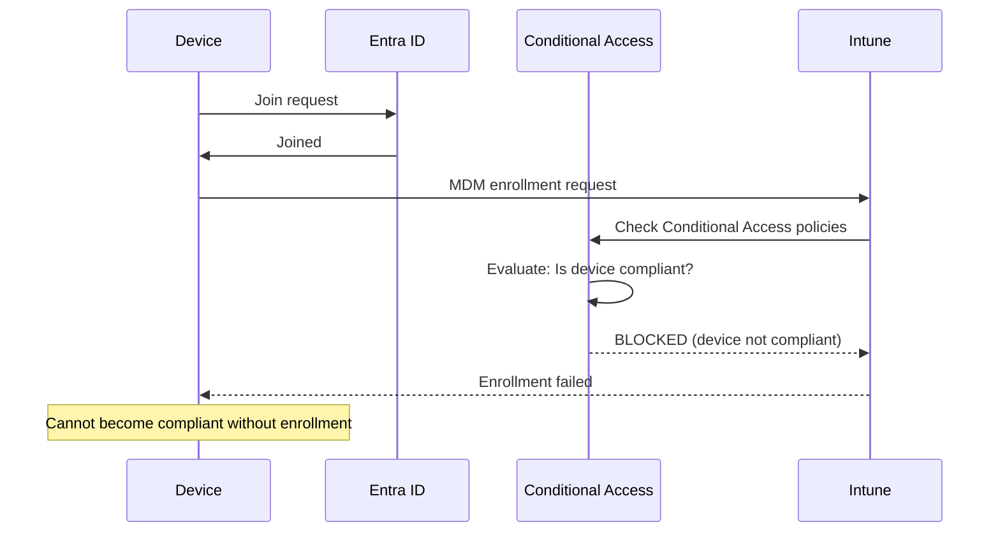

> **Cross-platform:** This guide covers the Windows enrollment scenario. For macOS Conditional Access enrollment timing, see [macOS Compliance Policy](../admin-setup-macos/05-compliance-policy.md). See also: [Compliance Policy Timing](compliance-timing.md).

# Conditional Access Enrollment Timing: The Compliance Chicken-and-Egg Problem

## The Problem

Conditional Access policies that require a compliant device can accidentally block new device enrollment before a device has had any chance to become compliant. This creates a permanent loop: the device cannot enroll without passing compliance, and it cannot become compliant without enrolling.

### Why It Happens: Step-by-Step

1. Admin creates a Conditional Access policy: "Require compliant device" for all cloud apps.
2. A new device starts Autopilot enrollment — the device is not yet evaluated for compliance.
3. The CA policy evaluates the device → "Not compliant" (because no compliance evaluation has run yet) → access blocked.
4. Enrollment requires access to the Intune service → blocked by CA → enrollment fails.
5. Without enrollment, the device can **never** become compliant → permanent chicken-and-egg loop.

The error surfaces at OOBE as an authentication failure — not as a compliance error — which makes the root cause non-obvious. Admins commonly diagnose this as a network or credential issue before identifying the CA misconfiguration.

---

## Built-In Mitigations

Microsoft provides default exclusions that solve this chicken-and-egg problem for the **common case**:

- **"Microsoft Intune Enrollment" cloud app** is excluded by default from CA compliance requirement policies.
- **Company Portal** has built-in exclusions from certain CA grant controls during the initial enrollment flow.

These exclusions solve the enrollment loop without any admin action — **as long as the defaults are intact**.

> **Admin Note:** The built-in exclusions only protect you if you have not explicitly overridden them. The three scenarios below describe how admins commonly break this protection.

---

## How Admins Break It

### Scenario 1: Explicitly Including Intune Enrollment in a Compliance Policy

Admin creates a CA policy that explicitly includes **"Microsoft Intune Enrollment"** or **"Microsoft Intune"** cloud app in the assignment and requires device compliance.

> **What breaks if misconfigured:** Every new device fails enrollment. Existing devices are unaffected. The error appears as an authentication failure during OOBE, not as a compliance error — making root cause non-obvious. There is no warning in the CA policy editor that these app IDs are enrollment-critical.

### Scenario 2: All Cloud Apps Without an Exclusion List

Admin creates a policy targeting **"All cloud apps"** with "Require compliant device" grant control and no exclusion list.

> **What breaks if misconfigured:** Same enrollment loop as Scenario 1. The "All cloud apps" target implicitly includes Microsoft Intune Enrollment unless that app is explicitly excluded. New devices will fail enrollment with the same authentication error.

### Scenario 3: Removing the Default Intune Enrollment Exclusion

Admin manually removes the default Microsoft Intune Enrollment exclusion from an existing CA policy (typically to "clean up" what appears to be an unnecessary exception).

> **What breaks if misconfigured:** Breaks enrollment for all new devices immediately. No warning is shown in the CA policy editor when removing this exclusion. Existing enrolled devices are not affected — only new enrollments fail.

---

## Resolution Patterns

### 1. Exclude Intune Enrollment App from Compliance CA Policies

In any CA policy that grants based on device compliance:
1. Navigate to **Entra admin center** > **Security** > **Conditional Access** > **[Policy name]**.
2. Select **Cloud apps or actions** > **Exclude**.
3. Add **"Microsoft Intune Enrollment"** and **"Microsoft Intune"** to the exclusion list.
4. Save and confirm the policy is in the correct state (On or Report-only).

This is the correct long-term configuration. Both app IDs should be excluded, not just one.

### 2. Use Report-Only Mode for CA Policy Rollout

When rolling out new CA policies, set to **Report-only** first.

1. Set the new policy to **Report-only** state (not On).
2. Monitor **Entra admin center** > **Sign-in logs** > filter for "Conditional Access: Report-only" results.
3. Look for any entries where "Microsoft Intune Enrollment" appears as "Would be blocked."
4. Resolve any blocking conditions before switching the policy to **On**.

Report-only mode lets you validate the impact of a CA policy against real sign-in traffic without enforcing it. This catches enrollment-blocking configurations before they break new device deployments.

### 3. Stage Compliance Rollout with Grace Periods

Set compliance policy actions to "Mark device as noncompliant" with a grace period (minimum **0.25 days / 6 hours**) rather than immediate enforcement.

This gives a newly enrolled device time to complete its first compliance evaluation cycle before CA enforcement activates on the "Non-compliant" state.

See [Compliance Policy Timing](compliance-timing.md) for grace period configuration details.

### 4. Use Device Filters to Scope CA Policies

Target CA policies to specific device groups that are already enrolled, excluding the "all devices" scope during enrollment.

1. Create a dynamic device group for enrolled, compliant devices.
2. Scope CA compliance policies to this group — not to "All devices."
3. New devices entering enrollment are not yet in this group and therefore not subject to the compliance requirement during the enrollment window.

---

## Verification

- [ ] CA policy shows "Microsoft Intune Enrollment" in the Exclude list under Cloud apps
- [ ] CA policy shows "Microsoft Intune" in the Exclude list under Cloud apps
- [ ] New test device completes enrollment without authentication errors during OOBE
- [ ] **Entra Sign-in logs** show "Not applied" for the Microsoft Intune Enrollment app during device enrollment (not "Success — blocked by CA" or "Failure")

---

## Configuration-Caused Failures

| Misconfiguration | Symptom | Runbook |
|-----------------|---------|---------|
| Intune Enrollment included in compliance CA policy | New devices fail enrollment with auth error at OOBE | Remove Intune Enrollment from CA policy scope |
| All cloud apps + require compliance, no exclusions | Same as above — all new enrollments fail | Add Intune Enrollment to exclusion list |
| Grace period set to 0 days | Compliance enforcement immediate; devices blocked before first evaluation completes | Set minimum 0.25 days grace period |

---

## See Also

- [Compliance Policy Timing](compliance-timing.md) — Grace period configuration, state transitions, evaluation schedule
- [Security Baseline Conflicts](security-baseline-conflicts.md) — Security settings that conflict with Autopilot provisioning
- [Post-Enrollment Verification](../lifecycle/05-post-enrollment.md) — What "Not evaluated" vs "Non-compliant" means post-enrollment
- [APv1 Configuration-Caused Failures](../admin-setup-apv1/10-config-failures.md) — Reverse-lookup table for all APv1 configuration mistakes

---

> **macOS:** For macOS Conditional Access enrollment timing, see [macOS Compliance Policy](../admin-setup-macos/05-compliance-policy.md).
